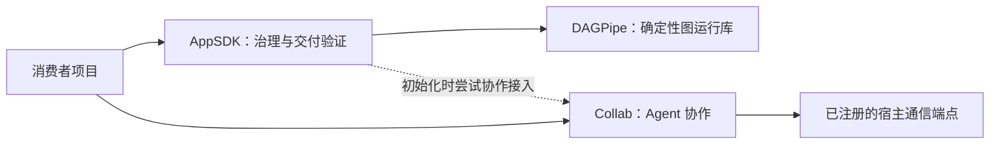

# AppSDK

AppSDK 为 AI 与开发者提供通用项目治理：明确目标和变更边界，维护项目规则与
模块合同，校验交付证据，编译并发布可追溯产物。业务源码、协议、provider 和
业务 pipeline 由使用它的项目拥有。

默认流程是：**明确目标与范围 → 实现 → 受影响验证 → 适用 review → 交付**。
日常按风险选测，release 执行完整发布门禁。Guidance 与 Memory 按需使用；
Collab 的可用性与项目质量准入分别判断。

## 三个模块如何配合

| 模块 | 提供什么 | 何时使用 | 安装入口 |
|---|---|---|---|
| **AppSDK** · `rust/` | `appsdk` 治理 CLI、`project-memory` 与三个 SDK Skills；初始化、规则升级、合同/证据验证、编译和冻结发布 | 开始项目治理；按需启用 Guidance 和 Memory | `scripts/install-global-appsdk.sh` |
| **DAGPipe** · `dagpipe/` | `pipeline_runtime` Rust 库、`dagpipe` CLI、SDK 副本与运行 Skill | 声明、校验和执行确定性 DAG，或在 Rust 项目注册 Operators | `scripts/install-global-dagpipe.sh` |
| **Collab** · `collab/` | `collab`、`collab-mcp` 与协作 Skill；daemon、身份、durable mailbox、任务与资源归属 | 多 Agent 协作及宿主原生消息投递 | `scripts/install-global-collab.sh` |



AppSDK 在源码中以 path dependency 使用 DAGPipe；普通 `appsdk init` 不重复
安装独立 DAGPipe CLI。Collab 有独立 binary 与 daemon，AppSDK 初始化会尝试
官方 Collab 接入；不可用时明确报告 pending/unavailable，独立开发继续。
三个模块在同一仓库维护，安装和运行生命周期各有 owner。

## 安装 AppSDK

当前正式安装入口从公开 release 的源码 tag 构建，适用于具备 Unix 工具链的
macOS/Linux 环境。需要 Git、Rust/Cargo 和本机 C 编译工具链；平台证据范围见下表。

```bash
git clone --branch v0.1.0014 --depth 1 https://github.com/Jasonzhangf/appsdk.git
cd appsdk
scripts/install-global-appsdk.sh
appsdk version
```

installer 将 `appsdk`、`project-memory` 安装到当前 Cargo executable 所在目录，
将 `appsdk-project-governance`、`appsdk-migration`、`project-memory` Skills 安装到
`~/.agents/skills/`。将 binary 目录加入 PATH；已有 shell 可执行 `rehash`（zsh）
或 `hash -r`（bash）刷新命令缓存。

当前 [公开 release](https://github.com/Jasonzhangf/appsdk/releases/latest) 的下载资产
用于核对版本和哈希；正式安装仍使用上述源码 installer。原生 Windows 安装和
npm 安装尚未提供，不将 Git Bash 或 WSL 视为原生 Windows 支持。

## 如何开始治理

### 新项目

在目标项目的父目录运行：

```bash
appsdk new ./my-project
cd my-project
appsdk verify
```

生成骨架后，读取项目 `AGENTS.md`，由项目 owner 明确目标、模块归属、
业务源码位置、构建命令和验收要求。`verify` 检查当前阶段的合同完整性；
骨架通过不等于业务功能或发布验收完成。

### 已有项目

在已有项目的 canonical main checkout 中准备初始化：

```bash
cd /path/to/existing-project
appsdk prepare
```

与 Agent 确认 `.appsdk-prepare.json` 中的目标、项目根、旧代码边界、允许/
禁止修改路径及验收，将准备记录完整确认后执行：

```bash
appsdk init
appsdk verify
```

需要将治理项目放在子目录时，在准备记录中确认该相对根，并使用
`appsdk init --project-root <relative-path>`。普通 init 保留已有项目规则；
旧 SDK pin 不匹配时应按迁移 Skill 升级，不能通过重复 init 绕过。

### 从规则走到日常开发

请 Agent 读取上层规则、项目 AGENTS/Skills、真实测试命令和 CI/hooks，
审计哪些旧规则应删除、合并或收窄；将项目事实保存在项目 AGENTS，开发
操作保存在项目 Skill，并同步实际测试入口。已有规则无需整份替换。

- 提交前验证变更影响范围和必要消费者；共享合同/依赖的风险决定扩大范围。
- 适用的独立 review 在完整重大 milestone 的交付边界执行。
- release 执行完整门禁，保留准确的源码、产物与消费者证据。
- Guidance、Memory 和协作队列按实际需要启用。

若选择 Guidance，在模块已绑定后执行只读 setup intake：

```bash
appsdk guide init --task guidance-setup --mode bootstrap --module app-core
```

`app-core` 替换为真实 module ID。读取返回的 setup proposal，按项目授权更新
规则源，再执行 `appsdk guide compile`。详细用法见下方 Guidance 文档。
治理 reset 会替换旧 epoch，须按迁移 Skill 明确范围和授权。

## 使用 DAGPipe 与 Collab

以下安装命令从 AppSDK 源码 checkout 根目录运行。

### DAGPipe

```bash
scripts/install-global-dagpipe.sh
dagpipe modules list
dagpipe sdk path
dagpipe graph validate dagpipe/examples/governance_graph.json
```

图校验检查拓扑与合同；业务 Operators 由消费者注册。
Rust 库消费、并发和效果语义见 [DAGPipe 使用指南](dagpipe/docs/usage.md)。
DAGPipe 无 daemon。

### Collab

```bash
scripts/install-global-collab.sh
```

在需要协作的项目 main checkout 中执行 `collab context`，读取实际身份、
route 和 peer 状态。它需要可用的宿主通信端点；安装成功不证明消息投递成功。
installer 不重启已有 daemon，升级运行态须在已授权维护窗口按正式
`collab down` → `collab up` 流程执行。详见 [Collab 入口](collab/README.md)。

## 平台与渠道状态

以下是截至 `v0.1.0014` 的已知证据，按产品和 CPU 架构区分：

| 平台 | AppSDK | DAGPipe | Collab | 下载/渠道 |
|---|---|---|---|---|
| macOS ARM64 | 已有安装、消费者和公开产物证据 | 随 AppSDK 构建使用库；独立 CLI 不在此 AppSDK release 资产中 | 已有独立安装/live [交付记录](docs/evidence/collab-master-authority-fix-20261007/README.md) | GitHub 源码与 AppSDK ARM64 资产 |
| Linux x64 | Ubuntu release 门禁、安装器与消费者 smoke 通过 | Ubuntu release 门禁测试通过 | 有独立 Ubuntu CI job；具体 live 能力依宿主环境验收 | 可使用源码安装；尚无该 release 的 Linux 二进制 |
| macOS x64 / Linux ARM64 | 尚未建立对应架构的完整发布证据 | 同左 | 同左 | 未提供对应平台的该 release 资产 |
| 原生 Windows | 待适配：路径、锁、事务与安装入口 | 待平台构建与安装验收 | 待适配：Unix socket、宿主 transport、锁与进程管理 | 尚无原生 installer 或 release 资产 |

本仓库尚未实现 npm 发布；已确定主包名为 `@jsonstudio/appsdk`。
三平台产物、npm 包边界、版本映射与交付顺序见
[跨平台与发布渠道方案](docs/design/release-distribution.md)。新增平台和渠道
完成对应验收后更新本表；编译成功不等于该平台的完整运行支持。

## 文档路由

| 你要做什么 | 阅读入口 |
|---|---|
| 开始项目治理、理解初始化与模块合同 | [项目集成](docs/design/appsdk-project-integration.md)、[治理 Skill](sdk-skill-sources/appsdk-project-governance/SKILL.md) |
| 审计/升级现有规则 | [治理 Skill：规则与 Skill 升级](sdk-skill-sources/appsdk-project-governance/SKILL.md#rule-and-skill-upgrade-audit) |
| 迁移 SDK 或授权重置治理 | [迁移 Skill](sdk-skill-sources/appsdk-migration/SKILL.md) |
| 使用 Guidance | [Harness 架构](docs/architecture/development-process-control-harness.md)、[详细合同](docs/design/appsdk-guidance-framework.md) |
| 编译、promotion、freeze 与版本化消费 | [Promotion 合同](docs/design/playground-active-promotion.md)、[生命周期记录](docs/design/lifecycle-records.md)、[分区转换](docs/architecture/zone-transition-matrix.md) |
| 使用项目记忆 | [Memory 设计](docs/design/project-memory.md)、[Memory Skill](sdk-skill-sources/project-memory/SKILL.md) |
| 接入通信、投递与消费回执 | [Communication 合同](docs/design/apps-sdk-communication.md) |
| 声明/运行 DAG | [DAGPipe](dagpipe/README.md)、[SDK 接入职责](docs/design/dagpipe-internal-module.md) |
| 多 Agent 协作与 daemon 操作 | [Collab](collab/README.md)、[原生通信架构](docs/codex-tui-collab-architecture.md) |
| 开发本仓库、按风险选测 | [根级 AGENTS](AGENTS.md)、[appsdk-dev Skill](.agents/skills/appsdk-dev/SKILL.md) |
| 平台适配、发布资产与 npm 等渠道 | [发布方案](docs/design/release-distribution.md) |

## 验证与发布

[verify.yml](.github/workflows/verify.yml) 按实际变更选择组件。部分未细分 Rust
路径、共享合同/版本与未知路径仍扩大到整个 AppSDK 包；该限制在开发 Skill
中记录。版本 tag 或 `workflow_dispatch` 执行完整 AppSDK release 候选门禁：
AppSDK/DAGPipe 完整测试、合同/版本一致性、两个 release binary、installer、
source registry 与真实消费者 smoke。Collab 使用独立门禁和产品安装流程。

此仓库的根级规则和开发 Skill 管理 SDK 源码开发。消费者项目的
Playground/Active/Protected 分区和治理合同在相应设计中定义；根仓库
不会因为存在 AGENTS 就自动成为已注册的 AppSDK 消费者项目。
