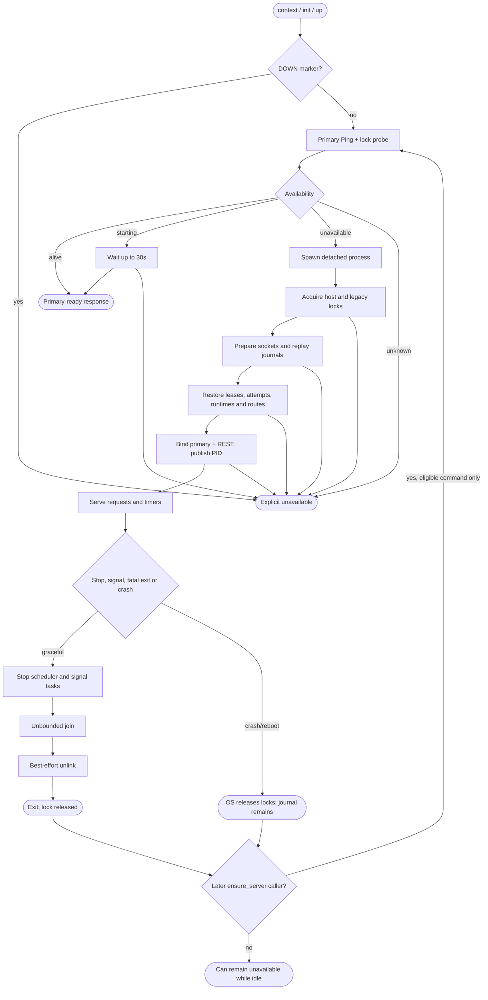
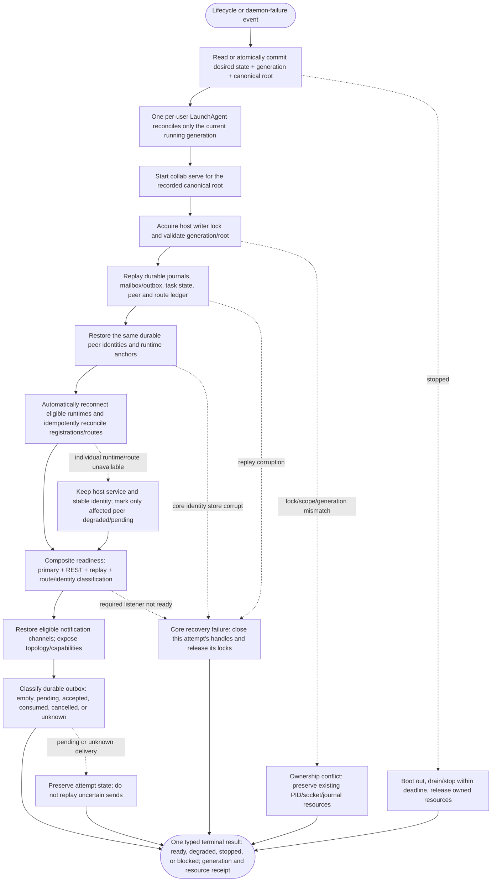
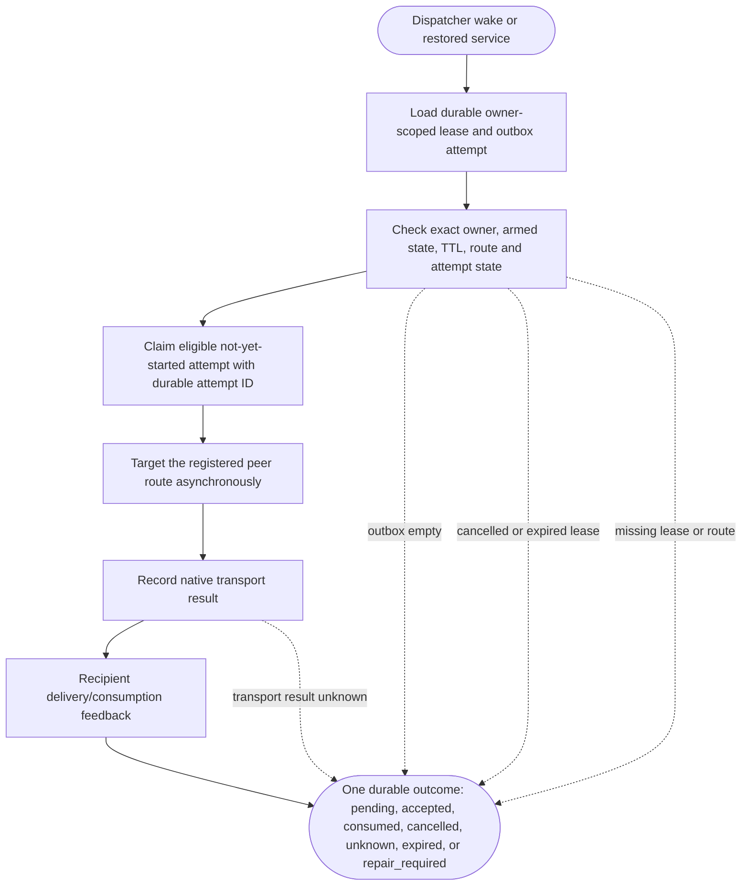

# Collab daemon lifecycle resilience audit

## Scope and evidence

Audit scope: the global host daemon and its registered peers from start intent through durable replay, readiness, peer identity/route restoration, communication recovery, crash/restart, stop, and owned-resource cleanup. Daemon process lifetime and peer identity lifetime have distinct owners, but they are one end-to-end recovery DAG: restarting the daemon must not require an agent to manually recover, rebind, or recreate its identity.

- Source baseline: `origin/main` / `75c2ddd8184a21991c9c73d59c32de8eb4c9214d`.
- Installed runtime observed: `collab 0.2.0153`, binary SHA256 `cdba3e58a3c404a67074e27812e1df7cac2beb1c30609c0fd37108bf983aadfd`; PID `84516` maps to it. Primary and REST sockets existed; `collab status --all` responded. Unauthenticated REST returned 401, proving listener reachability only.
- Read-only service-manager inspection found no Collab/AppSDK launchd job in `launchctl list` or checked LaunchAgents/LaunchDaemons directories.
- REST source is in staged communication candidate `/Volumes/Intel/playground/appsdk/comm-rest-20260929-main`, base `75c2ddd8184a21991c9c73d59c32de8eb4c9214d`, staged tree `a6556a3fb79c2b40a4658c1022ec0a193b3f085c` (not merged to origin/main).
- No daemon lifecycle command, crash injection, host reboot, or shutdown-under-load test was run. No claim of live self-recovery is made.

## Current ownership and flow

`client::ensure_server` checks the `DOWN` marker, probes primary typed Ping and host lock, waits up to 30s for Starting, launches a detached process for safe Unavailable, and fails closed on Unknown. It is called only by `context`, `init`, `up`; ordinary `status`, `send`, and other RPCs connect directly. `spawn_server` returns after `Command::spawn`, without waiting or supervising. `collab serve` resolves its project root from the process cwd; a login service has no guaranteed canonical project cwd.

The daemon acquires host and legacy writer fences, prepares both socket paths, replays resident journal, opens the writer, restores leases and uncertain async delivery state, purges expired storage, restores project runtimes and reconciles routes, then binds primary and REST sockets and publishes PID. Individual external-runtime startup errors may leave not-ready routes; fatal route reconciliation aborts startup. Typed readiness checks only primary Ping. There is no REST health endpoint.

On stop, the daemon stops timer work, signals connection tasks, joins all tasks without a deadline, then best-effort removes matching socket/PID paths while discarding cleanup errors. REST requests do not share the primary cancellation receiver. Listener accept errors are logged/retried without classification or backoff; timer task results are ignored.

This current-state graph is observational and is **not** a valid self-recovery SESE DAG: it exposes partial outcomes and has no independent restart owner.

## Findings

### P1 — No continuous crash recovery

The detached daemon has no waiting parent and no host supervisor job was found. A crash/reboot releases locks but does not restart service. Only later `context`, `init`, or `up` can reach `ensure_server`; ordinary RPCs may fail and the daemon can stay down indefinitely while idle.

### P1 — Readiness overstates service availability

The primary Ping does not check REST, registered route recovery, or timer progress. The REST listener has no health endpoint. A successful Ping cannot prove the full communication contract is usable.

### P1 — Stop can hang and cleanup is unproven

Joining requests has no deadline and REST has no shared cancellation. One stalled request can retain the process, lock, and sockets indefinitely. Ignored unlink failures mean process exit does not prove endpoint cleanup.

### P2 — Partial route restore has no recovery owner

An individual runtime restore can be ignored while the host starts, leaving a not-ready route; fatal same-pane reconciliation instead aborts startup. The two outcomes are not represented in a single health model or repaired by a background owner.

### P2 — Listener/timer failures can silently degrade service

Permanent accept errors can loop without backoff; timer task failures are discarded. The process can keep the writer lock while useful work has stopped.

### Evidence boundary

The observed daemon answered Ping and `status --all`; prior `COLLAB_IDENTITY_ANCHOR_MISSING` / `IDENTITY_REBIND_UNPROVEN` is a caller identity failure, not daemon downtime. Historical logs are not attributed to PID 84516 without process-lifetime correlation.

## Target SESE design

Availability scope: a per-user macOS LaunchAgent supervises the service while the user session is loaded. Before login or after user-session termination is outside this contract.

There is one durable service record with `desired_state`, monotonic `generation`, and `service_scope_root`, atomically owned by CLI lifecycle commands under the host state root. On the first `up` with no record, `service_scope_root` is canonicalized from that command's exact project cwd. Later `up` from any project reuses the already-bound service root; it cannot switch the global daemon to whichever project happens to call. A different root requires an explicit scoped migration. The root belongs in the same truth record because the daemon's reducers need a project root, but launchd does not inherit that cwd. launchd is supervisor/actuator, not another desired-state store. Its `collab serve --service` entry reads the typed service record and uses the recorded canonical scope; it never guesses from launchd cwd or environment. If that root is missing/moved or conflicts with durable route ownership, startup is blocked with the recovery action preserved; no other project root is substituted. `up` commits `running` plus the bound root then bootstraps/reconciles the LaunchAgent. `down` commits `stopped` then boots it out and verifies process/socket/lock release. `context`/`ensure_server` can reconcile only when state is `running`; they never override `stopped`. Retire `DOWN` as a separate authority. Reconciliation serializes requests and discards actions whose generation is stale. Every startup attempt re-reads the current generation and scope root immediately before listener publication; if stopped, superseded, or inconsistent, it exits and releases its writer lease. The host lock remains the single-writer fence.

Peer identity is durable independently of daemon memory and process identity. The authoritative peer identity record (stable worker ID, credential/token reference, project binding, and runtime anchors such as the registered App Server session/thread or tmux endpoint) must survive daemon exit. Startup replay restores the peer/route ledger from its existing owner, then automatically reconnects eligible live runtime anchors and idempotently reconciles their registrations with the same worker identity. It must not mint a replacement peer, silently drop a route, or require `collab context`, `whoami`, `init`, `worker recover`, or a human to repair an ordinary daemon crash. Those commands remain explicit operator/bootstrap tools, not the recovery mechanism. If a runtime anchor is genuinely unavailable or the durable identity store is corrupt, preserve the identity and exact failure as degraded/blocked state; do not guess a new identity or claim communication readiness.

This external graph has one event entry and one typed outcome exit. Start/monitor/retry loops are internal behavior of the single LaunchAgent owner; they are not cross-node graph edges. Crash recovery must traverse durable replay through identity/route restoration before communication readiness. Readiness depends on daemon listeners, replay, stable identity restoration, and classification of expected routes/channels; it does not wait for recipient feedback. Delivery/feedback is a child DAG whose outcome is empty, pending, accepted, consumed, cancelled, or unknown. A single peer's unavailable runtime anchor degrades that peer while other eligible peers and the host service continue. Core identity-store corruption, lock/scope conflict, and listener failure have distinct resource rules. The exit outcome is `running-ready`, `running-degraded`, `stopped`, or `blocked`, always tied to the desired-state generation and preserving existing peer identities. No agent action is part of ordinary recovery.

The dispatcher/feedback child DAG has its own single entry and exit; it is scheduled by the restored service but does not gate listener readiness on a peer replying. It replays subscription state verbatim and only claims work whose durable attempt state proves it is safe to send:

An attempt marked started with no conclusive transport receipt remains `unknown`; it is not retransmitted on restart because the original might have reached the recipient. Payload remains in durable storage until its owner-scoped terminal policy permits cleanup. Delivery proves transport acceptance only; consumption requires recipient feedback. Missing subscription/route state is explicit `repair_required` and never silently becomes mailbox-only delivery. Cancelled, expired, and consumed records are not re-armed by daemon restart.

| Internal supervisor transition | Resource disposition | Required evidence |
|---|---|---|
| Start/restart | `collab serve --service` reads desired generation and canonical service scope from the host service record; new process acquires host and legacy locks before touching state | one owner holds each required lock; scope root is an existing canonical route owner |
| Lock busy/ambiguous | Exit blocked; do not alter socket, PID or journal | exact lock owner/error |
| Journal/replay failure | Preserve durable journals; close handles and release locks on process exit | replay error bound to generation |
| Route failure | Keep isolated route explicitly degraded or block core corruption; no alternate reducer | per-route health/readiness projection |
| Bind/readiness failure | Process exits; next attempt verifies lock release and classifies stale/ambiguous endpoint before cleanup | primary + REST probes, endpoint ownership, and service-root binding |
| Crash/host reboot | OS releases locks; old process does no cleanup; launchd restarts/relaunches; new process validates PID/socket ownership and replays | new PID owns lock and durable state replay succeeds |
| Peer identity/route restoration | Read durable identity/runtime-anchor records from their canonical owner; retain stable worker ID and credential; automatically reconnect and idempotently reconcile routes | before/after identity tuple unchanged; expected routes restored or individually classified; no manual recovery command |
| Per-peer runtime anchor unavailable | Keep host service and healthy peers serving; retain identity and route ownership; one daemon-owned reconnect worker applies bounded retry and records only that peer pending/degraded | exact peer ID, typed cause, retry owner/deadline; another healthy peer remains ready |
| Notification subscription restoration | Replay exact owner, state, and TTL; continue only subscriptions still `armed` and unexpired; never re-arm cancelled, expired, or consumed leases or silently create replacements | before/after state and expiry unchanged; missing lease is `repair_required`, not mailbox-only success |
| Durable delivery/outbox recovery | Retain payload and attempt ledger. Re-execute only a claim proven not to have started sending; preserve accepted/consumed/cancelled; classify attempt-started with unknown native result as unknown and do not duplicate-send | empty/pending/accepted/consumed/cancelled/unknown are queryable; no false delivery or consumption claim |
| Core identity store corrupt | Preserve identity records and routes; do not mint or bind another identity; block core recovery with exact cause | exact corrupt store evidence and preserved worker IDs; no false ready |
| Ownership conflict before publication | Do not alter resources not owned by this attempt; report lock/root/generation conflict | exact owner and conflicting generation; existing PID/socket/journal unchanged |
| Startup failure after endpoint publication | Close this attempt's listeners/tasks, release its locks, and remove only inode/PID-matched endpoints created by this attempt | no attempt-owned process, lock, or endpoint remains; unrelated/ambiguous resources preserved |
| Stop during startup | `stopped` generation supersedes attempt; bootout cancels/reaps; attempt rechecks generation before publish | desired generation stopped; no process/lock/socket |
| Stop while serving | Close admission, drain/cancel primary and REST to a deadline, flush durable writes | bounded receipt; PID gone, lock free, owned paths absent |
| Restart throttle exhausted | Enter explicit blocked outcome; preserve state and ambiguous artifacts | exact cause, desired generation, operator action |

The daemon never restarts itself after fatal internal failure; it exits with cause and launchd is the only restart owner. Retry a request only if failure is proven before any request bytes were sent. Otherwise return an uncertain result and query by durable ID; never replay a possibly committed mutation.

## Fix order and acceptance

1. Implement the single durable desired-state record and LaunchAgent adapter; eliminate detached `spawn_server` as a lifecycle owner and retire `DOWN` authority. Test concurrent up/down and login reconciliation.
2. Replay resident ledgers and automatically restore stable peer identities, runtime anchors, registrations, routes, notification subscriptions, and feedback channels; ordinary daemon restart must not need manual agent recovery.
3. Readiness checks primary and REST plus resident replay, identity/route restoration, and explicit per-route communication readiness/degradation.
4. Bound shutdown, cancel/drain both protocols, flush writes, verify inode-matched socket/PID removal and lock release.
5. Surface accept/timer failures; apply bounded retry/backoff to transient errors; fatal errors exit to supervisor; corruption/ambiguous ownership block without replacing identity.
6. Isolated process-level crash injection at each startup/commit/feedback/stop boundary, concurrent lifecycle controls, corrupted journal/identity anchor, stale/ambiguous socket, route loss, notification replay, REST-only fault, timer fault, and restart-throttle exhaustion.

Acceptance requires automatic restart without a client request; latest-generation convergence for concurrent controls; one lock owner; same peer identities and automatically restored routes/registrations/subscriptions without manual recovery; readiness bound to both endpoints, replay, identity, and route classification; per-peer failure degrades only that peer; delivery restart tests cover empty/pending/accepted/consumed/cancelled/unknown and expired subscriptions without duplicate send; durable delivery/task state survives crash without false success; stop/recovery reach bounded outcomes with complete owned-resource cleanup; tests, candidate/review SHA, build/install digest, service identity, restart timestamp, real multi-peer replay and cleanup receipts are bound together.

## Disposition

**FAIL for continuous self-recovery.** Single-writer fencing, journal replay, and stale-socket checks are useful foundations, but a live PID/Ping does not prove recovery from process or host failure. This is an audit/design artifact; no daemon product code changed.
