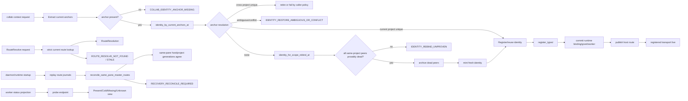
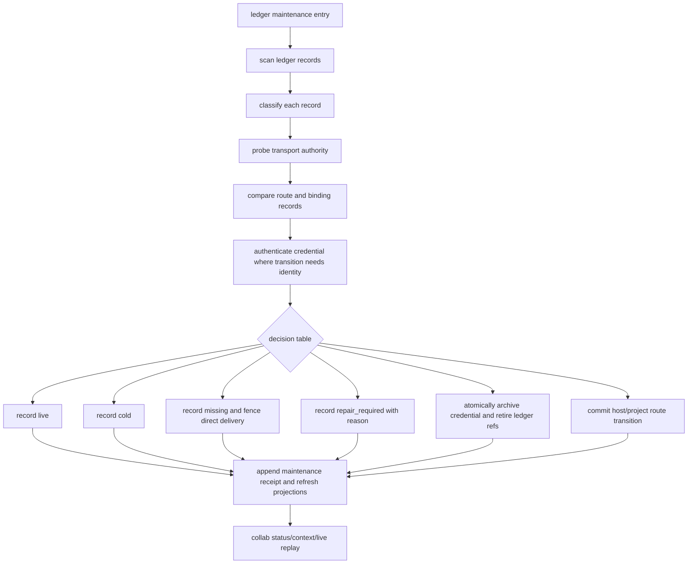

# Collab identity-route ledger maintenance DAG

## Purpose

This document defines the target maintenance DAG for the daemon-owned identity and route ledger. The ledger is the source of truth for registered projects, principals, masters, runtime bindings, session/thread IDs, tmux pane addresses, credentials, routes, master grants, subscriptions, mailboxes, and durable notifications.

The design goal is not to make route resolution guess. Strict lookup remains fail-closed. The new owner is a ledger maintenance loop that turns each ledger record into one of a small set of typed lifecycle states and only mutates records through the existing typed reducer/journal path.

## Current ledger sources

| Source | Current owner | Maintenance role |
| --- | --- | --- |
| `~/.collab/identities/<worker>/identity.json` | CLI identity owner | Credential and transport anchor for one principal. |
| `~/.collab/archives/identities-retired-*/<worker>/identity.json` | CLI identity owner | Reversible history for retire/recovery. |
| `~/.collab/routes.jsonl` | Host route registry | Project registration and split-journal host route index. |
| `<project>/.agent-collab/server/journal.jsonl` | Project runtime | Typed project state for bindings, grants, tasks, mailboxes, notifications. |
| daemon in-memory `current_thread_routes`, `runtime_bindings`, `master_grants`, worker registry | Runtime/global state | Current live projection used by route resolve and status. |
| mailbox/notification/subscription records | Mailbox/subscription owners | Delivery state and pending consumption. |

## Current graph as observed in code



## Gap analysis

| Gap | Observed opening | Required owner transition |
| --- | --- | --- |
| G1 no background ledger owner | Lost records are only seen on `collab who`, `context`, or registration. | Add one scheduled/manual ledger maintenance entry that scans identity/route/projection records. |
| G2 no typed ledger state | Status shows boolean/live strings but has no durable lifecycle classification. | Persist `LedgerPeerState`: `live`, `cold`, `missing`, `repair_required`, `retired`. |
| G3 pane missing cannot close peer lifecycle | A vanished tmux peer can remain registered with `TMUX_PANE_MISSING`; direct delivery has no durable fence. | If pane probe is `Missing`, transition peer to `missing`, fence further direct delivery, retain mailbox/durable notifications, and mark repair/retire eligibility. |
| G4 cold AppServer thread is not recoverable from ledger alone | `notLoaded` is `Unknown`, not dead. | Keep blocked unless an AppServer-specific recovery operation can load/resume the exact thread; do not archive cold threads. |
| G5 host/project split-journal reconciliation is request/startup scoped | Existing reconciliation covers same-pane master generation mismatch, not all ledger records. | Promote reconciliation to the same ledger maintenance DAG while preserving narrow typed admission. |
| G6 current MCP process without anchor cannot map to lost peer | `COLLAB_IDENTITY_ANCHOR_MISSING` stops before ledger repair. | A maintenance owner can classify missing peers, but must not authenticate or promote a caller that has no valid anchor/token. |
| G7 delivery and identity recovery are conflated | A lost endpoint is reported, but notification/subscription state has no separate terminal classification. | Split endpoint state from durable delivery state; mailbox receipt remains authoritative consumption. |
| G8 retire has no ledger-level policy owner | `archive_dead_peers` is triggered from context/rebind paths only. | Maintenance may propose/archive provably dead peers, but any credential retirement must be atomic and reversible. |
| G9 success evidence has no ledger sink | Success is reported through context/message replay, but the ledger has no durable repaired/reconciled receipt. | Persist a typed maintenance receipt per transition with previous/current generation and evidence kind. |
| G10 status projection can mislead | `identity_valid` and `endpoint_live` are display booleans, not repair commands. | Status must read ledger state plus probe result; repair commands must remain separate. |

## Target SESE maintenance DAG



The DAG has one source, `ledger maintenance entry`. It can be triggered by the daemon timer, an operator command, daemon startup, or `collab context` repair mode. The entry selects one transition owner and must not call arbitrary client registration to perform repair.

The DAG has one sink, `append maintenance receipt and refresh projections`. No successful scan is complete unless every scanned record reaches exactly one terminal classification or has an explicit receipt saying the transition was blocked and preserved.

## Typed record states

```text
LedgerPeerState
  live              endpoint probe Present or AppServer Live; route/binding/current anchor agree
  cold              endpoint is not currently active but can be resumed, for example AppServer notLoaded
  missing           endpoint probe Missing; direct delivery is fenced
  repair_required   ledger is internally inconsistent or lacks the exact proof needed
  retired           credential archived and no active route binding remains
```

Probe states do not directly become ledger states. The classification combines transport authority, route/binding consistency, credential availability, and delivery state.

## Decision table

| Identity | Route/binding | Transport probe | Master grant | Decision |
| --- | --- | --- | --- | --- |
| active identity | route agrees | Present | no conflict | `live`; no mutation. |
| active identity | route agrees | AppServer Live | no conflict | `live`; no mutation. |
| active identity | route agrees | AppServer notLoaded | no conflict | `cold`; preserve route, notifications and subscriptions. |
| active identity | route missing | Unknown | any | `repair_required`; do not retire. |
| active identity | route missing | Missing | no conflict | `missing`; fence direct delivery; eligibility check before retire. |
| active identity | host/project mismatch | Present | same principal adjacent generation | `reconcile`; commit only through route registry. |
| active identity | host/project mismatch | Present | same principal non-adjacent generation | `repair_required`; preserve both journals. |
| active identity | route belongs to another worker | any | any | `repair_required`; never transfer ownership. |
| archived credential | no active refs | Missing or all refs retired | revoked | `retire`; archive receipt retained. |
| no current anchor | any | any | any | caller remains unauthenticated; maintenance may classify but not promote. |

## Repair actions

1. **No-op classification.** For `live`, refresh projection metadata only; do not append journal events.
2. **Cold classification.** Preserve route, mailbox, subscriptions and pending notifications. Emit only a maintenance receipt if the durable state changes from unclassified/missing to cold.
3. **Missing classification.** Fence direct delivery to the vanished endpoint. Keep durable notifications and mailbox records so they remain addressable by durable peer ID. Do not consume or delete them.
4. **Repair-required classification.** Record exact reason, missing proof and candidate owner. No mutation of credentials or routes.
5. **Route reconciliation.** Use the existing route registry admission. Only same principal, same binding, adjacent generation and matching token may publish a missing host route or retire an uncommitted host route.
6. **Retirement.** Archive only records whose transport is proven Missing, whose active route refs are gone or atomically retired, and whose credential files are moved to a reversible archive. Mailbox history remains durable and must not be deleted by retirement.

## Required implementation plan

1. Add durable `LedgerPeerState` to project journal global state and define typed events: `LedgerPeerClassified`, `LedgerPeerRetired`, `LedgerRouteReconciled`, `LedgerRouteRetired`.
2. Add one maintenance owner in the daemon/runtime layer. It scans identity records, host routes, project bindings, grants, workers and delivery records.
3. Keep `RouteResolve` strict. Do not add fallback route resolution based on partial ledger hints.
4. Refactor same-pane master recovery to consume the maintenance/reconcile receipt, rather than becoming a second hidden ledger owner.
5. Refactor `identity_for_scope_rebind_at` so `archive_dead_peers` delegates to the same retirement reducer/evidence path.
6. Split `collab who` display into two fields: current classification and last observed probe. A transient probe error must not erase a durable `repair_required` classification.
7. Add explicit terminal evidence: classified record count, transitions, blocked records with reasons, receipt IDs, and unchanged mailbox counts.

## Tests and acceptance evidence

Required tests:

- live tmux peer remains `live`, no journal mutation.
- AppServer `notLoaded` becomes/remains `cold`, never retired.
- missing tmux peer becomes `missing`, direct delivery fences, mailbox remains.
- host/project adjacent split-journal mismatch reconciles through the route registry and emits a receipt.
- non-adjacent or cross-worker mismatch becomes `repair_required`, no mutation.
- two stale peers with one live peer block fresh identity creation and do not archive the live peer.
- all peers provably dead permits retirement, then fresh registration.
- current process without anchor cannot authenticate as any existing peer.
- retire archive is reversible enough for the existing archived pane recovery path and preserves worker ID/token/runtime generation.

Acceptance evidence must include isolated state-root tests, daemon startup replay, context replay, route resolve strictness, send/recv behavior for cold and missing peers, and a final `collab who` projection that reports ledger state and probe state separately.

## Non-goals

- No operator-editable route, token, journal or identity repair.
- No automatic promotion of master from stale records.
- No cross-worker ownership transfer.
- No notification loss or mailbox cleanup as a side effect of retirement.
- No generic partial-information identity inference in ordinary route resolve.

