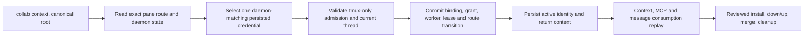

# Same-pane Collab master recovery

## Observed failure and scope

On 2026-09-28 `collab context` in the AppSDK main checkout and tmux pane `%3`
returned `RUNTIME_BINDING_REJECTED: worker token does not match the registered
identity`. The daemon retained `codex-%3` as master at generation 15, bound to
an older Codex thread in that pane. The active identity had become provisional;
the generation 15 credential was in a reversible identity archive. This is a
recovery of one existing principal, not a new master election.

The repair applies only when the daemon's **selected transport is tmux**. Its
full socket/server PID/session/pane/pane PID tuple is the sole input address.
Codex session/thread IDs annotate that address but do not create another tmux
input channel. A changed thread in the same verified pane can therefore
replace the annotation while the pane remains `Present`. If the selected
transport is App Server, the old thread may receive input independently:
same-pane recovery is forbidden, even when its thread probe is cold or unknown.
The ordinary App Server recovery contract remains separate.

## Admission table

| Proof | Accept | Otherwise |
| --- | --- | --- |
| Current caller | Canonical project root, validated current tmux candidate with both current Codex IDs, pane probe `Present` | Missing/unknown pane, missing IDs, or worktree root: explicit error, no mutation |
| Sole route | Exactly one current route whose complete persisted pane tuple equals the candidate, regardless of changed Codex IDs | Zero/ambiguous routes or route owned by another worker/project: explicit error, no mutation |
| Selected input | Registered worker and binding select `Tmux` with that same pane; no other current App Server transport or thread route for this principal | App Server selection or second independently addressable route: block recovery |
| Authority | Existing binding ID, project/app scope, worker ID, generation and master grant all agree in daemon state; registered worker token remains authoritative | Any mismatch: block recovery; never create or promote another master |
| Credential | One active or archived identity has the exact registered worker ID, canonical project scope, binding/runtime/app IDs, generation, old session/thread IDs, pane tuple and token equal to daemon state | No match or more than one distinct matching credential: block; provisional active identity cannot override it |
| Contention | New session/thread are not a current route of another principal, and old and new IDs differ only as annotations on this one pane | Block with owner/route conflict |

The archive search is restricted to `archives/identities-retired-*/<worker>/identity.json`
under the resolved Collab state root. Each record must parse as an `Identity`
and match the authoritative daemon binding and worker token field by field;
directory names or maximum generation alone grant nothing. Duplicate identical
records are one credential value; different matching values are ambiguous.
The active provisional file is replaced only after successful daemon receipt,
using the existing atomic identity writer. A cross-project archived identity
never qualifies, including when it happens to use the same pane. No token is
printed, copied by an operator, put in payload metadata, or selected from a
project guess.

## Recovery DAG and ownership

The host route registry owns B; the identity owner and daemon authenticate C;
the runtime admission owner owns D; the typed reducer and host route publisher
own E; the CLI identity owner owns F; the notification, mailbox and recipient
owners independently prove G. There is one success sink: the same worker and
master grant at one new generation, current-thread route, armed default direct
message lease, unchanged task/mailbox records, and a consumed message receipt.

The host and project journals are distinct, so E cannot honestly be described
as one existing durable transaction. Implement E as a **recoverable transition**
with a stable operation ID and an explicit reconcile step. Before committing,
capture the previous binding, grant, worker, subscriptions and host route.
The project typed registration commits its binding, grant, worker and lease in
one journal command. Publish the new host route next. A definite publish
failure commits the existing rollback event and verifies that project and host
state equal the snapshot. An uncertain append/flush result is not rolled back
blindly. On retry or daemon startup, compare the two journals against the
operation ID and binding generation: if both hold the new route, finish and
return the recorded result; if the project holds the new binding but the host
does not, publish the missing host route after rechecking admission; if the
host holds the new route but project does not, retire the uncommitted host
route; if neither holds it, retry from the old state. Divergent owners or
generations fail closed with both journals preserved. Do not expose the new
grant until the route is reconciled. The same operation ID makes a lost client
receipt a replay, not a second generation. No `WorkerClosed` cleanup event is
valid for this transition.

## Terminal states and evidence

| Event | Terminal state and retry condition |
| --- | --- |
| Old selected transport is App Server, another live route exists, or liveness is unknown | `RECOVERY_BLOCKED`; no mutation. Retry only after authoritative transport state changes or its own recovery path succeeds. |
| Pane missing/unknown, candidate IDs missing, wrong project, token, worker or archive conflict | `RECOVERY_UNPROVEN`; no mutation. Retry only with the exact missing proof. |
| Cancel/crash before project commit | Old binding, grant, route and credential remain authoritative; next context starts at B. |
| Project commit succeeded, host publication failed definitely | Rollback verified against the captured snapshot; next context starts at B. If rollback cannot be verified, mark `RECOVERY_RECONCILE_REQUIRED`. |
| Host append/flush or process result uncertain | `RECOVERY_RECONCILE_REQUIRED`; replay both journals before any further mutation. No success receipt is emitted from an uncertain result. |
| Commit and route succeeded, response lost or active identity write failed | Daemon state remains new and authoritative. Next context selects the same archived credential, reconciles by operation ID/generation, and persists the active identity without incrementing generation. |
| Repeated context after success | Same worker, generation, grant, route and credential; no additional journal transition. |

The old thread route must no longer resolve after success. Notification input
submission is distinct from durable mailbox receipt; only `collab recv` by the
recovered worker proves consumption. An isolated tmux/state-root E2E must cover
each applicable terminal state, including a lost receipt and restart replay.
The reviewed candidate then follows the Collab runtime delivery path:
targeted tests, official install and digest check, `collab down`/`collab up`,
context and MCP initialize, live send/recv replay, commit/merge/push, and
owned worktree and temporary-resource cleanup.
