# Same-pane Collab identity recovery

## Observed failure and contract

On 2026-09-28 the live AppSDK master `codex-%3` remained bound to tmux pane
`%3` and native thread `01a0cd79-9a81-7fe1-a0e6-3fc49b6b029a`. The current
Codex thread in that pane differs. Its active identity file contains only a
provisional worker ID and token; a complete identity for the bound thread is
in the reversible archive. `collab context` returns
`RUNTIME_BINDING_REJECTED: worker token does not match the registered identity`.
The daemon still reports the master as present because the pane is present.

The contract is to recover the **same worker** and its existing master grant
when the current thread replaces the old thread in the same exact pane. No
other pane, project, worker, token, or ambiguous archive may take that grant.
An App Server thread that is merely cold is not a dead or replaceable peer.

## Recovery DAG

```mermaid
flowchart LR
  A[collab context: current project and tmux candidate] --> B[Read unique live pane route]
  B --> C[Resolve authoritative worker binding and credential]
  C --> D[Validate exact pane, project, binding, token and new thread]
  D --> E[Register same worker at next endpoint generation]
  E --> F[Replace host route and reissue same master grant]
  F --> G[Persist selected identity and default notification lease]
  G --> H[Context and MCP/live receipt]
  H --> I[Commit, install, down/up, replay, cleanup]
```

Entry is a `collab context` call from the canonical project in the current
tmux pane. One success sink is the registered same worker with a current
native thread route, one master grant at the new generation, intact tasks and
mailbox, an armed notification lease, and a consumed live message receipt.
Every failed node exits with an explicit error and unchanged authoritative
worker, grant, route, journal and mailbox. The caller may retry the same entry
after correcting the cause. No second daemon or payload-derived control state
participates.

| Node | Unique owner | Acceptance evidence |
| --- | --- | --- |
| Resolve pane route | Host route registry | Exactly one route for the full socket/server/session/pane/pane-PID tuple; pane probe `Present`; other pane, `Missing`, `Unknown`, and ambiguous routes fail. Native thread ID from the current request is not used to guess the prior route. |
| Recover credential | Identity owner | Active identity or one archived identity matches the route's project, worker, binding, generation and old native IDs. A provisional active file never overrides a bound credential. Distinct matching credentials fail as ambiguous. Token stays in identity/control state and is checked by the daemon; it is never printed or copied by an operator. |
| Admit new thread | Runtime binding owner | Same worker and valid credential, same exact pane, current Codex session/thread IDs, no binding of the candidate thread to another peer. A replacement increments generation once; repeated context is idempotent. Wrong token, peer, project, pane or endpoint does not mutate state. |
| Commit binding and grant | Typed reducer plus host route publisher | One durable transaction updates the runtime binding and reissues its existing master grant for the new generation. Host route publication retires the old thread address with a tombstone. On definite failure roll back binding, grant, worker and subscriptions; ambiguous persistence fails explicitly. |
| Persist and resume | Identity and notification owners | Only after daemon acceptance, persist the selected transport/identity, re-arm the existing default lease, then return `collab context` with the same worker/master and new thread. The mailbox payload, notification and consumption paths remain separate. |
| Deliver | Release owner | Candidate tests and real isolated tmux replay; reviewed SHA; official install and digest; one `collab down`/`collab up` window; post-restart `collab context`, `collab-mcp initialize`, live send/recv/receipt; commit/merge/push and owned-resource cleanup. |

## Failure and recovery cases

- **No route or archive:** fail with the exact missing-proof reason. Do not
  mint another `codex-%3` token or silently promote a new master.
- **Old thread still owns a different live transport:** fail closed. A pane
  match does not displace an independently live App Server route.
- **Cross-project reuse of a pane:** archive/retire a prior identity only
  after its daemon route has been safely retired or the peer is proven dead;
  an active master record cannot be archived first and left registered.
- **Cancellation or process exit before commit:** old binding and grant stay
  authoritative. A failed route publish uses the existing rollback path.
- **Successful same-pane replacement:** previous route is stale, new route
  resolves, existing task/mailbox IDs remain, and no second master appears.

The graph and the failure table are the design gate for this repair. The
post-implementation review must assess the real code and traces, not infer
correctness merely from this document.
