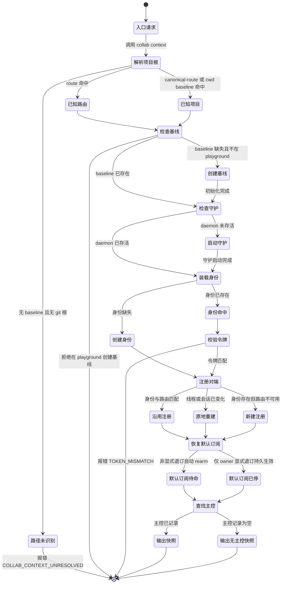
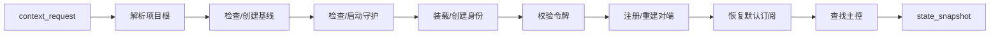

# Collaboration context state machine（按 DAGpipe 规范）

**本页是审计图，不是函数调用链。** 业务入口是唯一命令 `collab context`；
成功沉没点是 `state_snapshot`。失败终点显式报错，不静默退化为 mailbox-only；
重试以新的 attempt 身份开始，不允许在图上画回边。机器可校验的 SESE 图见
`docs/dagpipe/collab-context.graph.json`，可用 `dagpipe graph validate` 检查。

## 边界与角色

本状态机覆盖 `collab context` 的完整 Agent 引导路径。它不覆盖
`sendmessage`、`recv`、task 生命周期、master 派单，也不改变 daemon 自身的主控权。

| 角色 | 允许 | 禁止 |
| --- | --- | --- |
| Agent（普通 peer / master / managed-subagent） | 调用 `collab context`，读取返回快照，按 `operations` 执行 | 手改 routes/journal/mailbox/token；调用传输；运行 operator 诊断 |
| CLI `context` 包装 | 依次执行根解析、基线、daemon、身份、注册、订阅、主控查询、快照 | 绕过服务器单点写状态 |
| Bootstrap owner | 决定项目根、`.agent-collab/` 基线、全局 daemon 生命周期 | 修改身份/token/route |
| Identity owner | 还原或创建本地 worker 身份与 token | 在未验证时 mint 新 peer |
| Server Register owner | 校验令牌，注册/更新 peer route，派生角色 | 接受未验证身份或创建双主 |
| Notification restore owner | 按已注册 transport 恢复默认 direct-message lease | 把默认 lease 变成不可逆 cancelled |
| Master lookup owner | 投影 live master grant | 从失败状态推断“无 master” |

## 事件表

| 事件 | 生产者 | 消费者 | 何时发生 | 状态效果 | payload 边界 |
| --- | --- | --- | --- | --- | --- |
| `context_request` | Agent / CLI | `resolve_context_root` | 调用 `collab context` | 启动引导 | 仅请求意图 |
| `route_hit` | CLI | 基线检查 | 全局 route 命中项目 | 选择项目根 | 项目根 |
| `canonical_route_hit` | CLI | 基线检查 | canonical route 命中 | 选择项目根 | 项目根 |
| `cwd_baseline_hit` | CLI | 基线检查 | cwd 有 `.agent-collab` 或 git 根 | 选择项目根 | 项目根 |
| `path_unresolved` | CLI | Agent | 无 route、无 baseline、无 git 根 | 失败 `COLLAB_CONTEXT_UNRESOLVED` | 错误码 + 根 |
| `baseline_missing` | CLI | `scope::init` | 基线缺失 | 创建 `.agent-collab` | 基线目录 |
| `playground_refused` | CLI | Agent | 在 playground 内创建基线 | 失败，且不写任何状态 | 错误码 |
| `daemon_unavailable` | CLI | `client::ensure_server` | socket 不可达 | 启动 daemon | daemon socket |
| `daemon_alive` | CLI | 身份装载 | socket 可达 | 继续 | daemon socket |
| `identity_hit` | Identity | Token 校验 | 身份被当前锚点匹配 | 继续 | worker id + token |
| `identity_missing` | Identity | 注册 | 无匹配身份 | 创建 worker id + token | 身份文件 |
| `token_ok` | Server verify | 注册 | token 匹配 | 继续 | worker id |
| `token_mismatch` | Server verify | Agent | token 不匹配 | 失败 `TOKEN_MISMATCH`，状态不变 | 错误码 |
| `registration_matched` | Register | 订阅恢复 | route 与身份匹配 | 沿用注册 | route |
| `registration_rebound` | Register | 订阅恢复 | 线程/会话变化 | 原地重建 | route |
| `registration_recreated` | Register | 订阅恢复 | 身份存在但路由不可用 | 新建注册 | route |
| `lease_removed_explicitly` | Notification | Agent | owner 显式退订 | 默认 lease 已停（持久） | 订阅 id |
| `lease_needs_rearm` | Notification | 订阅恢复 | 默认 lease 缺失/过期/非显式取消 | `armed` 待命 | 订阅记录 |
| `master_found` | Master lookup | 快照 | live master 存在 | `state_snapshot` 含主控 | master grant |
| `master_absent` | Master lookup | 快照 | 无 live master | `state_snapshot` 主控为空 | 空 grant |

## 状态机

### 转移表（状态 → 事件 → 下一状态 / 终点）

| 当前状态 | 事件 | 下一状态 / 终点 |
| --- | --- | --- |
| 入口请求 | `context_request` | 解析项目根 |
| 解析项目根 | `route_hit` / `canonical_route_hit` / `cwd_baseline_hit` | 检查基线 |
| 解析项目根 | `path_unresolved` | 失败 `COLLAB_CONTEXT_UNRESOLVED` |
| 检查基线 | 基线已存在 | 检查守护 |
| 检查基线 | `baseline_missing` | 创建基线 |
| 检查基线 | `playground_refused` | 失败：拒绝在 playground 创建基线 |
| 创建基线 | 初始化完成 | 检查守护 |
| 检查守护 | `daemon_alive` | 装载身份 |
| 检查守护 | `daemon_unavailable` | 启动守护 |
| 启动守护 | 守护启动完成 | 装载身份 |
| 装载身份 | `identity_hit` | 校验令牌 |
| 装载身份 | `identity_missing` | 创建身份 |
| 创建身份 | 身份创建完成 | 注册对端 |
| 校验令牌 | `token_ok` | 注册对端 |
| 校验令牌 | `token_mismatch` | 失败 `TOKEN_MISMATCH` |
| 注册对端 | `registration_matched` | 恢复默认订阅 |
| 注册对端 | `registration_rebound` | 恢复默认订阅 |
| 注册对端 | `registration_recreated` | 恢复默认订阅 |
| 恢复默认订阅 | `lease_needs_rearm` | 默认订阅待命 |
| 恢复默认订阅 | `lease_removed_explicitly` | 默认订阅已停 |
| 默认订阅待命 / 默认订阅已停 | 订阅状态确定 | 查找主控 |
| 查找主控 | `master_found` | 输出快照 |
| 查找主控 | `master_absent` | 输出无主控快照 |
| 输出快照 / 输出无主控快照 | 快照完成 | 成功终点 `state_snapshot` |

## DAG 与数据契约（SESE）

机器图：`docs/dagpipe/collab-context.graph.json`。该图是审计/治理图，用来校验
引导流拓扑为单源单汇；真实调用入口与 operator 绑定见 “节点 owner 映射”。

ARC 契约：

| ARC | schema | 语义 |
| --- | --- | --- |
| `context_request` | Object | 唯一入口；仅携带请求意图 |
| `resolved_scope` | Object | 已解析项目根 |
| `baseline_ready` | Object | `.agent-collab/` 基线就绪 |
| `daemon_ready` | Object | daemon socket 就绪 |
| `identity_token` | Object | worker id + token |
| `verified_identity` | Object | 令牌校验通过 |
| `registered_route` | Object | route/transport 注册完成 |
| `notify_state` | Object | 默认订阅状态 |
| `master_grant` | Object | live master grant 或空 |
| `state_snapshot` | Object | 唯一出口，含 bootstrap/identity/daemon/route/subscriptions/master/operations/peers/inbox/worktrees/tasks |

失败终点不进入成功 DAG，作为 attempt 终态显式存在：
`路径未识别`、`拒绝在 playground`、`TOKEN_MISMATCH`。

## 节点 owner 映射

| 语义节点 | graph operator | Handler / Source |
| --- | --- | --- |
| 解析项目根 | `appsdk.collab_context.resolve_root` | `resolve_context_root` / `collab/src/main.rs` |
| 创建基线 | `appsdk.collab_context.ensure_baseline` | `scope::init` / `collab/src/scope.rs` |
| 启动守护 | `appsdk.collab_context.ensure_daemon` | `client::ensure_server` / `collab/src/client.rs` |
| 装载身份 / 创建身份 | `appsdk.collab_context.load_identity` | `identity::load_or_create` / `collab/src/identity.rs` |
| 校验令牌 | `appsdk.collab_context.verify_token` | `verify` / `collab/src/server/mod.rs` |
| 注册对端 | `appsdk.collab_context.ensure_registration` | `ensure_registration_with_outcome` / `collab/src/main.rs` |
| 沿用 / 原地重建 / 新建 | `appsdk.collab_context.register_route` | `handle_register_with_app_scope` / `collab/src/server/mod.rs` |
| 恢复默认订阅 | `appsdk.collab_context.restore_default_lease` | `default_direct_message_events` / `collab/src/server/mod.rs` |
| 查找主控 | `appsdk.collab_context.find_master` | `current_master_worker_id` / `current_master_grant` / `collab/src/server/mod.rs` |
| 输出快照 | `appsdk.collab_context.emit_snapshot` | `handle_context` / `collab/src/server/mod.rs` |

## 变更边界

- 范围内：`docs/collab-context-state-machine.md`、`docs/dagpipe/collab-context.graph.json`、
  `collab/skills/collab/SKILL.md`、CLI/MCP 描述、全局 AGENTS.md 表述收敛到单一入口。
- 范围外：不新增独立 `collab init / whoami / worker recover / route resolve` Agent 流程；
  不修改 daemon 派单、task、mailbox 数据模型；不把 tmux/AppServer 作为可替换 fallback。

## Agent-facing rule（与 Skill 同构）

只执行 `collab context` 一次；线程/会话变化、daemon 重启、身份/token/route 异常时
再次执行 `collab context`。其余动作读返回快照后执行。`collab init`、`collab whoami`、
`collab worker recover`、`collab route resolve`、`collab down`/`up` 是 operator 诊断，
不是 Agent 引导路径。
