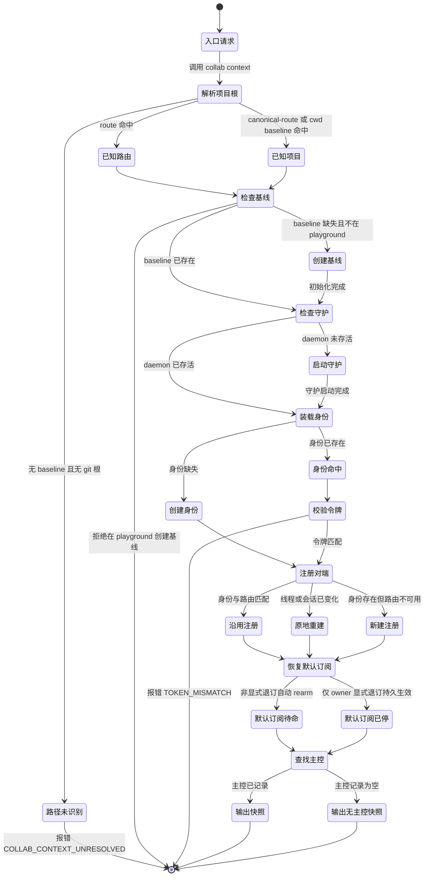
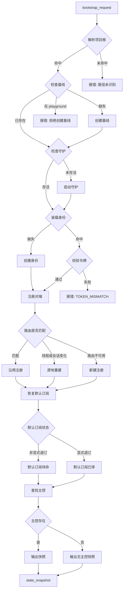

# Collaboration context state machine

One agent-facing entry: `collab context`. Its DAG is single-source
(`bootstrap_request`) and single-sink (`state_snapshot`). Failure terminals
are explicit and reported; retry uses a new attempt identity, not a graph
back-edge.

## Roles

- `agent`: calls `collab context`, reads the snapshot, acts on durable state.
  Never edits routes, mailbox, identity, or token.
- `cli context`: thin wrapper that owns the bootstrap sequence.
- `bootstrap`: owns project root resolution, `.agent-collab/` baseline, and
  the global daemon lifecycle.
- `identity`: owns the persisted local worker identity and token.
- `daemon register`: server-side handler owning registration, role
  derivation, and the default direct-message lease.
- `notification restore`: server-side handler re-arming the default
  direct-message lease from the registered transport.
- `master lookup`: server-side handler projecting the live master grant.

## State machine

## Decision DAG

## Terminals

- `路径未识别` -> `COLLAB_CONTEXT_UNRESOLVED`: preserve the error and report
  the registration problem; no daemon or identity is touched.
- `拒绝在 playground` -> explicit refusal; daemon, identity, and baseline
  stay untouched.
- `TOKEN_MISMATCH` -> the identity record and token are unchanged; re-derive
  a fresh identity through a real runtime anchor.
- `state_snapshot` -> the only sink; carries `bootstrap`, `identity`,
  `daemon`, `route`, `subscriptions`, `master`, `operations`, `peers`,
  `inbox`, `worktrees`, and `tasks`.

## Node owner mapping

| Semantic node | Handler | Source |
| --- | --- | --- |
| 解析项目根 | `resolve_context_root` | `collab/src/main.rs` |
| 创建基线 | `scope::init` | `collab/src/scope.rs` |
| 启动守护 | `client::ensure_server` | `collab/src/client.rs` |
| 装载身份 / 创建身份 | `identity::load_or_create` | `collab/src/identity.rs` |
| 校验令牌 | `verify` | `collab/src/server/mod.rs` |
| 注册对端 | `ensure_registration_with_outcome` | `collab/src/main.rs` |
| 沿用 / 原地重建 / 新建 | `Register` handler | `collab/src/server/state.rs` |
| 恢复默认订阅 | `default_direct_message_events` | `collab/src/server/mod.rs` |
| 查找主控 | `current_master_worker_id` / `current_master_grant` | `collab/src/server/mod.rs` |
| 输出快照 | `handle_context` | `collab/src/server/mod.rs` |

## Agent-facing rule

Call `collab context` once on bootstrap, and again only on thread/session
change, daemon restart, identity mismatch, or route loss. Every other action
reads from the resulting `state_snapshot`. `collab init`, `collab whoami`,
`collab worker recover`, `collab route resolve`, `collab down`/`up`, and any
direct transport call are operator-facing diagnostics, not part of the agent
flow.
