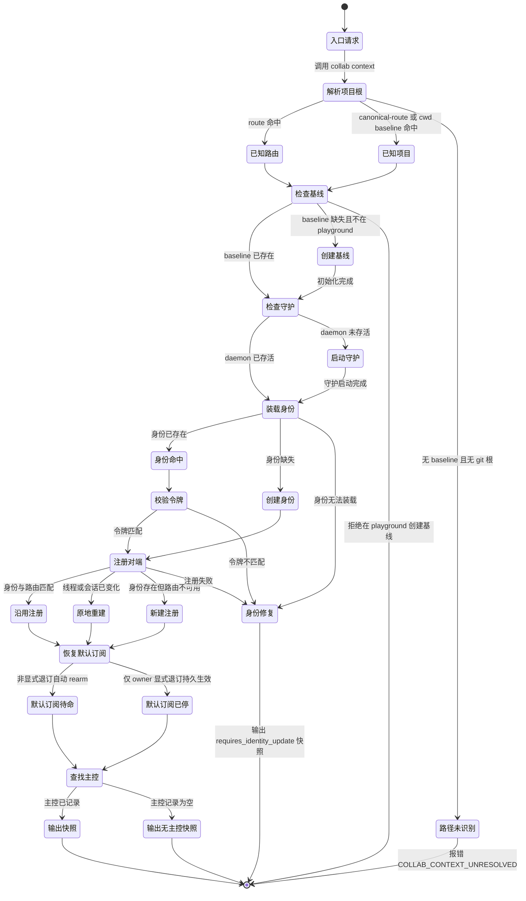
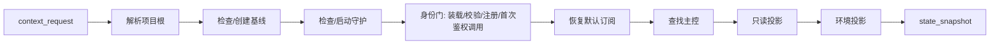

# Collaboration context state machine（按 DAGpipe 规范）

**本页是审计图，不是函数调用链。** 业务入口是唯一命令 `collab context`；
成功沉没点是 `state_snapshot`。失败终点显式报错，不静默退化为 mailbox-only；
重试以新的 attempt 身份开始，不允许在图上画回边。机器可校验的 SESE 图见
`docs/dagpipe/collab-context.graph.json`，可用 `dagpipe graph validate` 检查。

`state_snapshot` 同时是 Agent 的完整状态读取：除 bootstrap/identity/daemon/
subscriptions/master/operations 外，还含 `peers`/`peer_count`、`summary`/
`master_wake`/`subagents`/`pending_merges`、`env`，因此不再需要额外调用
`collab who`、`collab status --all`、`collab master status` 或 shell `env` 探测。
身份无法装载、注册或验真时**不新增第二个出口**：仍是同一个 `state_snapshot`
出口，但 `registered=false`、`identity=null`，并带 `requires_identity_update`
（`reason`/`action`/`exact_error`），同时保留只读的 peers/master/status/env 投影。

## 边界与角色

本状态机覆盖 `collab context` 的完整 Agent 引导路径。它不覆盖
`sendmessage`、`recv`、task 生命周期、master 派单，也不改变 daemon 自身的主控权。

| 角色 | 允许 | 禁止 |
| --- | --- | --- |
| Agent（普通 peer / master / managed-subagent） | 调用 `collab context`，读取返回快照，按 `operations` 执行 | 手改 routes/journal/mailbox/token；调用传输；运行 operator 诊断 |
| CLI `context` 包装 | 依次执行根解析、基线、daemon、身份、注册、订阅、主控查询、快照 | 绕过服务器单点写状态 |
| Bootstrap owner | 决定项目根、`.agent-collab/` 基线、全局 daemon 生命周期 | 修改身份/token/route |
| Identity owner | 还原或创建本地 worker 身份与 token | 在未验证时 mint 新 peer |
| Server Register owner | 校验令牌，注册/更新 peer route，派生角色 | 接受未验证身份或创建双主 |
| Notification restore owner | 按已注册 transport 恢复默认 direct-message lease | 把默认 lease 变成不可逆 cancelled |
| Master lookup owner | 投影 live master grant | 从失败状态推断“无 master” |

## 事件表

| 事件 | 生产者 | 消费者 | 何时发生 | 状态效果 | payload 边界 |
| --- | --- | --- | --- | --- | --- |
| `context_request` | Agent / CLI | `resolve_context_root` | 调用 `collab context` | 启动引导 | 仅请求意图 |
| `route_hit` | CLI | 基线检查 | 全局 route 命中项目 | 选择项目根 | 项目根 |
| `canonical_route_hit` | CLI | 基线检查 | canonical route 命中 | 选择项目根 | 项目根 |
| `cwd_baseline_hit` | CLI | 基线检查 | cwd 有 `.agent-collab` 或 git 根 | 选择项目根 | 项目根 |
| `path_unresolved` | CLI | Agent | 无 route、无 baseline、无 git 根 | 失败 `COLLAB_CONTEXT_UNRESOLVED` | 错误码 + 根 |
| `baseline_missing` | CLI | `scope::init` | 基线缺失 | 创建 `.agent-collab` | 基线目录 |
| `playground_refused` | CLI | Agent | 在 playground 内创建基线 | 失败，且不写任何状态 | 错误码 |
| `daemon_unavailable` | CLI | `client::ensure_server` | socket 不可达 | 启动 daemon | daemon socket |
| `daemon_alive` | CLI | 身份装载 | socket 可达 | 继续 | daemon socket |
| `identity_hit` | Identity | Token 校验 | 身份被当前锚点匹配 | 继续 | worker id + token |
| `identity_missing` | Identity | 注册 | 无匹配身份 | 创建 worker id + token | 身份文件 |
| `token_ok` | Server verify | 注册 | token 匹配 | 继续 | worker id |
| `token_mismatch` | Server verify | 身份修复 | token 不匹配 | 进入 `identity_update`，退出码 0，状态不变 | 错误码 |
| `identity_unresolved` | Identity / Register | 身份修复 | 身份无法装载或注册 | 进入 `identity_update`，退出码 0，不 mint 新身份 | 错误码 + worker id |
| `registration_matched` | Register | 订阅恢复 | route 与身份匹配 | 沿用注册 | route |
| `registration_rebound` | Register | 订阅恢复 | 线程/会话变化 | 原地重建 | route |
| `registration_recreated` | Register | 订阅恢复 | 身份存在但路由不可用 | 新建注册 | route |
| `lease_removed_explicitly` | Notification | Agent | owner 显式退订 | 默认 lease 已停（持久） | 订阅 id |
| `lease_needs_rearm` | Notification | 订阅恢复 | 默认 lease 缺失/过期/非显式取消 | `armed` 待命 | 订阅记录 |
| `master_found` | Master lookup | 快照 | live master 存在 | `state_snapshot` 含主控 | master grant |
| `master_absent` | Master lookup | 快照 | 无 live master | `state_snapshot` 主控为空 | 空 grant |

`token_mismatch` 与 `identity_unresolved` 只在失败可归入闭集身份码时触发；route、
runtime binding、transport 等非身份失败不产生这两个事件，也不进入 `identity_update`。

## 状态机

```mermaid
stateDiagram-v2
    [*] --> 入口请求
    入口请求 --> 解析项目根 : 调用 collab context
    解析项目根 --> 已知路由 : route 命中
    解析项目根 --> 已知项目 : canonical-route 或 cwd baseline 命中
    解析项目根 --> 路径未识别 : 无 baseline 且无 git 根
    路径未识别 --> [*] : 报错 COLLAB_CONTEXT_UNRESOLVED
    已知路由 --> 检查基线
    已知项目 --> 检查基线
    检查基线 --> 检查守护 : baseline 已存在
    检查基线 --> 创建基线 : baseline 缺失且不在 playground
    创建基线 --> 检查守护 : 初始化完成
    检查基线 --> [*] : 拒绝在 playground 创建基线
    检查守护 --> 装载身份 : daemon 已存活
    检查守护 --> 启动守护 : daemon 未存活
    启动守护 --> 装载身份 : 守护启动完成
    装载身份 --> 身份命中 : 身份已存在
    装载身份 --> 创建身份 : 身份缺失
    装载身份 --> 身份修复 : 身份无法装载
    创建身份 --> 注册对端
    身份命中 --> 校验令牌
    校验令牌 --> 注册对端 : 令牌匹配
    校验令牌 --> 身份修复 : 令牌不匹配
    注册对端 --> 沿用注册 : 身份与路由匹配
    注册对端 --> 原地重建 : 线程或会话已变化
    注册对端 --> 新建注册 : 身份存在但路由不可用
    注册对端 --> 身份修复 : 注册失败
    沿用注册 --> 恢复默认订阅
    原地重建 --> 恢复默认订阅
    新建注册 --> 恢复默认订阅
    恢复默认订阅 --> 默认订阅待命 : 非显式退订自动 rearm
    恢复默认订阅 --> 默认订阅已停 : 仅 owner 显式退订持久生效
    默认订阅待命 --> 查找主控
    默认订阅已停 --> 查找主控
    查找主控 --> 输出快照 : 主控已记录
    查找主控 --> 输出无主控快照 : 主控记录为空
    输出快照 --> [*]
    输出无主控快照 --> [*]
    身份修复 --> [*] : 输出 requires_identity_update 快照
```

### 转移表（状态 → 事件 → 下一状态 / 终点）

| 当前状态 | 事件 | 下一状态 / 终点 |
| --- | --- | --- |
| 入口请求 | `context_request` | 解析项目根 |
| 解析项目根 | `route_hit` / `canonical_route_hit` / `cwd_baseline_hit` | 检查基线 |
| 解析项目根 | `path_unresolved` | 失败 `COLLAB_CONTEXT_UNRESOLVED` |
| 检查基线 | 基线已存在 | 检查守护 |
| 检查基线 | `baseline_missing` | 创建基线 |
| 检查基线 | `playground_refused` | 失败：拒绝在 playground 创建基线 |
| 创建基线 | 初始化完成 | 检查守护 |
| 检查守护 | `daemon_alive` | 装载身份 |
| 检查守护 | `daemon_unavailable` | 启动守护 |
| 启动守护 | 守护启动完成 | 装载身份 |
| 装载身份 | `identity_hit` | 校验令牌 |
| 装载身份 | `identity_missing` | 创建身份 |
| 装载身份 | `identity_unresolved` | 身份修复终点 `identity_update` |
| 创建身份 | 身份创建完成 | 注册对端 |
| 校验令牌 | `token_ok` | 注册对端 |
| 校验令牌 | `token_mismatch` | 身份修复终点 `identity_update` |
| 注册对端 | `registration_matched` | 恢复默认订阅 |
| 注册对端 | `registration_rebound` | 恢复默认订阅 |
| 注册对端 | `registration_recreated` | 恢复默认订阅 |
| 注册对端 | `identity_unresolved` | 身份修复终点 `identity_update` |
| 恢复默认订阅 | `lease_needs_rearm` | 默认订阅待命 |
| 恢复默认订阅 | `lease_removed_explicitly` | 默认订阅已停 |
| 默认订阅待命 / 默认订阅已停 | 订阅状态确定 | 查找主控 |
| 查找主控 | `master_found` | 输出快照 |
| 查找主控 | `master_absent` | 输出无主控快照 |
| 输出快照 / 输出无主控快照 | 快照完成 | 成功终点 `state_snapshot` |
| 身份修复 | 装载只读投影并写入修复请求 | 终点 `state_snapshot`（`registered=false` + `requires_identity_update`） |

## DAG 与数据契约（SESE）

机器图：`docs/dagpipe/collab-context.graph.json`。该图是审计/治理图，用来校验
引导流拓扑为单源单汇；真实调用入口与 operator 绑定见 “节点 owner 映射”。

```mermaid
flowchart LR
    S[context_request] --> R[解析项目根]
    R --> B[检查/创建基线]
    B --> D[检查/启动守护]
    D --> I[身份门: 装载/校验/注册/首次鉴权调用]
    I --> N[恢复默认订阅]
    N --> M[查找主控]
    M --> P[只读投影]
    P --> E[环境投影]
    E --> O[state_snapshot]
```

该图的契约要求每个节点恰好一个输入、每条 ARC 恰好一个汇，因此拓扑是一条链。
身份失败有三个真实边界 —— `load_or_create_for_context`、令牌校验/注册、以及第一次
带鉴权的 daemon 调用（`Req::Context` 返回的 token mismatch）—— 它们都属于同一个
`identity_gate` 节点，由该节点内部决定走已分类失败的修复终点还是成功路径；契约不允许
在图上分出第二个出口，所以修复终点不单独成节点。`read_only_state` 与 `env_view` 是
两种结果共用的投影。

ARC 契约：

| ARC | schema | 语义 |
| --- | --- | --- |
| `context_request` | Object | 唯一入口；仅携带请求意图 |
| `resolved_scope` | Object | 已解析项目根 |
| `baseline_ready` | Object | `.agent-collab/` 基线就绪 |
| `daemon_ready` | Object | daemon socket 就绪 |
| `identity_verified` | Object | 身份门通过：身份已装载、令牌已校验、route 已注册、首次鉴权调用成功 |
| `notify_state` | Object | 默认订阅状态 |
| `master_grant` | Object | live master grant 或空 |
| `read_only_projection` | Object | peers / master / status 只读投影 |
| `env_projection` | Object | 过滤后的 shell 环境子集（凭据形状的键已丢弃） |
| `state_snapshot` | Object | 唯一出口，含 bootstrap/identity/daemon/route/subscriptions/master/operations/peers/peer_count/summary/master_wake/subagents/pending_merges/inbox/worktrees/tasks/env；身份修复时另有 requires_identity_update 且 registered=false |

失败终点不进入成功 DAG，作为 attempt 终态显式存在：
`路径未识别`、`拒绝在 playground`。只有**已分类的身份失败**
（`TOKEN_MISMATCH`、`IDENTITY_REBIND_UNPROVEN`、`IDENTITY_RESTORE_CROSS_PROJECT`、
`COLLAB_IDENTITY_ANCHOR_MISSING`）不另设终点，由 `identity_gate` 内部的修复终点 →
同一个 `state_snapshot` 出口，由 `requires_identity_update` 显式承载失败事实。
route / runtime binding / transport（`DAEMON_*`）等非身份失败**不进入**
身份门的修复终点：它们保留原始错误并非零退出，避免 `requires_identity_update`
掩盖真实故障。

## 节点 owner 映射

| 语义节点 | graph operator | Handler / Source |
| --- | --- | --- |
| 解析项目根 | `appsdk.collab_context.resolve_root` | `resolve_context_root` / `collab/src/main.rs` |
| 创建基线 | `appsdk.collab_context.ensure_baseline` | `scope::init` / `collab/src/scope.rs` |
| 启动守护 | `appsdk.collab_context.ensure_daemon` | `client::ensure_server` / `collab/src/client.rs` |
| 身份门（装载/校验/注册/首次鉴权） | `appsdk.collab_context.identity_gate` | `identity::load_or_create_for_context` / `collab/src/identity.rs`；`verify` / `collab/src/server/mod.rs`；`ensure_registration_with_outcome` / `collab/src/main.rs`；`handle_register_with_app_scope` / `collab/src/server/mod.rs`；首次 `call_project(&Req::Context)` / `collab/src/main_context.rs` |
| 恢复默认订阅 | `appsdk.collab_context.restore_default_lease` | `default_direct_message_events` / `collab/src/server/mod.rs` |
| 查找主控 | `appsdk.collab_context.find_master` | `current_master_worker_id` / `current_master_grant` / `collab/src/server/mod.rs` |
| 输出快照 | `appsdk.collab_context.emit_snapshot` | `handle_context` / `collab/src/server/mod.rs` |
| 只读投影（peers/master/status） | `appsdk.collab_context.read_only_state` | `read_only_project_state` / `collab/src/main_context.rs` |
| 环境投影 | `appsdk.collab_context.env_view` | `context_env_view` / `collab/src/main_context.rs`；只取 `HOME`/`USER`/`LOGNAME`/`CARGO_HOME` 与 `COLLAB_`/`APPSDK_`/`CODEX_` 前缀，名字含 TOKEN/KEY/SECRET/PASSWORD/CREDENTIAL 的键一律丢弃 |
| 身份修复终点（`identity_gate` 内部） | `appsdk.collab_context.identity_gate` | `IdentityFailure::classify` / `identity_terminal` / `identity_update_view` / `identity_update_snapshot` / `collab/src/main_context.rs`；只有闭集身份码进入，其余失败原样上抛 |

## 变更边界

- 范围内：`docs/collab-context-state-machine.md`、`docs/dagpipe/collab-context.graph.json`、
  `collab/skills/collab/SKILL.md`、CLI/MCP 描述、全局 AGENTS.md 表述收敛到单一入口。
- 范围外：不新增独立 `collab init / whoami / worker recover / route resolve` Agent 流程；
  不修改 daemon 派单、task、mailbox 数据模型；不把 tmux/AppServer 作为可替换 fallback。
- 单一入口收敛：`collab who`、`collab status --all`、`collab master status` 的字段已并入
  `collab context` 快照，这三条命令降级为 operator 诊断；Agent 流程不再单独调用它们，
  也不再用 shell `env` 探测身份相关变量。

## Agent-facing rule（与 Skill 同构）

只执行 `collab context` 一次；线程/会话变化、daemon 重启、身份/token/route 异常时
再次执行 `collab context`。其余动作读返回快照后执行。`collab init`、`collab whoami`、
`collab worker recover`、`collab route resolve`、`collab down`/`up`、`collab who`、
`collab status --all`、`collab master status` 是 operator 诊断，不是 Agent 引导路径。
快照带 `requires_identity_update` 时，Agent 按其中的 `action` 修复身份；退出码 0
不代表身份已验真，`registered` 与 `requires_identity_update` 才是判据。
`action` 永不是刚失败的那条调用（否则跟随即死循环）：身份未确立的三类返回
`collab context --worker <worker_id>` 并要求 operator 声明（`requires_approval=true`），
`TOKEN_MISMATCH` 返回向 live master 的 blocker 上报（`requires_approval=false`）。
