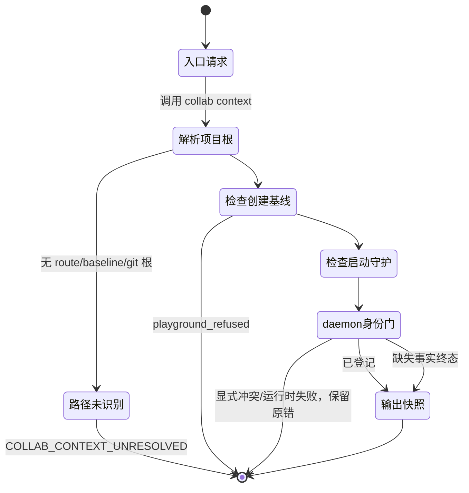

# Collaboration context state machine（按 DAGpipe 规范）

**本页是审计图，不是函数调用链。** 业务入口是唯一命令 `collab context`；
成功出口是 `state_snapshot`。缺失事实是本次调用的终态；显式冲突或运行时失败保留
原始错误并非零退出。重试以新的 invocation 开始，不允许在图上画回边。机器可校验的
SESE 图见 `docs/dagpipe/collab-context.graph.json`，可用 `dagpipe graph validate`
检查。

`state_snapshot` 同时是 Agent 的完整状态读取：除 bootstrap/identity/daemon/
subscriptions/master/operations 外，还含 `peers`/`peer_count`、`summary`/
`master_wake`/`subagents`/`pending_merges`、`env`，因此 Agent 不需要额外调用
`collab who`、`collab status --all`、`collab master status` 或 shell `env` 探测。
daemon 拥有身份选择、创建、恢复、更新、credential/binding/lease 持久化和完整快照。

## 边界与角色

本状态机覆盖 `collab context` 的完整 Agent 引导路径。它不覆盖 `sendmessage`、
`recv`、task 生命周期、master 派单，也不改变 daemon 自身的主控权。

| 角色 | 允许 | 禁止 |
| --- | --- | --- |
| Agent（普通 peer / master / managed-subagent） | 调用 `collab context`；读取 `state_snapshot`；只按 `requires_identity_update.required_fields` 用一次 `collab context --provide` 补充真实事实 | 手改 routes/journal/mailbox/token；选择或猜测 worker；运行身份选择/恢复或 status/route/init 探测命令；设置身份覆盖环境或 approval supplement |
| CLI `context` 包装 | 解析 canonical project root；检查/创建 baseline；检查/启动 daemon；自动观察 runtime facts；提交 typed `IdentityContext` 请求并显示快照 | 选择 worker；创建或加载 identity；mint credential；跑 CLI 侧 recovery 序列 |
| Daemon identity gate | 核验自动观察和 supplement 事实；选择、创建、恢复、更新身份；持久化 credential/binding/default lease；返回完整 snapshot 或精确缺失字段 | 把缺失事实变成 pending workflow；用 worker guess 或 approval 字段补足；把显式错误伪装成成功 |
| Server Register owner | 在既有 host 事务内校验并提交 route/binding | 接受未验证身份；创建双主；把业务 payload 当控制真源 |
| Human operator | 明确授权 `collab down`/`up`、reset、migration、master promotion；使用只读诊断 | 用诊断命令代替 Agent 的 `collab context` 流程；绕过 daemon 手改控制状态 |

## 事件表

| 事件 | 生产者 | 消费者 | 何时发生 | 状态效果 | payload 边界 |
| --- | --- | --- | --- | --- | --- |
| `context_request` | Agent / CLI | `resolve_context_root` | 调用 `collab context` | 启动引导 | 仅请求意图 |
| `route_hit` / `canonical_route_hit` / `cwd_baseline_hit` | CLI | 基线检查 | 项目根可解析 | 选择 canonical root | 项目根 |
| `path_unresolved` | CLI | Agent | 无 route、无 baseline、无 git 根 | 失败 `COLLAB_CONTEXT_UNRESOLVED` | 错误码 + 根 |
| `baseline_missing` | CLI | `scope::init` | baseline 缺失 | 创建 `.agent-collab` | 基线目录 |
| `playground_refused` | CLI | Agent | 在 playground 内创建 baseline | 失败且不写状态 | 错误码 |
| `daemon_unavailable` | CLI | `client::ensure_server` | socket 不可达 | 启动 daemon | daemon socket |
| `daemon_alive` | CLI | identity request | socket 可达 | 继续 | daemon socket |
| `facts_observed` | CLI adapter | daemon identity gate | 自动观察到 session/thread/endpoint/namespace 或 tmux candidate | 作为 typed facts 输入 | 仅 runtime facts |
| `facts_missing` | daemon identity gate | Agent | 实际缺失一个或多个必要事实 | `requires_identity_update.required_fields` | 仅缺失字段名与描述 |
| `facts_supplied` | Agent / CLI | daemon identity gate | 新 invocation 带 `--provide` | 核验真实事实 | 四个 scalar keys |
| `facts_conflict` | daemon identity gate | Agent | supplement 与自动观察事实冲突 | `IDENTITY_FACT_CONFLICT`，不改状态 | 原错 |
| `identity_reconciled` | daemon identity gate | Register / snapshot | 事实核验通过 | daemon 完成身份决策与持久化 | identity receipt 内部使用 |
| `registration_committed` | Server Register owner | snapshot | route/binding 提交成功 | 产生 registered snapshot | route/binding |
| `explicit_failure` | daemon / CLI | Agent | token、endpoint、route、transport 或持久化失败 | 保留原错并非零退出 | 原错 |
| `snapshot_emitted` | daemon | Agent | 成功或缺失事实终态 | 输出 `state_snapshot` | 完整 snapshot |

`facts_missing` 不是错误码伪装成功。它是同一次调用的明确终态：`registered=false`、
`identity=null`，并携带 `requires_identity_update`。`facts_supplied` 是新的
invocation，不是图上回边，也没有 pending token、TTL、challenge 或第二套 registry。

## 状态机


```mermaid
stateDiagram-v2
    [*] --> 入口请求
    入口请求 --> 解析项目根 : 调用 collab context
    解析项目根 --> 检查创建基线
    解析项目根 --> 路径未识别 : 无 route/baseline/git 根
    路径未识别 --> [*] : COLLAB_CONTEXT_UNRESOLVED
    检查创建基线 --> 检查启动守护
    检查创建基线 --> [*] : playground_refused
    检查启动守护 --> daemon身份门
    daemon身份门 --> 输出快照 : 已登记
    daemon身份门 --> 输出快照 : 缺失事实终态
    daemon身份门 --> [*] : 显式冲突/运行时失败，保留原错
    输出快照 --> [*]
```

### 转移表（状态 → 事件 → 下一状态 / 终点）

| 当前状态 | 事件 | 下一状态 / 终点 |
| --- | --- | --- |
| 入口请求 | `context_request` | 解析项目根 |
| 解析项目根 | `route_hit` / `canonical_route_hit` / `cwd_baseline_hit` | 检查创建基线 |
| 解析项目根 | `path_unresolved` | 失败 `COLLAB_CONTEXT_UNRESOLVED` |
| 检查创建基线 | baseline 已存在或创建完成 | 检查启动守护 |
| 检查创建基线 | `playground_refused` | 失败：拒绝在 playground 创建 baseline |
| 检查启动守护 | `daemon_alive` / `daemon_unavailable` | daemon身份门 |
| daemon身份门 | `identity_reconciled` + `registration_committed` | 输出快照 |
| daemon身份门 | `facts_missing` | 输出快照（`registered=false` + `requires_identity_update`） |
| daemon身份门 | `facts_conflict` / `explicit_failure` | 保留原错并非零退出 |
| 输出快照 | `snapshot_emitted` | 成功出口 `state_snapshot` |

## DAG 与数据契约（SESE）

机器图：`docs/dagpipe/collab-context.graph.json`（root-owned）。当前版本为
`appsdk-collab-context` 0.6.0，拓扑是一条 6 节点链：


```mermaid
flowchart LR
    S[context_request] --> R[resolve_context_root]
    R --> B[ensure_baseline]
    B --> D[ensure_daemon]
    D --> I[identity_gate]
    I --> E[env_view]
    E --> O[emit_snapshot]
```

ARC 契约：

| ARC | schema | 语义 |
| --- | --- | --- |
| `context_request` | Object | 唯一入口；仅携带请求意图 |
| `resolved_scope` | Object | 已解析 canonical project root |
| `baseline_ready` | Object | `.agent-collab/` 基线就绪 |
| `daemon_ready` | Object | daemon socket 就绪 |
| `identity_result` | Object | daemon 身份门结果：已登记 snapshot、缺失事实终态或显式失败 |
| `env_projection` | Object | 过滤后的 shell 环境子集（凭据形状的键已丢弃） |
| `state_snapshot` | Object | 唯一出口；含完整项目、身份、daemon、subscriptions、master、peers、tasks、worktrees 和 env 投影 |

身份输入是 typed `IdentityContext`：

```json
{
  "op": "IdentityContext",
  "facts": {
    "session_id": "optional caller session",
    "thread_id": "optional caller native thread",
    "endpoint": "optional unix:///absolute/socket",
    "namespace": "optional codex_app or codex_tui",
    "tmux": null
  },
  "project_context": {
    "app_scope_id": "appserver-cli",
    "project_scope": "/canonical/project",
    "canonical_root": "/canonical/project"
  }
}
```

`IdentitySupplement` 只含四个 optional, non-empty string 字段：`session_id`、
`thread_id`、`endpoint`、`namespace`。unknown/duplicate/empty 字段被拒绝；supplied
值与自动观察值不一致是 `IDENTITY_FACT_CONFLICT`，不是 override。supplement 不接受
`worker_id`、token、approval、generation、binding、project scope、transport 选择或
伪造的 tmux ownership。没有手动的身份覆盖变量。

缺失信息响应是 invocation-local 终态，不是 durable workflow：

```json
{
  "ok": true,
  "snapshot": {
    "registered": false,
    "identity": null,
    "requires_identity_update": {
      "required": true,
      "reason": "IDENTITY_INFORMATION_REQUIRED",
      "required_fields": ["session_id", "thread_id"],
      "field_descriptions": {
        "session_id": "Current runtime session identifier",
        "thread_id": "Current native thread identifier"
      },
      "action": "collab context --provide '<JSON containing required_fields>'",
      "requires_approval": false
    }
  },
  "identity_receipt": null
}
```

`required_fields` 由 daemon 按真实缺失值计算，示例不是固定列表。完整 verified tmux
candidate 在未选择 AppServer endpoint 时无需额外字段；选择 AppServer endpoint 时，
其 namespace/session/thread 必需。可用值不得重复请求。没有候选时，缺失的 AppServer
事实会按需请求。DSH 继续走既有 gateway Register 协议，不新增 CLI gateway 猜测。

成功响应是 `{ok:true,snapshot:<handle_context result>,identity_receipt:<Identity>}`。
receipt 只供 daemon 和 immediate authenticated operation 使用；CLI 不显示 token，
不把 receipt 写入 snapshot、message body、metadata、debug log 或 business payload。

## 节点 owner 映射

| 语义节点 | graph operator | Handler / Source |
| --- | --- | --- |
| 解析项目根 | `appsdk.collab_context.resolve_root` | `resolve_context_root` / `collab/src/main.rs` |
| 创建基线 | `appsdk.collab_context.ensure_baseline` | `scope::init` / `collab/src/scope.rs` |
| 启动守护 | `appsdk.collab_context.ensure_daemon` | `client::ensure_server` / `collab/src/client.rs` |
| daemon 身份门 | `appsdk.collab_context.identity_gate` | daemon `IdentityContext`；identity resolver；既有 ProjectRuntimeManager Register transaction；`handle_context` snapshot |
| 环境投影 | `appsdk.collab_context.env_view` | `context_env_view` / `collab/src/main_context.rs`；只取 `HOME`/`USER`/`LOGNAME`/`CARGO_HOME` 与 `COLLAB_`/`APPSDK_`/`CODEX_` 前缀，名字含 TOKEN/KEY/SECRET/PASSWORD/CREDENTIAL 的键一律丢弃 |
| 输出快照 | `appsdk.collab_context.emit_snapshot` | `handle_context` / `collab/src/server/mod.rs` |

## 变更边界

- Agent 只执行 `collab context`；缺事实时只执行一次 factual supplement
  `collab context --provide`，且只含 `session_id`、`thread_id`、`endpoint`、
  `namespace`。
- Agent 不运行身份选择/恢复或 status/route 探测命令，也不设置身份覆盖
  环境或 approval supplement。
- pane 冲突（陈旧 claim，或来自其他 worker/项目的 claim）由 daemon 在 `collab context`
  内默认顶掉；agent 不参与裁决，也不需要第二条命令。一个 pane 在 host 范围内只有一个
  binding，后注册者取胜。
- `collab init` 不是 Agent 的默认入口，也不是第二套身份算法：它与 `collab context`
  共用同一 daemon 身份门（`identity_gate`），保留为既有 AppSDK init 消费者的入口。
- master 权威的转移是一条独立命令：`collab master promote --approval "<user text>"`，
  无显式用户批准时不触碰 master 权威。
- 只读诊断保留：`collab who`、`collab status --all`、`collab worker status`、
  `collab route resolve`、`collab master status`。
- 人类授权操作保留：`collab down`/`up`、reset、migration、master promotion 和
  delegation。它们不替代 daemon 的身份决定。
- 不修改 daemon 派单、task、mailbox 数据模型；不把 tmux/AppServer 作为可替换
  fallback；不从日志、snapshot 或 payload 重建控制状态。

## Agent-facing rule

只执行 `collab context` 一次；线程/会话变化、daemon 重启或身份信息缺失时再次执行
`collab context`。若 snapshot 带 `requires_identity_update`，读取
`required_fields`、`reason`、`action`、`exact_error`，并只在 action 为 factual
supplement 时用一次 `collab context --provide` 提供请求的真实字段。`registered`
与 `requires_identity_update` 才是判据；退出码 0 不代表身份已验真。显式冲突、token
拒绝、route/runtime/transport 失败保留原始错误，不 fallback、不进入 pending workflow。
