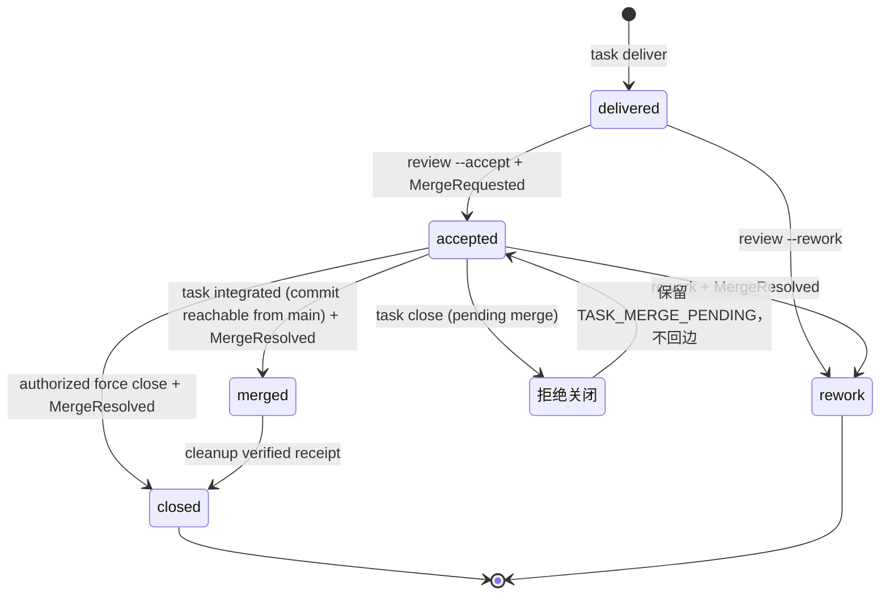

# Merge-pending state machine（按 DAGpipe 规范）

**本页是审计图，不是函数调用链。** 业务入口是 `collab task review --accept`；
成功沉没点是 `task closed`。失败终点显式报错，不允许回边。机器可校验的 SESE
图见 `docs/dagpipe/merge-pending.graph.json`（`dagpipe graph validate`）。

## 背景：被修复的开环

旧链路里 `task review --accept` 把任务置为 `accepted`，然后靠一条
`collab sendmessage` 通知 master merge。master 忙时这条消息只是一条普通通知，
没有任何持久 obligation，也没有 close 门禁，所以 merge 会被遗忘，任务停在
`accepted`。这是开环：通知的消费者（master）不在闭环里，且没有失败终点。

## 单源单汇

| 角色 | 唯一 owner | 说明 |
| --- | --- | --- |
| merge obligation 真源 | daemon journal (`Event::MergeRequested` / `MergeResolved`) | 不是聊天消息，不是 master 记忆 |
| 登记触发 | `handle_task_review` 的 accept 分支 | 与 `accepted` 状态同一事务提交 |
| 解除触发 | `handle_task_integrated` / rework / cancel / authorized force close | 与对应状态转移同一事务提交 |
| 关闭门禁 | `handle_task_close` | pending 未解除时返回 `TASK_MERGE_PENDING` |
| 提醒投影 | `collab context` / `collab status --all` / `appsdk longhorizon show` / master idle wake | 只读投影，不写第二份真源 |

## 事件表

| 事件 | 生产者 | 消费者 | 何时发生 | 状态效果 | payload 边界 |
| --- | --- | --- | --- | --- | --- |
| `review_accept` | task owner 或 live master | daemon | `task review --accept` | `accepted` + `MergeRequested` | task id、evidence |
| `merge_pending_notice` | daemon | live master | 登记同一事务 | durable direct-message `merge-pending:<task>` | task id、owner |
| `idle_wake` | keepalive/timer | live master | master idle 且有 pending | body 含 `pending_merges=` | 只读 |
| `integration_recorded` | task owner 或 live master | daemon | `task integrated --commit` 且 commit 可达 main | `merged` + `MergeResolved` | commit、evidence |
| `rework` | task owner 或 live master | daemon | `review --rework` 或 accepted→rework | `rework` + `MergeResolved` | evidence |
| `force_close` | 授权方 | daemon | 授权 force close | `closed` + `MergeResolved` | reason |
| `close_blocked` | daemon | caller | pending 未解除时 close | 失败 `TASK_MERGE_PENDING` | task id、rule |

## 状态机

## 终点检查

| 终点 | 检查方法 |
| --- | --- |
| merge obligation 持久 | 重启 daemon 后 `collab status --all` 仍含该 task id |
| master 可见 | `collab context` 的 `operations` 含 `merge_pending` |
| 长程可见 | `appsdk longhorizon show` 的 `待合并` 区块列出该 task |
| idle 提醒 | master idle wake body 含 `pending_merges=<task>` |
| close 门禁 | pending 期间 `task close` 返回 `TASK_MERGE_PENDING` |
| 正确解除 | `task integrated` 后 `pending_merges` 不再含该 task，且可 close |

## 失败终点

| 失败 | 语义 | 处理 |
| --- | --- | --- |
| commit 不在 main | `TASK_INTEGRATION_COMMIT_MISMATCH` | 先真正 merge，再记录 |
| pending 期间 close | `TASK_MERGE_PENDING` | 由 master 完成 merge 与 integrated |
| review rework | obligation 显式解除 | 回到 `rework`，不残留 pending |
| 授权 force close | obligation 显式解除并留 reason | 审计可查 |
