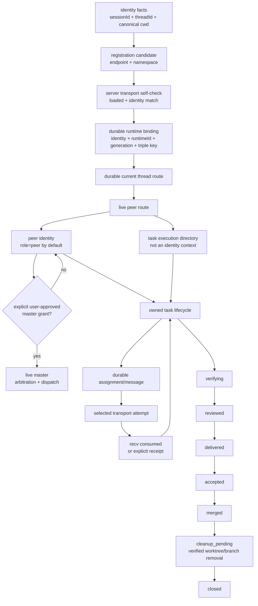

# collab workflow

This project uses the local `collab` daemon for multi-agent coordination.
The source and build truth lives in the AppSDK repository's `collab/` directory;
the installed independent binaries are `~/.cargo/bin/collab` and
`~/.cargo/bin/collab-mcp`. From an AppSDK checkout, use
`scripts/install-global-collab.sh`; do not build a second copy from an external
Collab checkout.

The daemon is detached. Normal commands may start it when no explicit `DOWN`
marker exists. `collab init` creates the global `~/.collab` persistence directory,
so old projects need no manual repair. Use
`collab down` only for an explicit stop; use `collab up` to clear that stop and
start it again. Never start a second daemon.
Existing projects migrate through `collab migrate inspect`, `plan`, `apply`,
controlled daemon upgrade/restart, identity rebind, and `verify`;
deleting `~/.collab`, editing JSON state, clearing mailboxes, copying
tokens, mixed runtime writes, and guessing thread identity are deprecated.

## Runtime boundary

- Every peer registration is admitted by the server after transport
  self-check. App Server is the only supported transport; a registration that
  cannot verify a live native route fails explicitly.
- Registration creates or refreshes one reusable default `direct-message`
  lease with a bounded 600-second TTL; inspect its current status and expiry
  with `collab notify status`.
- App Server delivery means the native queue accepted a bounded preview; it is
  not execution, read, or reply.
- Server state, journal, and mailbox are durable truth; a failed wake cannot
  roll back state or fabricate success.
- The runtime is part of the worker identity boundary, not a task preference.

## Closed DAG

The runtime is a directed acyclic graph. A peer identity is bound to the
canonical project root, the host sessionID, and the App Server threadID. A
Git worktree is only a task execution directory; it is not an identity context
and cannot select or reuse the main route. Terminal, model name, and mailbox
are not identity keys.



The graph is closed only when every edge has a durable fact and an explicit
failure state:

- **Identity and route:** `(sessionId, threadId, canonical project root)` is
  verified by the host and App Server, persisted in the runtime binding, and
  required for route resolution. A worktree path, process memory, and the
  current model name never select or rewrite identity.
- **Rebind:** replacing a binding's `(sessionId, threadId)` writes a durable
  tombstone for the old pair before the new route becomes current. The
  canonical project root remains part of the identity contract; a different
  cwd is rejected rather than treated as a rebind. The tombstone carries the
  old identity/runtime/binding and a typed `reboundTo` binding; route
  resolution reports `SESSION_THREAD_BINDING_STALE` with that replacement in
  the error text instead of treating the old address as unknown.
- **Worktree:** a task may bind one clean `./playground/<short-slug>` worktree,
  but the binding is task execution state. Identity lookup, registration,
  recovery, and master promotion run from the canonical project main tree;
  `collab context` from a worktree fails closed because its cwd does not match
  the registered route. Entering, leaving, relocating, or removing the
  worktree does not change the peer's identity, role, parent, or route.
- **Peer/master:** a recorded identity without a live verified route is not a
  live master. Initial master authority requires an explicit user-approved
  promotion; later delegation requires the current live master. Rebind preserves
  role and task relations, but a dead transport cannot exercise master
  authority.
- **Notification:** the durable mailbox is the loss-recovery record, not the
  timely transport. A notification edge closes only after a live subscription,
  one durable attempt, selected-transport acceptance, and `recv` consumption
  (or an explicit receipt where the contract allows one). `subscribed-not-sent`,
  `unknown`, `absent`, `thread-lost`, and `identity-mismatch` are explicit
  failures, never mailbox-only success.
- **Task:** assignment is durable before notification. Ownership is bound to
  the peer identity, while the worktree is a separately declared resource.
  Delivery, review, integration, cleanup verification, and close are distinct
  durable milestones. A task is not closed until its worktree and branch are
  cleanly removed or an authorized force-close records an auditable unverified
  cleanup receipt.

### Failure and legacy recovery edges

Every failure below keeps the existing journal and mailbox facts. Do not edit
route, binding, task, or mailbox JSON by hand.

| Failure | Required recovery |
| --- | --- |
| Missing `sessionId`, `threadId`, or canonical cwd | Obtain and verify all three host facts, then explicitly rebind the same identity and persisted `runtimeId`; never synthesize one key from another. A first registration may derive `runtimeId` once, but a rebind must reuse the registered value. |
| Triple-key mismatch | Preserve the old binding and return `SESSION_THREAD_BINDING_MISMATCH` or `ROUTE_RESOLVE_INVALID`; fix the host binding and re-register from the canonical project root without creating a replacement identity. |
| Old address is tombstoned | Read `reboundTo`, use the current `(sessionId, threadId)`, and never revive the old route. |
| Host route commit outcome is uncertain | Preserve both journals, restart the affected daemon from the reviewed AppSDK main binary, and replay. Do not guess which journal won. |
| Registration publishes worker/route facts but the host route fails | When the failure is definite, restore the exact previous `WorkerRec.transport`, all notification subscriptions owned by that worker, runtime binding, and master grant. For a first registration, remove the failed worker and its subscriptions. Keep the new state only when publication is ambiguous and replay resolves it. The old thread must remain resolvable or the operation must fail with an explicit recovery instruction. |
| A legacy binding has only `threadId` | Replay fails closed with `SESSION_THREAD_BINDING_MIGRATION_REQUIRED` and the affected identity/thread. Obtain the host `sessionId`, then perform an explicit rebind of the same identity and persisted `runtimeId`; never infer the session from the thread or edit the journal. |
| A worktree-local `.agent-collab/` is missing | This is normal. Run `collab context` and `collab master status` from the canonical project main tree; do not initialize, register, or resolve identity from the worktree. |
| A legacy master record has no live route | Treat it as non-live. Do not transfer or infer master authority; require the explicit promotion/delegation path. |
| Only a mailbox copy exists | Keep it as durable recovery data, but do not claim transport delivery or consumption. Restore a live route and replay one bounded notification. |
| Task worktree was already removed | Inspect the durable cleanup receipt and branch ancestry. If cleanup is unproven, keep the task in the explicit cleanup/force-close path; never mark it closed by assertion. |

## Session and thread recovery

An App Server registration carries three distinct verified facts: the
host-provided `sessionId`, the native App Server `threadId`, and the canonical
project cwd. They are persisted together in the runtime binding and must all
match during route resolution. Missing, empty, or mismatched values fail
closed; no key may be inferred from another, from a model name, or from
historical routes.

When a session or thread changes, the peer performs an explicit rebind with the
same stable identity, `bindingId`, and persisted `runtimeId`; only the
endpoint generation advances. A new registration derives `runtimeId` once from
the first verified transport and must never derive a replacement from a later
session or thread. The previous `(sessionId, threadId)` address becomes a
read-only tombstone and the new pair becomes current. Role, parent, task
relations, `messageId`, `attemptId`, and historical receipts are preserved. A
daemon restart must replay the same current pair from durable facts; process
memory is not a recovery input; the canonical cwd must be re-presented and
matched, not inferred from a worktree.

Recovery errors are actionable and must not be repaired by hand:

- missing `sessionId` or `threadId`: obtain and verify both from the host, then
  rebind the same identity;
- mismatched pair: preserve the old binding, fix the host binding, and
  re-register; never overwrite the old binding or create a replacement
  identity;
- tombstoned old address: read the `reboundTo` pair from the exact
  `SESSION_THREAD_BINDING_STALE` error and use that current address; never
  revive the old pair;
- uncertain host-route commit: preserve both journals, restart the affected
  daemon, and replay; a replay inconsistency is reported as
  `HOST_ROUTE_REPLAY_FAILED`, so do not edit route or binding state manually.

## Roles

- Every registered identity is an equal `peer`; there is no inferred master
  from first registration. A host agent root is not Collab master.
- `collab init` and peer registration never create a master. A master exists
  only when a registered peer has a live transport and was assigned by
  user-approved self-promotion or live-master delegation. A recorded identity
  with a dead transport is not a live master.
- If a live master exists, other peers cannot promote; only that master may
  `collab master delegate <peer>`. If no live master exists, a peer may
  `collab master promote --approval "<user text>"` itself after explicit user
  approval. Master authority is arbitration only; it does not take another
  peer's task. Independent peers may temporarily decline a master
  collaboration invite to protect their own task; managed subagents must obey
  the master.
- Each peer self-registers one task and owns its full worktree, test,
  integration, main verification, push, cleanup, and resource lifecycle.
- Task owner, resource holder, integration lease, and daemon operator are
  scoped capabilities, never durable identity roles.
- Peers send no normal progress reports. P2P communication is limited to
  durable resource occupancy and release coordination.

## Task lifecycle

```
working -> verifying -> reviewed -> delivered
        -> owner sync/verify/integrate -> merged -> cleanup_pending
        -> cleanup_verified -> closed
        -> rework -> working
blocked -> bounded waiting -> resource release/timeout -> owner recheck
```

Task records use a fixed shape:
`id / owner / feature_id / worktree_path / branch / base_commit / priority /
 status`. Normal statuses are `working`, `blocked`, `waiting`, `verifying`,
 `reviewed`, `delivered`, `rework`, `merged`, `closed`, and `cancelled`.

## Common commands

```sh
collab up                         # clear explicit down and start daemon
collab down                       # explicit stop; disables auto-restart
collab who                        # registered peers + local state projection
collab task status [task-id]      # durable task registry
collab notify methods             # discover opt-in notification methods
collab notify subscribe --event direct-message --ttl-seconds 600
collab notify status
collab context                    # read-only authoritative state snapshot
collab master status              # live master, or recorded-but-dead identity
collab master promote --approval "<user text>"
collab master delegate <peer>     # live master only
collab task register <id> --feature <feature-id> --worktree <path> \
  --branch <branch> --base-commit <sha> --priority p2
collab task wait <id> --for <blocking-task>
collab task deliver <id> --evidence "commit=<sha>; gates=pass" --worktree <path>
collab task block <id> --next "blocked: <evidence and next condition>"
collab task update <id> --status merged
collab task close <id>            # owner; verifies merged/clean, releases claim
```

Peers never share worktrees. Each task owner starts from latest main in one
declared clean `./playground/` worktree, implements and tests, commits the exact
change set, syncs latest main again, verifies the candidate, acquires a short
integration lease, merges the exact commit to main, verifies and pushes main,
then closes the task to remove only its clean merged worktree/branch and persist
a cleanup receipt. A bound worktree is a mandatory cleanup obligation;
`delivered`/`merged` are not cleanup completion, and a task with a pending or
unproven cleanup cannot become closed or pass audit. Delivery is an owner-local
durable milestone and sends no peer notification. `/goal`
delegation and interactive task recognition are intentionally deferred.

## Message handling

On a notification, use its id and abbreviated subject to weigh urgency against
the current task. Query durable state before acting when the notice is relevant.
`collab sendmessage` requires `--subject` and accepts only explicit coordination
or asynchronous-result notices. Never type peer messages directly; the daemon
sends through the selected transport. After the receiving Agent registers a
finite subscription, the daemon may send one id,
abbreviated subject, safe one-line original body preview, and final submit key
as one submit through the server-selected transport. App Server uses
`thread/queue/add`. The direct-message lease is reusable until expiry; resource,
deadline, and async-result subscriptions remain one-shot.

`collab inbox` and `collab msg <id>` query the durable local mailbox after a
transport is unavailable; mailbox state remains authoritative.

## Notifications and waits

There is no periodic continuation. Agent-owned subscriptions are exact-event,
exact-subject, and finite. Direct-message delivery is serialized and reusable
until expiry; other subscriptions are one-shot. No registration, absent,
unknown, working, expired, cancelled, consumed, or exhausted message produces
transport input. Every wait stores waiter, blocking task owner, reason, deadline,
resume events, and P2P escalation. Timeout changes state without unsolicited
messages; resource release notifies only an exact active subscriber.
