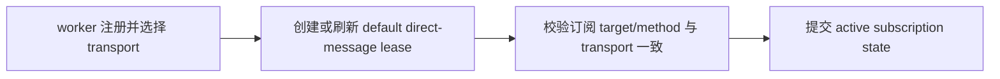
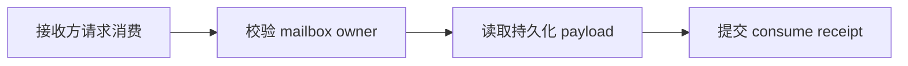

# Collab AppServer 通知与恢复 DAG

## 目标

关闭当前通信 DAG 的 AppServer route 失效开口：旧 thread 已死时，daemon 自己根据
稳定 `session_id` 找回同 session 的 live thread，通过既有 durable registration
路径重新绑定 route，并只重试当前消息一次。

本图是设计真源，不代表当前实现已经接通。实现只能补齐图中缺链，不得让 tmux、
peer、CLI、master 或用户手工恢复成为主路径。

## 基础能力确认

| 能力 | 真源 | 结论 | 使用边界 |
| --- | --- | --- | --- |
| daemon 选择 transport | `WorkerRec.transport` / `SelectedTransport` | 可用 | daemon 是发送前 transport owner；peer 不能手改 route |
| default direct-message lease | `default_direct_message_events` | 可用 | registered peer 应保持可唤醒；显式 unsubscribe 才是停止条件 |
| durable mailbox | `Event::Sent` / `msgs` | 可用 | mailbox 只承载 payload，不替代通知 |
| subscription lifecycle | `NotificationSubscribed` / `NotificationSuppressed` | 可用 | 注册 owner 创建或对齐 default lease；只有 owner 显式 unsubscribe 可停止当前生命周期 |
| AppServer immediate wake | `immediate_notify` | 可用 | success 只代表 AppServer accepted，不代表消费 |
| AppServer queued wake | `queued_notify` | 可用 | 同样只证明 native accepted |
| thread not found 判定 | `AdapterError::RouteUnavailable` | 可用 | 只有 route unavailable/thread missing 可触发 repair |
| live candidate 发现 | Codex `thread/list` | 可用但需新增封装 | `thread/list` 无 sessionId filter；需分页、cwd filter、本地过滤 |
| candidate 可选投递字段 | Codex `Thread.canAcceptDirectInput` | 可用 | 只作为可投递性判断，不能替代 thread identity |
| durable rebind | `RegisterWorker` / `GlobalCurrentThreadRouteSet` | 可用 | 复用既有注册和 current route commit 路径 |
| 消费 receipt | `collab recv` | 可用 | 独立闭环，不从 notification accepted 推断 |

关键限制：AppServer `thread/list` 的 `sessionId` 在返回的 thread 对象内，不是查询参数。
daemon 必须分页读取，按旧 thread 排除、同 `session_id` 过滤、同 cwd 过滤，并要求候选唯一。
多个候选、无候选、旧候选或查询失败都 fail closed，不切 tmux。

## 通知 DAG 与独立 route repair DAG

```mermaid
flowchart LR
  A[收到持久化通知请求] --> B[解析注册 worker 和当前 transport]
  B --> C[恢复 default direct-message lease]
  C --> D[按已绑定订阅尝试 AppServer 通知]
  D --> E[分类通知结果并决定是否 repair]
  E --> R[进入 route repair 图]
  R --> F[按 session_id 查询 live thread]
  F --> G[验证同 session 候选唯一]
  G --> H[通过既有注册路径 durable rebind]
  H --> I[刷新 worker transport 和订阅]
  I --> J[对当前消息只重试一次]
  J --> Z[提交 terminal notification receipt]
```

`appsdk-collab-appserver-route-repair@0.2.0` 是独立 SESE 图：入口为 `route_unavailable_failure`，出口为 `notification_result_receipt`。它只在已经证明的 route unavailable/thread missing 之后进入，不再要求首次成功通知也必须经过 repair。

主通知图的 terminal receipt 只能是：

- `notification_accepted`：原生 AppServer 接受第一次或唯一一次重试；
- `route_repair_required`：无候选、多候选、候选不可投递或 rebind 失败；
- `notification_delivery_failed`：非 route 类失败。

route repair 图内的节点是严格线性闭环；repair 内部的 no-candidate、ambiguous、old-candidate、discovery incomplete、rebind failed、retry failed 都归入同一个 terminal receipt 类型，不能静默回退到 tmux。

## 设计态 compile gate

`docs/dagpipe/manifest.json` 是 AppSDK DAG 设计清单，包含 contracts 里的两张可执行图和 docs 里的 Collab 设计图。`appsdk dagpipe validate` 会对每张图执行 SESE 拓扑检查、operator registry 注册，以及 `compile(graph, &registry, &capabilities)`。这里证明的是图拓扑和 owner/operator 注册边界，不证明 Collab runtime 已实现；route discovery、rebind、lease refresh、retry 和消费 receipt 仍以后续实现验证为准。

## 订阅生命周期 DAG

单源：`worker_transport_registration`。
单汇：`active_subscription_state`。

daemon 是 default lease 的唯一 owner。注册时或 route rebind 后，订阅必须重新指向
当前 worker transport；订阅与 transport 不一致是发送前 fail-closed 条件，不能静默
变成 mailbox-only。显式 unsubscribe 属于后续生命周期 epoch 的停止条件，不进入当前
registration-to-active 的 repair 回边。

通知图的 retry 只允许由
`rebind_current_route` 的新 route 触发一次，不能回到通用发送节点无限循环。

## 消费 DAG

这个图与通知图独立：通知 DAG 不知道消费是否发生，消费 DAG 不等待通知结果，也
不修改订阅、route 或 transport。mailbox 缺失订阅时仍保留完整 payload，但发送结果必须显式
`repair_required`，不能伪装成成功通知。

## 实施映射

| 语义节点 | owner | 当前状态 | 缺口 |
| --- | --- | --- | --- |
| 解析注册 worker 和当前 transport | Collab daemon | 已实现 | 无 |
| 创建或刷新 default direct-message lease | Collab daemon | 已实现 | route rebind 后必须刷新订阅 |
| 校验订阅与 transport 对齐 | Collab daemon | 已实现 | 不对齐时必须 fail closed，而不是 mailbox-only |
| 尝试 AppServer 通知 | AppServer adapter | 已实现 | 无 |
| 分类 route 失败 | AppServer adapter + daemon | 部分实现 | 只在 `RouteUnavailable` 触发 repair |
| 查询 live session thread | AppServer adapter | 缺失 | 新增 `thread/list` candidate discovery |
| durable rebind | Collab registration owner | 路径可用 | daemon 在 notification failure 后复用 |
| 单次 retry | daemon notification owner | 缺失 | 只在 repair 成功后调用一次 |
| 提交 consume receipt | Collab mailbox owner | 已实现 | 独立，不合并到通知图 |

## 失败终点

- 无同 session live thread：`APPSERVER_ROUTE_REPAIR_NO_CANDIDATE`，`repair_required=true`。
- 多候选：`APPSERVER_ROUTE_REPAIR_AMBIGUOUS`，不得猜测较新 thread。
- 候选仍是旧 thread：`APPSERVER_ROUTE_REPAIR_INVALID_CANDIDATE`。
- `thread/list` 不可用或分页不完整：`APPSERVER_ROUTE_REPAIR_DISCOVERY_FAILED`。
- rebind 失败：保留原失败，并记录 `repair_required=true`。
- retry 后仍失败：保留原失败，不再循环。

## 必测场景

1. 旧 AppServer thread not found，同 session 有唯一 live thread：daemon 自动 rebind，
   notification retry accepted。
2. 同 session 无 live thread：保持 route repair required，不切 tmux。
3. 同 session 多个候选：fail closed，报 ambiguous。
4. 候选仍是旧 thread：拒绝重绑。
5. rebind durable：daemon replay 后 current route 指向新 thread，旧 route 记录保留。
6. notification accepted 但无 recv：consumption 仍缺失；只有 recv receipt 才算消费。
