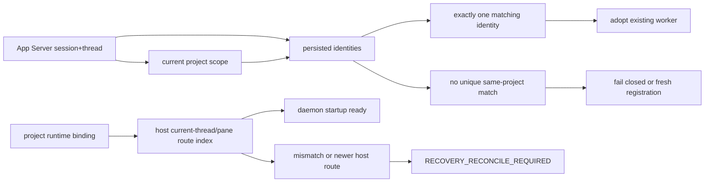

# Collab daemon lifecycle audit and automatic maintenance DAG (2026-09-29)

This branch closes two daemon-owned recovery gaps that can make Collab lose a
live worker route or identity.

First, App Server identity recovery is scoped by exact Codex session, thread,
and project. A unique persisted identity for the same live thread and project is
adopted instead of minting a new peer ID. A same thread in another project is
not adopted. Fresh registration persists project scope so later recovery can
match it.

Second, daemon startup reconciles host and project route indexes before serving
requests. The project runtime owner remains the source of truth for runtime
bindings; startup can refresh a lagged host pane index to that same durable
principal. A newer host route or a true principal mismatch still fails closed.

Continuous daemon crash recovery remains a separate supervisor/desired-state
track and is not claimed here.

## SESE DAG



Single sources:

- persisted identity set keyed by session, thread, and project scope;
- project runtime binding as owner of the durable route.

Single sinks:

- adopted identity with persisted project scope;
- startup-ready daemon route index or explicit reconcile failure.

Forbidden:

- waking a stale thread/pane address;
- leaving a pending direct-message wake binding bound to an old non-default
  subscription after the default lease is repaired;
- silent mailbox-only fallback for a transport mismatch;
- manual route/journal/token edits;
- restarting to an old endpoint;
- adopting a cross-project identity for a same-session/thread lookup;
- admitting a newer host route from a lagged project journal.

## Implementation closure

- App Server identity lookup computes the current project scope once, then
  filters persisted identities by exact session, thread, and project.
- Fresh App Server registration stores project_scope so the same live thread
  can be adopted later without manual re-registration.
- Cross-project identity reuse remains fail-closed; stale cross-project state is
  archived only through the existing rebind path.
- ProjectRuntimeManager::reconcile_same_pane_master_routes now reports a
  lagged same-principal host route as reconcileable instead of conflating it
  with a true disagreement.
- A newer host route remains fail-closed, preserving fencing semantics.

## Explicit non-goal

No LaunchAgent/desired-state supervisor is implemented in this branch. A live
Ping still does not prove automatic process restart after daemon crash/reboot.

## Acceptance

- targeted identity and host route registry unit tests;
- full single-threaded collab suite;
- independent architecture review PASS;
- installed binary version and SHA after build/install;
- collab up, collab context, route resolution, and live wake/receive evidence.

## Completion DAG

```mermaid
flowchart LR
  C[candidate source + tests] --> B[release build]
  B --> I[install to runtime path]
  I --> D[installed SHA equals candidate SHA]
  D --> M[controlled collab up + context]
  M --> CTX[collab context restores correct worker]
  CTX --> MCP[collab-mcp initialize succeeds]
  MCP --> LIVE[real send/wake/receive]
  LIVE --> R[independent architecture review PASS]
  R --> MERGE[commit, merge, push origin/main]
  MERGE --> CLEAN[cleanup worktree, playground, temp resources]
```



## Current-state DAG


## Plugin gap and repair plan

Gap 1: native Codex TUI or App Server recovery could create a new peer ID for
the same live Codex thread because project scope was not part of the automatic
App Server identity lookup.

Repair 1:

1. Compute the current project scope once for the active CLI app server.
2. Look up persisted identities by exact Codex session and thread.
3. Keep only identities with the same project scope; if unique, adopt that
   existing worker.
4. On first fresh registration, persist the current project scope so the same
   thread can be adopted automatically later.
5. Preserve fail-closed behavior when no exact match exists and when an App
   Server thread has no reliable persisted anchor.

Gap 2: daemon startup treated any host/project pane route disagreement as a
hard reconcile error, even when the host index was simply lagged behind the
project runtime owner.

Repair 2:

1. Split the startup reconcile check into two distinct failure classes:
   principal disagreement (fail closed) and lagged host generation
   (reconcile to the project owner).
2. Preserve the existing fence for a newer host route so a lagged project
   journal cannot overwrite a fresher host index.
3. Cover both classes with targeted host route registry tests.

## Goal prompt

```text
/goal
目标：完成 Collab daemon 身份自动恢复与生命周期交付，消除重启、pane/endpoint 变化后的 worker 身份丢失和无法通信，并合并到 origin/main。
范围与约束：仅修改目标项目内必要代码、测试和交付文档；使用现有外置 worktree；按 daemon 变更执行 rebuild、install、installed digest 验证、collab up、context、MCP initialize 和 live replay；禁止 broad kill、第二 daemon、手改 route/identity、绕过 hook 或清理他人资源。
依据：docs/design/collab-daemon-lifecycle-20260929.md 及目标 DAG：已审候选 -> 测试 -> rebuild -> install -> digest verified -> restart -> context -> MCP -> live replay -> review PASS -> merge/push -> cleanup。
验收：精确候选 SHA 与 main merge SHA；身份、回归和全量测试记录；候选 binary SHA 与 installed binary SHA 一致；restart 后 collab context 自动恢复正确 worker；MCP initialize 成功；真实发送/唤醒/接收证据；独立架构 review PASS；origin/main 回执；本任务 worktree、playground 和临时资源已移除。
直接执行本任务，不再为它生成一层提示词。
```
