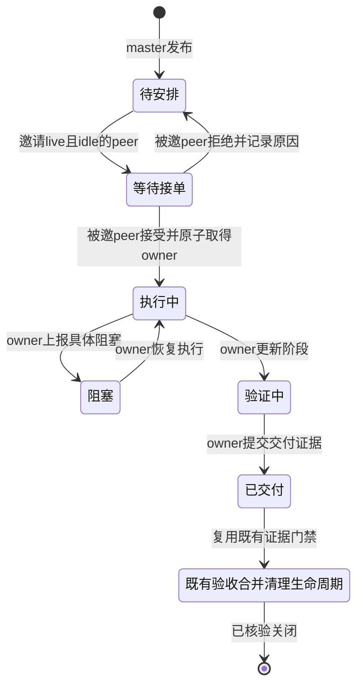

# Collab 执行任务板 v1

状态：已实现；候选提交 caf598d2218aedc9f17d9d776e0e07ad6f70db73（parent origin/main 68ef9c0fd42101797b9979de47c618efdcf57ba8），独立架构 review 无 P0/P1。阶段证据见 docs/design/collab-dashboard-run-notes.md。

## 用户已确认的契约

- 独立 AppSDK Web 任务板，不依赖 DSH GUI。
- master 发布项目任务、邀请 idle peer；peer 独立登记任务，也可以接受或拒绝邀请。一般不向有自己任务的 peer 派单。
- owner 更新自己的进度；发布者不因此拥有已接单 peer 的进度写权。
- subworker 是 parent 的内部执行细节；公共任务板、成员列表与 master/peer 通信不暴露它，不新增 subworker 管理。
- 本轮不扩展 spawn CLI。Codex TUI 是首要真实入口，DSH 复用同一协议；不修改另一个在研 worktree 或网关仓库。

## 入口与唯一 owner

Collab daemon 继续持有任务、身份、角色、邮箱和消费回执的唯一真源。CLI/MCP 与 DSH 是适配消费者，不复制状态机。Web 服务仅查询 daemon 当前项目的任务板投影，不读取 journal/日志重建控制状态，不自动 init/register/promote/up/down。

第一版 Web 是共享观察面，执行者通过 CLI/MCP 写入。浏览器不冒充 master/peer，不用下拉选择身份获取代理写权。真实 actor 来自原有认证注册路径。后续如需人类操作面，另行定义 operator 的授权，不把本期 API 变成任意身份代理。

现有 TaskRec 是唯一执行任务记录；新增 task board detail 仅持有标题、描述、交付/测试条件、版本及邀请信息，不再建第二套任务状态、owner 或进度字段。现有生命周期和证据继续使用 TaskRec/TaskLifecycleRecord/CleanupReceipt。

## 最小增量

1. `collab board show`：共享投影，只显示 master/ordinary peer；托管子执行者及其内部任务不输出。历史任务保留，只要其 owner 是公共 peer，防止失联任务从板上消失。暴露 status、owner、publisher、priority、next_step、更新时间、交付/review/integration/cleanup证据；输出不得泄漏 token、host credential、transport endpoint。
2. `collab board publish <id>`：仅 live master；必须提交标题、描述、交付条件和测试条件。TaskRec 在待安排状态，owner 暂为发布 master；待安排任务不占执行产能、不订阅执行 keepalive。
3. `collab board invite <id> --to <peer> --expected-revision <n>`：仅 live master，任务仍待安排。只能 ordinary peer。外部 presence 读证明 live/idle，锁内再次检查身份 binding 未变、无 active task、无其他有效邀请。邀请不转移 owner，不意味着开始执行。
4. `collab board respond <id> --accept|--decline --expected-revision <n>`：仅当前被邀请 peer。accept 再检查任务占用，原子转移 TaskRec.owner 并进入 working；decline 清除邀请，回待安排，保留原因和审计事件。拒绝不可取消原有任务。
5. `collab board update <id> --expected-revision <n> --status <allowed> --next <text>`：仅 owner，复用原有任务更新和状态门禁。现有 CLI/MCP 更新仍兼容；所有相关 TaskCreated/TaskUpdated 事件都会使 board revision 递增，因此旧界面更新可检测冲突。不得允许直接写 delivered/accepted/merged/closed 绕过证据。
6. `collab dashboard --port <port>`：只绑定 127.0.0.1；启动于显式当前项目。随机 capability 仅作为浏览器读板凭证，不授予 actor 写权。通过 URL fragment 传入，浏览器内存保存、用 header 发送，服务器不从 query/log 中取凭据。静态资源不含状态、token；daemon 不可达显示显式错误和旧数据标记，而非空任务假成功。使用正式 HTTP 库，不手写 HTTP parser。浏览器每 2 秒读取最新投影；第一版明确采用轮询，不宣称事件推送。

独立 peer 继续 `collab task register/update/deliver/...`；已有任务无需迁移，不强制 master 批准。可选的标题/条件可由 owner 通过 board detail 编辑补齐。公共板不提供 cancel/reassign/force-close按钮。

## 状态机

独立peer登记直接进入执行中；上述graph只治理一次操作请求，不把状态机循环误建为DAG环。失败、旧版本、身份不匹配、busy等均无业务状态修改；邀请目标失联后由发布master显式撤回邀请，不自动接管或重派；owner仍保留原任务。撤回邀请只允许等待接单状态，并以版本保护，不影响已接受任务。

## 通信闭环

仍走现有 Send/Inbox/Recv/ACK与App Server adapter。正文不进入控制metadata。派单邀请持久化任务变更和通知outbox在同一daemon提交，通知失败不撤销持久邀请、不报告已接受；响应携带任务和消息标识及通知状态。恢复不新增任意自动重试链。接受/拒绝是任务命令，不从消息正文猜。普通进度只更新板，不唤醒全员。邀请通知只面向目标peer；拒绝与交付通知面向发布master（已有交付不自动发消息的行为不暗改，可显式sendmessage）。没有可用route显式返回repair_required，不静默mailbox-only成功。

## DSH 边界

已读在研网关 `docs/COLLAB-DSH-CHANNEL-DESIGN.md`：其通道正在对齐message_id去重和enabled门禁，未把通道完整live验收当成既成事实。AppSDK main 已有TransportKind::Dsh。本期board不依据transport名称授予角色，不重写DshCandidate、admit、notify或网关队列。DSH插件可查询board、按认证peer调用相同命令；DSH未就绪不是Codex/Web主线的fallback或阻塞。验收中如无真实DSH入口，明确DSH live未验证。

## 变更边界

允许：collab/src 的协议、任务board模块、projection/reducer、CLI/MCP和dashboard入口；collab内静态web资源与测试；相关图、文档、skill工具说明。
禁止：appsdk治理语义、dagpipe内部、DSH原生agentteams、网关仓库、他人worktree、全局插件安装、peer/subworker spawn治理变更。

必须审计新状态在 task_resource_active/task_claim_held、keepalive、scheduler eligibility、compaction/replay、task accept provenance、scope admission中的影响。不能把本期邀请与旧scheduler任务识别成两套接单真源：保留合法来源区别，但共享最终owner验收和工作开始门禁。

具体并发准入：daemon中的公共执行者容量判定是唯一共享helper，既有registered_available_peer_for_admission候选选择、scheduler提交时的锁内重查、board invite与最终工作开始门禁均调用它。容量由既有未收口执行任务责任 + TaskRec处于invited且board detail.invited_peer命中当前peer的邀请预留派生，不新增另一份busy布尔或reservation表。同一个peer只能有一个有效邀请；既有scheduler不能穿透该预留再派assigned任务。peer仍可以在邀请期间自主登记自己的任务；这会使accept返回busy且不修改原任务，peer可以明确decline，master可以撤回旧邀请。它不自动取消邀请、转移owner或唤醒子执行者。

普通peer派单唯一入口：新派单只通过board publish/invite的完整交付/测试条件及expected-revision进入。旧SchedulerDispatch的输入缺少这些必要typed字段；选择ordinary peer后明确返回BOARD_INVITATION_REQUIRED，要求调用者使用board工具，不再创建assigned任务/提前转移owner，也不静默转去managed fallback。这是明确的旧接口行为调整，不伪造delivery/test条件或从body解析控制字段。已有scheduler request_id回执仍按原记录查询/恢复，不重新派单。既有普通peer的TaskAccept对board invitation必须转入同一accept事务；CLI补充expected-revision以保护新邀请（缺失则返回明确用法错误）。存量非board scheduler assigned保持历史owner归属，但accept也必须共用最终工作开始门禁：验证来源、scope、当前binding以及排除当前任务后的其他未收口责任，不能接受busy peer。存量普通peer可用新增TaskDecline命令拒绝assigned：只在尚未开始且无worktree/claim/证据时原子转owner回created_by并进入pending/记录拒绝；若已预绑资源则明确拒绝且要求发布者撤回资源义务，不暗中改资源owner。managed分支保留原有私有语义，不改spawn/parent或把子执行者输出到公共投影。

board待安排/等待接单新增状态必须在task_resource_active、task_claim_held、worker active_task和keepalive责任投影中排除；邀请占用只来自上述helper。board respond/TaskAccept只是同一事务的适配入口，不各维护状态。对已开始执行的board任务，进度更新复用既有handle_task_update，不允许publisher通过task update跳过accept。版本比较与任务更新必须在同一次锁内完成，不能check后unlock再调用旧handler。

资源转移门禁：pending/invited任务不能通过旧TaskRelocate/TaskWait/TaskDeliver/TaskReview/TaskIntegrated/TaskClose入口获得worktree、claim或生命周期证据；TaskUpdate不能直接进入working或任何执行阶段。publish/invite输入不接受worktree/branch/base_commit。accept必须验证该任务确无WorktreeBinding和生命周期/资源义务，之后仅owner可以按既有流程创建worktree。旧scheduler对ordinary peer预绑参数显式拒绝并要求accept后由owner绑定；managed路径不变。本期不做资源迁移。

版本/恢复真源：新增typed BoardTaskDetails记录title/description/conditions、revision、public_visibility、当前邀请(binding_id及endpoint_generation)、拒绝记录，不镜像TaskRec.owner/status/next_step。BoardDetailsChanged显式持久化完整记录；TaskCreated/TaskUpdated/TaskLifecycleUpdated/CleanupVerified通过reducer让已有detail的revision单调增加，且legacy无detail的任务首次创建/接入时生成初值。snapshot/compaction在任务和资源事件之后输出各detail的最终完整BoardDetailsChanged，恢复不重新计数。邀请及唯一message_id同一事务持久化，outbox/accepted/consumed仍由原Message事件持有；不重建另一个通知状态表。accept和withdraw锁内核对TaskRec状态、邀请目标、当前binding_id/generation、expected_revision；重新绑定导致旧邀请明确stale，master可withdraw再invite，不自动换目标。测试多次更新、待邀、拒邀/撤回后compact/down/up，owner/revision/邀请/预留/投递与消费状态等价。

可见性真源：每个任务的public_visibility作为typed board detail随creation记录，认证ordinary peer/master创建为public，managed创建为private；legacy replay只在创建事件当时可证明ordinary actor、且不存在managed来源时赋public，不能把未知身份默认公开。WorkerClosed不会删除已经持久的task visibility。managed child登记事件把属于该child的既存task detail设private；compaction保存最终detail值，不能按当前roster再计算成public。未知历史任务默认不公开，owner恢复并认证ordinary身份后可显式补齐detail；禁止operator替未知owner开启可见性。专用公共DTO白名单只含公开actor、公开task及其公开引用，不透传WorkerRec/role_brief/内部任务wait引用或嵌入对象。证据只显示owner主动提交的证据文本，路径不自动读取；若指向隐藏任务仅显示“内部依赖”，不暴露其id/actor。接受角色不影响已有task public标记。测试公共peer退场后task保留、managed退场隐藏、未知历史fail-closed、compact/restart保持等价。

## 可重复验收

开发黑盒：真实collab CLI+daemon与外部AppServer fixture贯穿公开协议（fixture不冒充真实TUI）。覆盖master发布/邀请、peer独立任务、accept/decline、busy拒绝、非owner拒绝、stale revision、daemon重启恢复、隐藏subworker、scope隔离、通知接受不冒充消费、existing deliver/review/integrated/close门禁。

真实验收：隔离Collab状态目录、独占AppServer endpoint，两台Codex TUI启动/注册；用户授权master晋升用于隔离测试项目；经Collab发送双向唯一marker，在目标TUI执行并生成消息绑定消费回执；CLI更新owner进度，浏览器读取相同任务。busy peer邀请拒绝，idle peer接单/拒绝都覆盖；daemon down/up后读取同一任务/邀请/回执。模型/凭据不可用则live节点不通过，保留精确错误，不用fixture替代。

浏览器验收：安装/稳定入口的dashboard，真实浏览器打开capability URL；任务列、成员、状态、owner、证据和阻塞一致；CLI变更可见；无凭证API拒绝、跨源/Host拒绝、恶意任务标题作为文本显示、daemon断开显示错误、托管子执行者不可见。用已安装camo工具，记录实际URL和截图；不启动替换DSH GUI服务器。

作者完成tests/install/digest/down/up/context/MCP initialize/live replay后，才独立架构review。精确候选绑定证据、更新latest origin/main重验受影响路径、集成push、核对远端、清理本任务worktree和隔离进程。

## 能力确认与未完成

已确认：外置盘存在；独占worktree clean且等于最新origin/main；Cargo/Codex/tmux/dagpipe/camo安装；现有通信fixture测试可复用；AppServer真实双TUI路径有历史证据，但本次必须重新验证。
已确认基础入口：当前Codex0.160.0通过本轮隔离AppServer unix endpoint接入真实TUI，显式--cd测试目录后模型gpt-6.1-sol响应DASHBOARD_PEER_A_READY；本地OAuth已登录，未修改全局provider；camo实际创建/关闭本轮独占tab成功（不停止persistent profile）；axum0.8.8可从registry取得；现有Collab公开通信fixture通过3/3；dagpipe图校验通过。独立设计复审ba1f22ec已PASS五项修订，准入依据见run notes。

这些只确认入口/工具/依赖可用，不代表新功能或完整通信live已通过。作者实现后仍须当前候选的真实双TUI收发与消费证据、browser任务板、installed digest/context/MCP initialize及明确批准的适用runtime维护窗口；共享服务不得自行中断。
