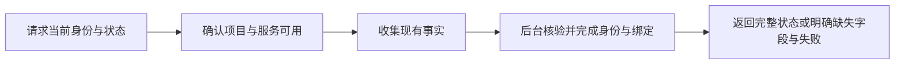
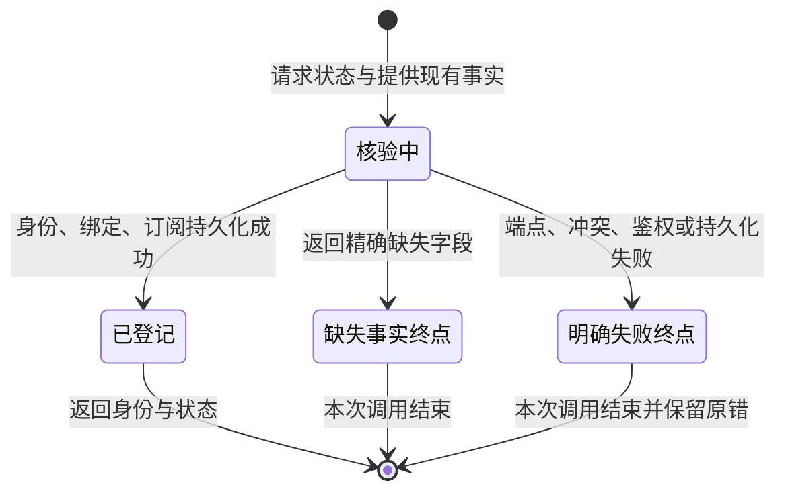

# Collab identity: daemon ownership, minimum facts

## Contract

Agent runs `collab context`. CLI automatically observes runtime facts. Daemon
establishes, identifies, restores and updates the identity, binding and default
lease. CLI neither selects workers nor creates credentials nor runs recovery.
When facts are absent, daemon returns exact `required_fields`; agent supplies
those real facts once with `collab context --provide '<JSON>'`. The remaining
work completes in that daemon invocation. No worker-id hunt or status/init/route
sequence. Genuine conflicts and runtime failures stay explicit.

Project root resolution stays automatic: a linked Git worktree resolves to
its exact registered canonical main root, including worktrees outside that
root's directory. Root resolution reads Git and registered project routes; it
does not load or select a worker identity.

This implements the original user contract. The concurrent draft is retained
in the task run directory as evidence; its extra init recovery entry and five
questions are superseded. No project decision is delegated to those questions.

## Exact control schema

`IdentitySupplement` is JSON with only four optional, non-empty string fields:
`session_id`, `thread_id`, `endpoint`, `namespace`. Serde rejects unknown and
duplicate fields. Values must satisfy the existing native-id/endpoint adapter
contracts. A supplied value differing from an automatically observed value is
an explicit `IDENTITY_FACT_CONFLICT`, not an override. Missing optional values
are omitted. A supplement cannot supply worker_id, token, approval, generation,
binding, project scope, transport selection, or fabricated tmux ownership.

Internal host wire request:

```json
{
  "op": "IdentityContext",
  "facts": {
    "session_id": "optional caller session",
    "thread_id": "optional caller native thread",
    "endpoint": "optional unix:///absolute/socket",
    "namespace": "optional codex_app or codex_tui",
    "tmux": null
  },
  "project_context": {
    "app_scope_id": "appserver-cli",
    "project_scope": "/canonical/project",
    "canonical_root": "/canonical/project"
  }
}
```

`IdentityFacts` is a typed internal control resource with the four optional
runtime scalars and an optional `TmuxCandidate` automatically observed by CLI.
The project context uses the existing validated CLI app scope and canonical
root from `context_bootstrap`. Facts and credentials never enter message bodies.

Missing-information response (invocation-local terminal, no pending record):

```json
{
  "ok": true,
  "snapshot": {
    "registered": false,
    "identity": null,
    "requires_identity_update": {
      "required": true,
      "reason": "IDENTITY_INFORMATION_REQUIRED",
      "required_fields": ["session_id", "thread_id"],
      "field_descriptions": {
        "session_id": "Current runtime session identifier",
        "thread_id": "Current native thread identifier"
      },
      "action": "collab context --provide '<JSON containing required_fields>'",
      "requires_approval": false
    }
  },
  "identity_receipt": null
}
```

The daemon computes `required_fields` from actual missing values, so the example
is not a fixed list. A complete verified tmux candidate needs no additional
fields if no AppServer endpoint is selected. With an AppServer endpoint, its
namespace/session/thread are required; available values are never re-requested.
Without either candidate, the four absent AppServer facts are requested. DSH
remains gateway-owned through its existing Register protocol; no DSH_SESSION_ID
guess or newly invented CLI gateway discovery. The gateway already supplies
its verified runtime/agent/session facts to daemon. Unavailable gateway remains
an explicit gateway failure.

The supplement is an ordinary new context invocation for the same canonical
project and automatically observed caller facts. No challenge, pending state,
TTL, retry token or second control registry is needed: admission validates the
supplied actual endpoint again. Idempotency comes from the durable runtime
anchor and existing registration transaction. After successful admission, a
unique current anchor reuses missing facts from that identity's committed typed
receipt; later calls do not repeat the supplement. Observed conflicting facts
are never replaced. When the caller retains no stable
anchor, a later new invocation must supply facts again; globally remembering
one anonymous caller's values would incorrectly bind other agents.

## Admission and credentials

This is a host-local bootstrap capability over the existing daemon Unix socket
whose mode is 0600 (`server/mod_parts/part_12.rs`). It has the same user trust
boundary as the identity files existing CLI reads today. It is not exposed over
TCP or MCP as an unauthenticated credential endpoint. A remote/foreign user
cannot connect. Missing/invalid canonical ProjectContext fails before identity
selection. Normal authenticated commands retain existing token/runtime checks.

Daemon validates supplied native endpoint through existing `verify_candidate`
identity/cwd/capability probes, or tmux through its actual socket/server/pane
probe, before issuing credentials or archiving old identities. Supplied facts
are claims, not proof. Invalid ownership or cross-project live conflict fails
without minting a replacement. There is no manual worker selection or approval
field in this entry. Human master assignment, reset and migration remain
separate existing authorized operations; no new approval state or override API.

Daemon is the sole new credential issuer using existing random token generation.
It owns `$COLLAB_STATE_DIR/identities/<worker>/identity.json` (default state root
resolved by HostPaths), writes atomically with mode 0600, and persists the
registered receipt. It reuses existing token on proven recovery. No automatic
rotation, new expiry policy or revocation API: worker retirement/reset/migration
retain their existing contracts. A stored token rejected by reducer is
TOKEN_MISMATCH, with concrete worker id and explicit failure; it is never minted
again to conceal the rejection.

Internal success response is `{ok:true,snapshot:<handle_context result>,
identity_receipt:<Identity>}`. The receipt has existing Identity fields
worker_id/token/project_scope/runtime/transport. Only token is secret. CLI uses
the receipt in memory for the immediate authenticated operation; daemon owns
its durable copy. Context displays only snapshot, never identity_receipt/token.
No response/activity diagnostic may log token or copy identity facts into
business payloads. Later worker commands call the same daemon identity owner,
then use the receipt; board/dashboard keep their declared read-only behavior.

## Single owner and failure boundary

Host ProjectRuntimeManager dispatches IdentityContext after ProjectContext
validation. One reconciliation mutex serializes bootstrap identity selection
and receipt persistence. Register remains its existing host transaction with
its own gate. Avoid recursive acquisition of that register gate. Existing
Register admission/finalize/host route rollback remains authoritative.

Identity resolver accepts explicit facts instead of ambient environment. Reuse
existing anchor/scope/archive logic at one owner. Do not adopt an unrelated
cold identity by recency alone: recovery needs a compatible current anchor.
No explicit COLLAB_WORKER override. A new verified independent anchor can
establish a fresh peer without taking another anchor's identity. Archived
same-pane recovery remains supported. Cross-project live overlap or ambiguous
matched identities fails explicitly; agent does not choose a worker.

Daemon performs one internal Register when needed, validates its receipt,
persists it, then obtains Context from the registered reducer. Same-anchor
registration remains idempotent and preserves its generation. Host-route loss
is repaired through that Register transaction before Context; do not weaken
the existing RECOVERY_RECONCILE_REQUIRED fence. No retry as a fresh registration
after an arbitrary error. If registration committed but receipt persistence or
socket response failed, the original error remains explicit; next context
reconciles the same proven anchor/token and existing host commit, never creates
a second identity to conceal it.

The waiting states in the earlier draft are removed: missing facts and conflict
are response terminals, not pending durable workflows. There is no new cancel
command. Disconnect before dispatch has no identity effect. After dispatch,
existing registration commit/rollback semantics decide state; client disconnect
does not roll back a committed binding. A lost-response replay queries/reuses
the same proven anchor. Existing route transaction owns partial commit cleanup.
Unregistered drafts remain in memory and are neither persisted nor advertised.
Failed endpoint admission creates no credential record. After a committed
registration, replay recovers the original reducer credential for the proven
anchor even if the local receipt file was lost. Task resource cleanup remains
with the task owner, not bootstrap.

## Semantic graph and implementation mapping





Project graph is `docs/dagpipe/collab-context.graph.json`: root -> baseline ->
daemon -> daemon identity result -> local env view -> emitted result. The
identity stage owns validation, reconciliation, binding, lease and snapshot,
including failure terminals. Static graph has one entry/one sink; a factual
supplement is a separate execution, not a backwards edge. Graph schemas remain
Object because these are registered design operators, not executable business
code. Existing AppSDK graph registry/compile validates declared bindings.

| Stage | Owner |
| --- | --- |
| Observe project, runtime facts | CLI context and native adapter discovery |
| Verify/select/create/recover identity | daemon identity context + identity resolver |
| Commit binding and host route | existing ProjectRuntimeManager Register transaction |
| Maintain default lease, snapshot | existing handle_context |
| Display result | CLI strips internal credential receipt, adds local env view |

## Removal and acceptance

Remove agent identity selectors/recovery paths: context --worker, whoami,
worker recover, init --worker-id, and client load/mint/recreate retries. Preserve
only an internal AppSDK init adapter delegating to the same context owner if its
consumer needs the existing response shape. Remove retired command aliases
that only emit removed-role errors. Keep task/communication, explicit authorized
role and maintenance commands, and operator read-only diagnostics.

Public CLI/Unix-socket black-box scenarios:

1. Removed help flags/commands rejected; --provide unknown/duplicate/empty or
   conflicting fields rejected with no identity side effect.
2. No anchor/partial native facts produce exact missing fields, no worker guess.
3. One complete supplement establishes identity/binding/default lease. Same
   actual anchor/context replay returns same worker and generation.
4. Forged endpoint/cwd and missing/invalid ProjectContext rejected before mint.
5. Identity survives compatible drift, lost response and daemon restart through
   context alone; tasks/mailbox preserved; no duplicate identity.
6. Stored token rejection returns TOKEN_MISMATCH with named worker, no new token.
7. Existing real isolated tmux and AppServer public-entry E2E success/failure
   tests pass after redundant selectors migrate to observed anchors.
8. Graph validate and AppSDK graph registry/compile pass. Skill sources agree on
   agent/daemon responsibilities; installed embedded bytes match candidate.

Available capabilities: external clean worktree, Rust toolchain, installed CLI,
dagpipe, isolated tmux CLI/daemon E2E, native AppServer socket and integration
harness. Shared daemon delivery requires one controlled maintenance window,
candidate binary digests/new PID/context/MCP/public-path receipts before final
architecture review. Preserve audit/candidate evidence and clean only this
task's processes, fixtures and worktree after delivery. Missing capability or
FAIL review means INCOMPLETE; no source-test substitute for live delivery.
