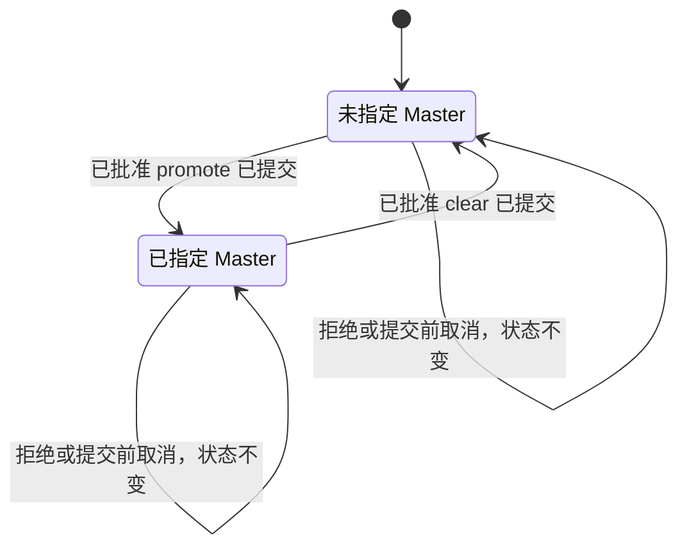

# Collab master authority contract (2026-10-07)

状态：设计准入 PASS（2026-10-07，独立设计 reviewer）。本文冻结合同语义；实现与验证进行中，未完成交付，不宣称 DONE、live 或已合并 main。

输入绑定：

- base SHA：`7350fbf6b020b1464d531337c7b2f6b8fa5de6f2`
- accepted plan：`docs/evidence/collab-master-authority-fix-20261007/plan.md`
- design review：`docs/evidence/collab-master-authority-fix-20261007/design-review.md`
- evidence index：`docs/evidence/collab-master-authority-fix-20261007/README.md`
- graph artifacts：
  - `docs/dagpipe/collab-master-authority.graph.json`
  - `docs/dagpipe/collab-context.graph.json`
  - `docs/dagpipe/collab-dashboard.graph.json`

## 1. 冻结决定

第一轮继续使用现有 `(project_scope, app_scope_id)` 授权作用域。每个公开回执、status、context、board 和 panel 都必须显示这两个 scope。一个 app scope 为空，不代表同一项目其他 app scope 为空。

授权状态 owner 是现有 daemon typed grant/reducer。显式授权变更 owner 是现有 authority-change 事务；同主体恢复 owner 是现有 `part_02.rs` typed registration transaction。CLI、MCP、context、board 和 panel 都是适配或投影消费者。adapter 与 recipient 是通信事实和发送能力 owner。AppSDK init 不是授权 owner。

本设计不新增全局 schema，不迁移业务数据，不改变任务、消息、peer 或 endpoint 生命周期。授权变更只写当前 route 的 typed authority state。

本设计明确不引入：

- `request_id` 参数；
- 通用操作账本、计数器或幂等表；
- 新的 clear event；
- 第二套授权 epoch；
- 通用 `force` 旁路；
- panel 写接口。

promote、clear 和同主体 rebind 复用现有 `GlobalMasterGranted` 与 `GlobalMasterRevoked` 事件。提交后响应丢失时，调用者读取当前 route status。只有后续 replay 红测证明现有 revoke 不能表示 empty 时，才停下并重新规划。

共享授权投影只使用当前 `MasterGrant` 已有 metadata、当前 scope 和独立通信观察。不得加入虚构的 authority revision 字段。现有 command receipt 的 `sequence`/`revision` 可以按原 wire 合同返回，但不能成为授权真源或放进 `authority` 投影。

## 2. 公开入口

### 2.1 CLI

```text
collab master promote --approval <non-empty text>
collab master clear   --approval <non-empty text>
collab master delegate <worker-id>
collab master status
```

`approval` 必须是非空文本，不能包含控制字符。它是人类批准证据，不是 token、身份凭据或 scope 证明。

`clear` 不要求调用者先成为 master。调用者仍必须通过现有认证入口，并持有当前 route 的当前 binding。

### 2.2 MCP

```text
collab_master(action="promote", approval="<non-empty text>")
collab_master(action="clear",   approval="<non-empty text>")
collab_master(action="delegate", target="<worker-id>")
collab_master(action="status")
```

### 2.3 Wire request

现有 `Req::MasterPromote` 保持不变：

```text
Req::MasterPromote { worker_id, token, approval }
```

新增精确 clear 请求：

```text
Req::MasterClear { worker_id, token, approval }
```

现有 `Req::MasterDelegate` 和 `Req::MasterStatus` 保持不变。`MasterClear` 必须进入与 promote 相同的 `project_route_actor` admission、scope 校验、当前 binding 校验和持久提交路径。

## 3. 操作矩阵

| 操作 | 授权条件 | 传输条件 | 结果 |
| --- | --- | --- | --- |
| `master promote` | 已认证当前 binding，精确 scope，非空 approval | 不探测旧 holder 或候选 holder | 原子替换该 scope 的当前 grant，返回持久回执 |
| `master clear` | 已认证当前 binding，精确 scope，非空 approval | 不要求旧 holder 可通信 | 撤销该 scope 的当前 typed grant，返回 empty 回执 |
| `master status` | 只读当前 typed grant | 通信观察独立 | 成功返回 authority 与 transport facts；reducer/scope 失败显式报错 |
| `context` | 只读当前 typed grant与调用者身份 | 通信观察独立 | authority 投影与 status 一致 |
| 同主体 rebind | token 加持久化身份与 binding 锚点；旧 grant 匹配旧 binding、agent、scope、generation | endpoint generation 可以变化 | `GlobalRuntimeBound` 与重签发 `GlobalMasterGranted` 同一注册事务提交 |
| `board publish`、`board withdraw` | 当前 grant holder | 旧 master 的通信状态不参与 | 授权与 binding 有效时本地写入成功 |
| task review、integration、close | task owner 或当前 grant holder | 旧 master 的通信状态不参与 | 保留 task owner、candidate/main、pending merge 和清理证据门 |
| `board invite`、`delegate` | 当前 grant holder | 目标 binding 与地址必须可用 | 授权变更与通知发送分别返回结果 |
| `send`、cross-project send | source 当前 grant holder | 目标 binding 与地址必须可用 | delivery 与 consumption 分别返回回执 |
| 第二次 `master clear` | 无当前 typed grant | 无 | 成功返回 empty 和 `was_empty=true`，不重建授权 |
| 提交后响应丢失 | 当前 route status | 无 | 查询实际持有人；不自动重放替换 |
| 持久化失败 | admission 已通过 | 无 | 显式错误；不投影成功，提交回滚 |
| 提交前取消 | 无 journal commit | 无 | 授权和业务状态不变 |

旧 holder 的 `unknown`、`cold`、`missing` 不阻断 promote、clear、status、context、board publication 或 task integration。实际 reducer、scope、binding、approval 或持久化错误仍然显式失败。

## 4. 状态与终止合同

授权状态只有两个持久状态：

- `Empty`
- `Assigned`



请求终止状态：

| 终止 | 条件 | 必要证据 |
| --- | --- | --- |
| Success | journal commit 完成 | 现有提交回执；authority 投影；scope |
| Rejected | token、scope、approval、binding 或 generation 无效 | 明确错误；授权和业务状态不变 |
| Cancelled before commit | daemon commit 前取消 | 无 authority journal event；状态不变 |
| Persistence error | 提交失败 | 原始错误；无成功投影 |
| Result unknown | 可能已提交但响应丢失 | 当前 route status 查询；不自动重放 |
| Restart replay | daemon replay | 与已提交序列等价的 authority 状态 |
| Cleanup | 授权操作结束 | 不隐含 task、mailbox、peer 或 endpoint cleanup |

## 5. 原子授权事务

### 5.1 promote

1. `project_route_actor` 校验 token、当前 binding、project scope、app scope 和 endpoint generation。
2. 校验 approval 非空。
3. 从当前 binding 构造 replacement `MasterGrant`。
4. 撤销该精确 scope 的所有当前 typed grant。
5. 在同一提交签发 replacement grant。
6. 返回当前 authority 投影和现有提交回执。

promote 不调用 `live_master_id`、`live_master_worker_snapshot` 或任何 endpoint probe。promote 不要求旧 holder 可通信。

### 5.2 clear

1. 走与 promote 相同的 admission 和 scope 校验。
2. 校验 approval 非空。
3. 查找该精确 scope 的当前 typed grant。
4. 对每个当前 grant 提交现有 `GlobalMasterRevoked`。
5. 若 legacy master projection 可解析到该精确 scope 的 binding，也通过现有 `GlobalMasterRevoked` adapter 清除；公共投影仍只读当前 typed grant。
6. 若当前没有 typed grant，直接返回成功 empty 回执，`was_empty=true`，不重建 grant。
7. 返回 scope、前持有人、空持有人、`was_empty` 和现有提交回执。

clear 不删除 task、mailbox、peer、endpoint 或 journal。资源 cleanup 属于任务生命周期，不是 authority operation。

现有 `GlobalMasterRevoked` 同时是 legacy master projection 的现有 revoke adapter。公共 authority 查询只读当前 typed grant，不回退到 `state.master_*`。因此 legacy replay 不能复活公共授权。若后续 replay 红测证明现有 revoke 不能表达 empty，停止实现并重新规划。

### 5.3 delegate

1. 调用者必须是该 scope 的当前 grant holder。
2. 目标必须已注册，并具有该精确 scope 的当前 binding。
3. 授权转移在同一 authority transaction 内提交。
4. 目标地址检查和通知发送在授权提交之外执行。
5. 授权结果与发送结果分开返回；发送失败不撤销授权。

## 6. 同主体恢复

同主体恢复的唯一 owner 是现有 `part_02.rs` typed registration transaction。

主体键固定为：

```text
(project_scope, app_scope_id, agent_id)
```

恢复条件：

1. token 和持久化身份通过现有验证。
2. 新 binding 的 scope 与主体键匹配。
3. 旧 grant 匹配旧 binding、agent、scope 和 generation。
4. `GlobalRuntimeBound` 与重签发的 `GlobalMasterGranted` 在同一提交写入。
5. 旧 endpoint generation 继续由现有 binding-generation fence 拒绝。

以下事实不能证明主体连续性：

- pane 存在；
- pane 名称相同；
- 新主体占用同一地址；
- 通信 probe 成功。

删除 `part_06.rs` 中把 unknown liveness 当作身份恢复授权门的围栏，以及只为绕过该围栏存在的 same-pane 或 same-DSH 授权例外。保留 token、scope、binding、generation、身份歧义和跨项目拒绝。不要把 `bind_runtime` 改成对所有重绑都保留 grant。

## 7. 统一授权投影

status、context、board 和 panel 必须使用同一个 daemon-owned authority projection。投影只读当前 typed grant，并单独读取通信观察。

### 7.1 Assigned

```json
{
  "authority": {
    "status": "assigned",
    "worker_id": "worker-id",
    "scope": {
      "project_scope": "/canonical/project/root",
      "app_scope_id": "app-scope"
    },
    "grant": {
      "boundary": "project",
      "granted_by": "worker-id",
      "approval": "user approval text",
      "binding_id": "binding-worker-id",
      "endpoint_generation": 7,
      "granted_at_ms": 123
    }
  },
  "master_transport": {
    "worker_id": "worker-id",
    "kind": "tmux",
    "address": "socket/session/pane",
    "state": "unknown",
    "observed_at": "2026-10-07T20:27:28-07:00",
    "error": "TMUX_ENDPOINT_NOT_QUERYABLE: a tmux transport has no App Server endpoint"
  }
}
```

### 7.2 Empty

```json
{
  "authority": {
    "status": "empty",
    "worker_id": null,
    "scope": {
      "project_scope": "/canonical/project/root",
      "app_scope_id": "app-scope"
    },
    "grant": null
  },
  "master_transport": null
}
```

`master_transport` 的字段只表达通信观察。它不能改变 authority status。

投影约束：

- 不包含 fabricated `revision`。
- `master` 兼容别名只能由同一 authority holder 派生，不能依赖 transport presence。
- `recorded_unusable` 不能作为授权状态。若为 wire 兼容保留，它始终为 `null`，且不被控制逻辑读取。
- `unknown`、`cold`、`missing` 时 holder 仍为 assigned。
- route 解析、reducer 读取或 scope 解析失败返回明确错误。不能用 `.ok().flatten()` 伪造 empty。
- panel 继续是只读 GET consumer，不新增 POST、PUT、PATCH 或 DELETE authority route。

## 8. 授权与通信边界

授权读取当前 typed grant。通信读取 selected endpoint 和 presence probe。

保留 recipient 通信检查：

- delegation target validation；
- board invitation target validation；
- direct send 和 cross-project send target validation；
- wake、notification 和 consumption receipt。

这些检查只报告 delivery 或 consumption 结果，不撤销授权，不把通信失败写成无授权。

保留现有安全门：

- `project_route_actor` 的 token、scope、唯一当前 binding、session/thread/runtime 和 generation 校验；
- tmux socket、server、session、pane 元组和 pane ownership 校验；
- AppServer 当前线程校验和原生发送规则；
- DSH gateway 的 runtime、agent、session、cwd 校验；
- durable mailbox、recv、consumption receipt、subscription owner 和 wake attempt 规则；
- force close/finalize 中 owner Missing 与 Unknown 的区分。

删除仅用于授权判断的 live fence：

- `part_07.rs` 的 `verify_master_actor` caller live 条件；
- `board_handlers.rs` 的 `BOARD_LIVE_MASTER_REQUIRED`；
- `part_06.rs` 的 master recovery live/unknown fence；
- deadline/master-idle 订阅资格中的 live 授权门；
- `part_09.rs` review、integrated、close、finalize cleanup 中的 live master 门；
- `part_08.rs` 的 `task_integration_authorized` live 条件；
- `subagent.rs` parent-or-master 控制中的 live master 门；
- `main.rs` cross-project send 的 sender `endpoint_live` 门；
- `part_04.rs` source master live 门；
- status、context、role brief 和 operations 中 unknown 触发的重新赋权建议。

每个 `live_master_id` 和 `live_master_worker_snapshot` 调用都必须逐项核实。纯通信用途保留并独立命名。已无真实消费者的 live authority helper 和旧断言删除。

## 9. 持久化、重启与 AppSDK init

journal 是持久化 owner。replay 必须产生与已提交序列相同的授权状态：

- 已提交 promote 在重启后保留新 holder；
- 已提交 clear 在重启后保持 empty；
- legacy `MasterAssigned` 不能通过公共 authority fallback 复活 holder；
- 旧 endpoint generation 不能通过 replay 重新取得授权；
- clear 后任务、mailbox、peer 和消费状态保持。

AppSDK init 和 fresh governance init 不做代码修改，不新增报告输出面。它们不得调用 revoke，不得暗删授权，不得成为第二 clear 路径；AppSDK init 不是隐式授权重置。这里只保留该不变量。

## 10. 状态机 DAG 与节点 owner

授权图保持三节点 SESE：

```text
解析认证主体与授权作用域
  -> 原子替换或清除授权
  -> 返回持久回执或明确错误
```

三个节点都是单入口单出口。图级 success terminal 是 `authority_receipt`；图级 error terminal 是明确拒绝、admission 失败或持久化失败，且不产生成功授权投影。每个节点的 error 先在节点内终止或返回上游，不构造跨节点回边。

节点 owner：

| 节点 | 语义 owner | 代码 owner | 当前状态 |
| --- | --- | --- | --- |
| `resolve_authority_scope` | daemon admission | `part_10.rs` `project_route_actor` | 复用，clear 接线待实现 |
| `transfer_master_authority` | 唯一 authority transaction | `part_06.rs` 现有 transfer helper，扩展为 apply-change；保留现有 `appsdk.collab_authority.transfer_master@1` 注册绑定 | 待实现 |
| `emit_authority_receipt` | 公共投影与现有提交回执 | status/context/board 共用 serializer | 待实现 |
| same-principal rebind | 身份 owner | `part_02.rs` typed registration transaction | 现有事务，待删除 live fence |
| transport observation | adapter 与 presence probe | 现有 adapter/probe owner | 独立保留 |
| panel | 只读 board consumer | dashboard GET | 只读，待消费统一投影 |
| init | 不触碰 authority | AppSDK init | 无代码修改 |
| resource cleanup | 任务生命周期 | task cleanup owner | 与 authority 分离 |

context 图保持六节点 SESE，只修订 identity recovery 和 authority projection 合同。dashboard 图保持四节点 SESE，只把授权读取与 transport 投影的合同写清。没有新增 graph 框架、没有新增授权节点、没有跨节点回边。

## 11. 待实现代码边

以下边在设计审查通过前保持 pending：

1. `main_cli.rs`、`main.rs`、`collab-mcp.rs`：`clear` 参数和 MCP action 到 `Req::MasterClear`。
2. `proto.rs`、`part_10.rs`、`part_11.rs`：`MasterClear` wire variant、mutation admission、dispatch 和 project route actor。
3. `part_06.rs`：promote/clear/delegate 共用的 scoped authority transaction。
4. `part_02.rs`、`part_06.rs`：删除 live/unknown recovery fence 和传输专属授权例外，保留现有同主体 reissue。
5. status、context、board 和 panel：共享 authority projection，transport 独立。
6. 各 authority gate：读取当前 grant，保留 recipient communication 和 task lifecycle 门。
7. 测试：base 红测、clear 幂等、重启、legacy replay、scope、recipient safety、panel GET 和 AppServer/DSH consumer。

`dagpipe graph validate` 只证明三图静态形状。设计审查通过前不得编写产品代码。

## 12. 行为验收

完整命令和 fixture 绑定沿用 accepted plan 的 P01、P03 和黑盒矩阵 B01-B15。命令更正：该 package 没有 lib target，`cargo test --manifest-path collab/Cargo.toml --lib` 无效；库/二进制作者测试入口使用 `cargo test --manifest-path collab/Cargo.toml --bin collab`。设计审查必须确认以下断言已冻结：

- B01：tmux agent unknown 时，当前 grant holder 可执行受影响 master 控制；status/context/board holder 一致；agent 不显示 online。
- B02：明确 promote 替换旧 holder；旧 holder 控制拒绝；peer、task 和 mailbox 保留。
- B03：clear 成功，第二次 clear 返回 `was_empty=true`；authority empty；task、peer、message 和消费状态保留。
- B04：缺失或空白 approval 明确拒绝；holder 和业务状态不变。
- B05：错误 token、跨项目、跨 app scope、旧 runtime/binding/generation 明确拒绝。
- B06：同主体新 generation 保留原批准；旧 generation 拒绝。
- B07：新主体或同 pane 新占用者不继承授权。
- B08：替换后重启保留 holder；clear 后重启不复活 typed 或 legacy holder。
- B09：同一项目不同 app scope 各自显示自己的 scope 和 holder。
- B10：status、context、board show 和 panel GET holder 一致；panel 不新增写权限。
- B11-B13：AppServer、DSH 和 recipient 安全检查保留，通信失败不伪造成功。
- B14：task review、integration、close 按当前 grant 判定，保留 owner 和证据门。
- B15：并发 mutation 只产生一个完整前态或后态，不出现双 holder 或 partial clear。

## 13. 非目标

- 不把授权扩成项目唯一 master。
- 不迁移 schema 或清空旧 journal。
- 不删除 task、mailbox、peer、subscription 或 endpoint。
- 不新增 request id、操作账本、通用幂等框架或 clear event。
- 不改变 AppSDK init 行为。
- 不增加 panel 写接口。
- 不改变 recipient 安全规则、AppServer 原生规则或 DSH enqueue 合同。
- 不新增 graph framework、graph node 或跨节点回边。
