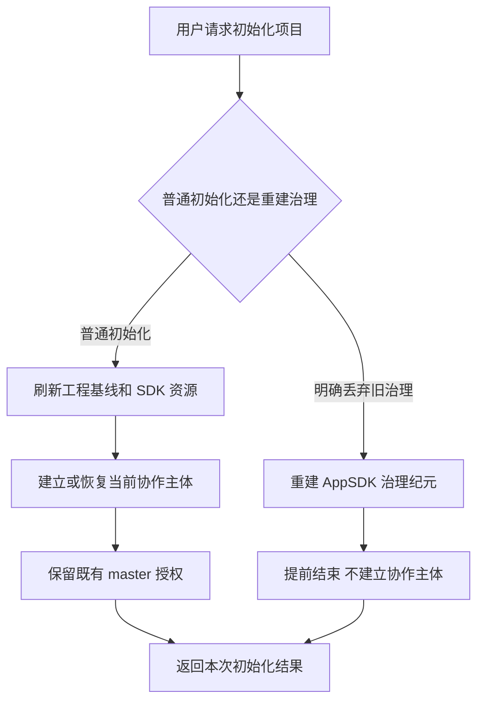
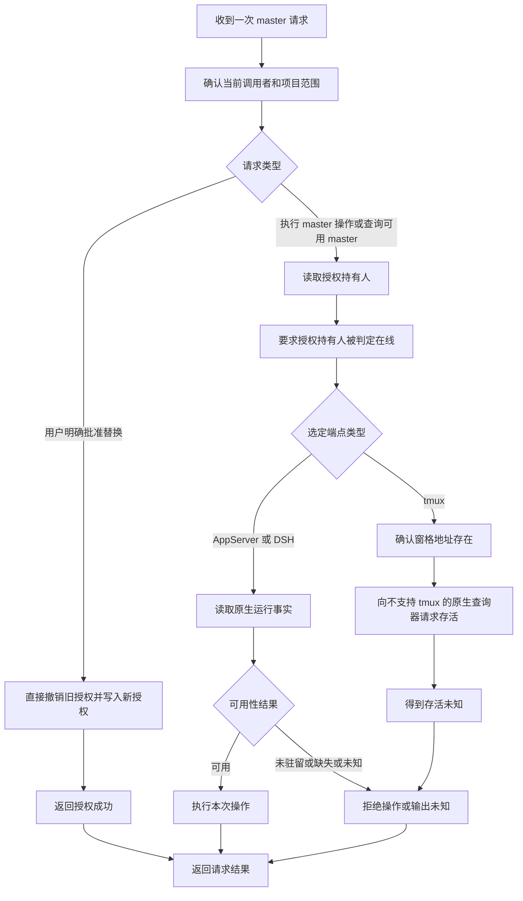
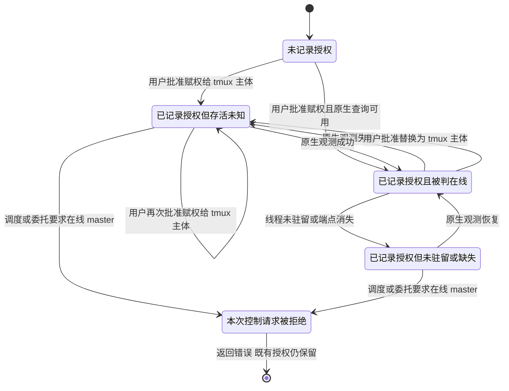
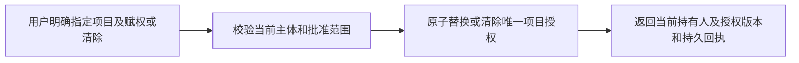
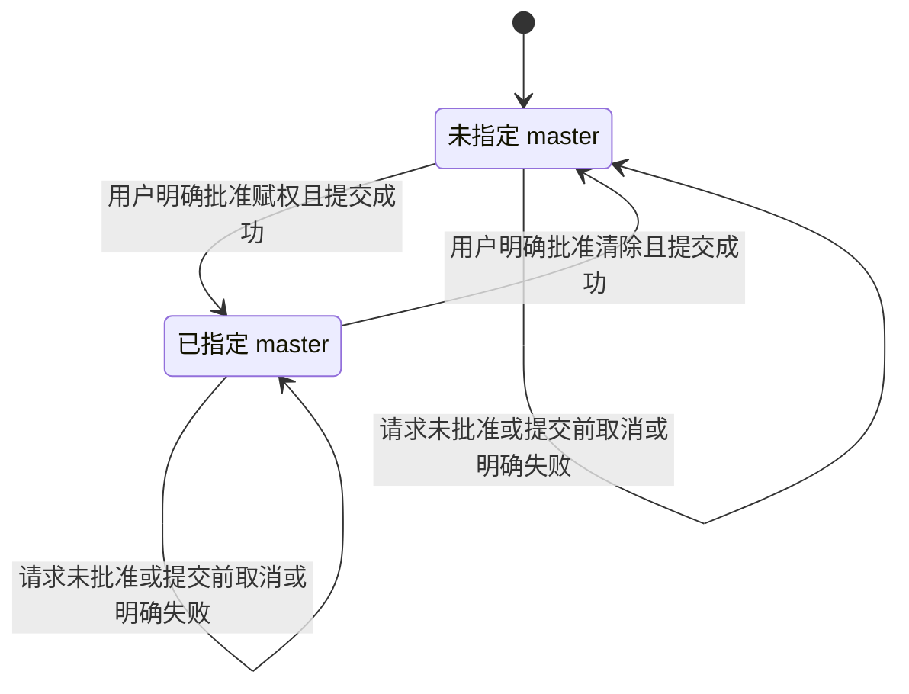
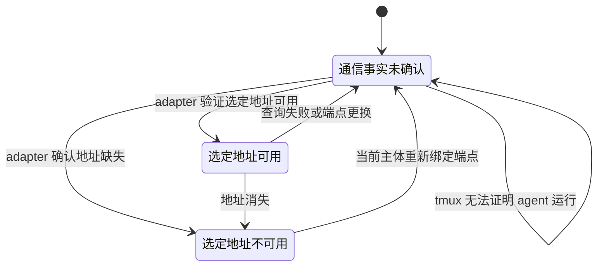
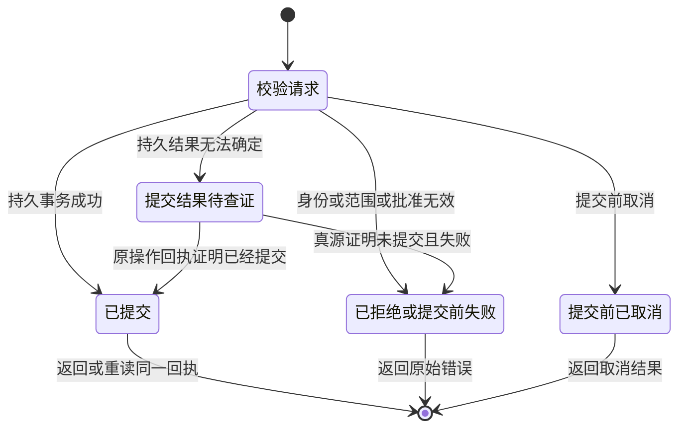

# Collab master 状态机审计与消融设计

审计输入：AppSDK main `7350fbf6b020b1464d531337c7b2f6b8fa5de6f2`，已安装 CLI `collab 0.2.0253`。本轮只有源码读取、公开诊断和文档产物。未切换 master、重新初始化、reset、安装或重启服务。

结论：当前设计将**主体身份、项目授权、端点地址、通信观测**混在同一存活判定链上。显式转移已经绕开旧 master 存活门，但实际控制操作和恢复仍依赖它。tmux 的生产 oracle 固定拒绝 tmux，形成“授权成功，master 操作不能执行”的确定性缺口。普通 AppSDK init 与 fresh governance init 都没有清除 Collab master 的语义。

## 1. 当前真实路径

### 初始化请求 DAG

这张图包含已有入口的两种互斥模式。工程初始化本身不应暗中销毁协作任务。错误在于将“重新初始化”作为清除协作授权的预期入口，却没有定义清除范围、执行边和对应回执。fresh init 的业务路径甚至没有调用协作初始化。应明确报告保留/未操作的控制状态；如果产品承诺重建协作状态，必须调用其唯一 owner，不能仅删本地文件。

### master 控制与观测 DAG

图中的错误边：`窗格地址存在 → 不支持 tmux 的原生查询器 → 存活未知 → master 权限失败`。它将无法获取的远端运行证据作为本地控制授权的必要条件。另一个冲突是替换路径已不需要该证据，而查询/执行路径仍要求它。

### 当前混合状态机

`Unknown → Usable` 对生产 tmux 分支不可实现：其查询器固定返回 `TMUX_ENDPOINT_NOT_QUERYABLE`。再次 promote 不能修复这个条件。这里绘制的是混合观测与请求状态，正是要删除的模型；请求结束不应成为授权状态的结束。

## 2. 实现证据和已复现边界

| 语义节点 | 实现 owner / 证据 | 已确认事实 |
| --- | --- | --- |
| 普通初始化、fresh 初始化 | `rust/src/main/init.rs:842-899` | 普通路径调用 `initialize_collab_peer`；fresh 路径提前 return；没有 master revoke |
| 协作初始化兼容入口 | `rust/src/main/init.rs:514-517` | 调用 `collab init`；不等于控制面 reset |
| tmux 窗格地址探测 | `collab/src/adapters/tmux.rs:83-121` | 只验证 socket/server/session/pane/pane PID 及 pane_dead；不能证明当前 agent 是旧 master |
| 生产原生查询器 | `collab/src/server/mod_parts/part_01.rs:275-285` | Tmux 固定返回 `TMUX_ENDPOINT_NOT_QUERYABLE` |
| 主体存活判定 | `collab/src/server/mod_parts/part_07.rs:1-65` | tmux 没有 IDs 返回 Unknown；有 IDs 又调用上述拒绝 tmux 的 oracle |
| master 权限执行 | `part_07.rs:403-448,1198-1222`；`board_handlers.rs:133-145` | Unknown 阻断；Cold/Missing 不作为 live master；publish/invite 也受影响 |
| 明确替换授权 | `part_07.rs:1224-1267`；已有 `collab-master-authority.graph.json` | token、注册范围、非空 approval 通过后，不探测旧 master 或候选存活，原子替换旧 grant |
| 注册/恢复旧授权主体 | `part_06.rs:1044-1115` | 仍有同 pane、同 DSH 主体例外；例外外 master 重绑需 live/unknown 判断。它不是所有 context 请求必经路径，但保留了耦合 |
| context 投影 | `part_09.rs:1281-1359` | 授权被拆成 master / recorded_unusable；Unknown 被写成“推迟授权变更”；无 live master 时又建议 promote |
| panel 投影 | `board_handlers.rs:50-88`、`dashboard/app.js:59-61` | role 从 current grant 得到；status 从 worker_presence 得到。tmux 通常显示 Master / 未知；不能据此判在线 |
| panel 能力 | `dashboard.rs` | HTTP 只有 GET；明确只读，无授权切换/清除操作 |
| 授权与连接代际 | `global_state_impl_part2.rs:600-604,752-858` | 重绑删除旧 grant；grant 必须匹配 binding generation；恢复需要重新接合授权 |
| 作用域 | `part_06.rs:1264-1383`、`global_state_impl_part2.rs:785-793` | master 排他按项目 + app scope，不能直接称为全项目唯一 master |
| 旧字段投影 | `part_08.rs:1-15,86-95`；`state_impl.rs:653-698` | typed grant 之外仍保留 legacy master 字段及读出兜底。需先查历史 replay 消费者再删除 |

公开诊断：

- AppSDK cwd：`collab master status` exit 0，`master=null`、`recorded_unusable=null`。
- RouteCodex cwd：`collab master status` exit 1，`recorded_worker_id=codex-%2`、`status=unknown`，原错为 `master identity is unknown; defer authority changes until transport probes succeed`。
- 当前会话 `collab board show` exit 1，`BOARD_IDENTITY_REQUIRED: run collab context from the owning TUI before opening the board`。没有为了审计注册新身份。用户当时 panel 的截图/响应未取得，不能声称亲见其显示“在线”。
- `ps` 观察到两个不同时间启动的 canonical collab serve 和一个既有隔离 serve。这不是同一 daemon 的证据；本轮未读取其完整环境，也未确认各自 socket/state scope，不能据此诊断进程冲突或清理它们。

已安装版本号不证明当前 daemon binary 与候选源码完全等价。本报告的“生产 tmux 恒 Unknown”是当前源码的逻辑结论；公开诊断只直接证明 RouteCodex 的 recorded master 为 Unknown。未执行 promote/rebind 的写入对照实验，故不将用户本次全部失败路径标为完整因果复现。

## 3. 错误与消融

| 错误 | 消融/收敛动作 | 必须保留 |
| --- | --- | --- |
| 用端点存活决定本地授权是否成立 | 从控制权限校验删除 live master 条件；检验当前认证主体是否持有当前项目授权 | 主体认证、项目隔离、当前 binding 防重放、授权版本检查 |
| tmux 注册成功后必经不支持它的 oracle | 删除 tmux → AppServer 存活 oracle 的边；tmux 只报告地址事实、身份绑定和不可证明的运行状态 | 窗格元组验证；发送前验证目标地址；消费回执 |
| “授权未知”来自通信观测未知 | 删除授权状态中的 Unknown/Cold/Missing；保留独立通信观测 | 读真源失败仍应明确报错；不伪造无授权 |
| 替换完成后 context/status 继续要求修旧端点 | 赋权、清除、状态读取只依赖授权 owner；通信失败在通信链报告 | 已提交操作回执；结果未知按原操作查证 |
| 注册恢复承担 master 继承/仲裁 | 删除恢复中的 master live/unknown 特判及传输专属授权继承例外；同主体恢复只改端点 | 真实身份锚点匹配；冲突拒绝；不能把 pane 等价于永久主体 |
| 授权绑连接 generation | 项目授权归稳定主体；连接代际归请求认证；更换同主体端点不重建人类批准 | 旧端点/旧请求拒绝；更换主体必须有新批准 |
| 授权多读模型 | current grant 为唯一读模型；context/status/panel 同一序列化投影。legacy 字段不得当第二份授权真源 | 历史 journal replay 必需 adapter，直到已有格式完成迁移；不直接删除历史记录 |
| 项目 master 随 app scope 分裂 | 若产品契约是项目唯一 master，则唯一键改为 canonical project；app/transport 仅作为 endpoint scope | 项目互相隔离；如果确实需要每 app 独立 master，必须明确命名产品作用域，不混称 project master |
| 清一个旧 master 要经过全控制面 reset | 增加明确清除授权语义，复用授权变更 owner；不销毁 mailbox/tasks/其他 peer | 全量 reset 的离线互斥、归档、审批和审计仍必要 |
| 只读 panel 被当作管理入口 | 状态展示准确区分授权与通信；需要管理时以真实用户控制授权调用同一变更 owner | 原 GET capability 保持只读，不能直接升级成写权限 |
| 图/Skill/文档仍留旧 live-master 前置规则 | 在实现确定后删除相反指引和陈旧恢复描述；同步唯一契约 | 本轮不修改全局规则或 Skill，不把审计直接当实现已完成 |

不把 token、binding generation、事务持久化、旧消息隔离、真实身份恢复、mailbox/notification/consumption 边界列为消融对象。授权与连接分离，仍须校验当前认证连接。只将不可获得的存活证据移出权限决策。

## 4. 重新简化的设计

采用三个互不代替的对象：

1. **主体**：谁在调用。已有 daemon 身份 owner 负责建立和恢复。
2. **项目授权**：谁能调度。已有 typed reducer 负责当前唯一授权及授权版本。
3. **通信观测**：某个端点是否存在、运行事实能否取得、消息是否消费。adapter 和收件人负责。

不增加新数据库、heartbeat 服务或 pending recovery 工作流。授权 epoch 是现有命令版本/拒绝旧权限的语义；实现先检查是否能复用现有 revision，不能直接增设第二套计数器。

稳定主体不能由 `codex-%2` 这样的 pane 派生名字或窗格存在单独证明。同窗格换成另一个 agent 时，只有身份 owner 已验证为同主体的恢复才可保留授权；新主体需要明确赋权。endpoint 唯一占用与主体连续性是两个合同，不能用“后来占窗格者自动继承旧 master”替代。发送仍须校验选定接收地址及其当前绑定；移除授权层的存活门不授权向未知归属的 shell 注入输入。

### 新授权变更 DAG（提议，未实现）

旧 master 是否在线不出现在图上。已有 `promote --approval` 的替换部分可复用；不再另加一个 force-promotion 旁路。清除是同一授权变更 owner 的“持有人为空”操作，公开 CLI 名称待实现设计收口，不能把不存在的命令写成当前可用能力。

### 新授权状态机（仅两个持久状态）

同状态迁移仍可能改变持有人或授权版本。替换后旧主体的控制请求失败，因为它不再持有当前授权，不能靠历史角色继续操作。授权变化不抢其他 peer 任务、不自动清消息。已提交变更不能用“取消请求”撤销；如需撤销，提交新的明确授权变更。

### 新端点观测状态机（与授权无回边）

“地址可用”与“agent 正在运行”是不同字段。AppServer 的运行/未驻留状态和 DSH 的 running/inactive 保留在原生事实里；tmux 只知道 pane 地址时，agent 运行事实明确未确认，不能显示成在线。Busy/Idle、任务状态、消息消费都不加入项目授权状态机。

### 新单次操作状态机

明确失败后修正输入再请求是新 attempt；丢失提交回执按原 operation 查证，不能重复变更。未知的是单次提交结果，不能回写成“master 身份未知”。

panel 应展示 `授权持有人`、`选定通信地址`、`agent 运行事实及来源/观测时间`。用户明确替换或清除时走同一控制操作；它不需要先把旧 master 修成在线。已有只读 panel 未提供写入口，不能用其查看 capability 直接执行变更。

## 5. 最小实施边界与验收

本次仅给出设计，不改产品代码。第一轮可用增量：保持当前身份/路由系统，修掉 tmux 必然 Unknown 对控制权限的影响，统一授权读模型，并补明确清除授权。后续再分离稳定主体授权与 endpoint generation，清理历史 replay adapter 和陈旧恢复文档。不能先删除身份或 journal 来遮住错误。

范围：上述 master owner、context/status/board 投影、master 注册恢复分支、对应公开入口测试；相邻 mailbox、任务 owner、订阅 lifecycle、全量 reset 的保留策略不重写。现有项目 DAG 应在最终方案审查后由其 owner 更新。本目录两个审计图不接入正式运行 registry，不新增执行治理骨架。

实施前对提议做独立设计审查；实施后作者完成公开入口黑盒回归，再进入独立架构 review。必需用例：

| 黑盒输入/事件 | 外部可观察结果 |
| --- | --- |
| 旧 master 的 tmux pane 还在，旧 agent 已结束；用户批准替换 | 新持有人可立即执行授权控制操作；旧主体控制请求明确拒绝；pane 存在不能阻止 |
| 旧地址不可达或运行事实未知；用户批准清除 | 当前授权为空；其他 peer/task/mailbox 保持；无需关闭共享 daemon |
| 没有批准、错误主体或跨项目请求 | 非零错误且授权不变 |
| 当前 master 同主体更换 thread/pane endpoint | 身份恢复后保留授权；旧 endpoint/generation 请求被拒绝 |
| 同项目从不同 app/transport 访问 | 按最终决定的唯一项目 scope 返回同一授权；不能误读另一个 app 的空 master |
| 并发两次授权变更、丢失响应、daemon 重启 | 版本按事务顺序；旧权限失效；原操作回执可查；重启不复活旧 master |
| 同一授权版本读取 context/master status/panel | 同一授权持有人；通信未知单列，不将授权读出为 null 或 unknown |
| 普通 AppSDK init / fresh governance init | 明确输出是否触及协作状态；按现有契约保留，不宣称清除了 master |
| 通信发送失败、通知接受、收件人消费 | 分别报告事实；授权状态不变；只以收件人回执证明消费 |

## 6. 校验边界

`current-master-command.graph.json` 记录当前控制请求依赖；`proposed-master-authority.graph.json` 记录待审授权变更依赖。对应可见标签为中文语义。失败/取消终点在节点结果和上面的状态机声明，不将它们塞成多个 graph 输出。

`dagpipe graph validate` 仅检查 SESE 静态拓扑和 binding 形状，不证明 Operator 已实现、状态机语义正确、runtime 已加载、用户入口通过或审查 PASS。本轮没有修复完成结论。
