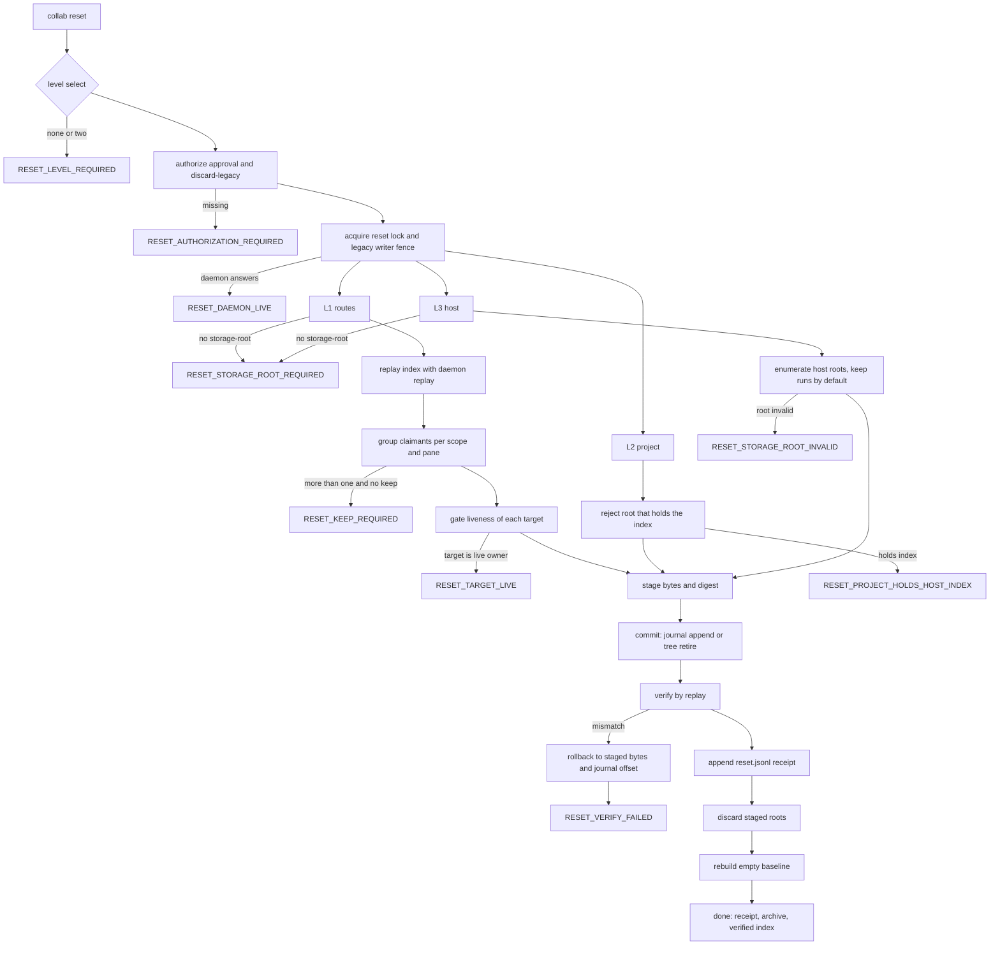

# Collab control-plane reset operation

Delivery 2 of the collab control-plane work. Delivery 1 is the normal-path fix
(scope-local pane uniqueness, named ambiguity, ensure-runtime logging) and is
designed in `collab-control-plane-reset-20261005.md`, revision 3. This document
covers the explicit reset/cleanup/initialization operation that clears
accumulated control-plane burden.

Revision 1, 2026-10-05. Status: design, not implemented.

## 1. Proven problem

The control plane accumulates history that no normal operation can clear. The
live host index measured on 2026-10-05:

| Burden | Measured |
| --- | --- |
| Panes with more than one route claimant | 5 (`$2:%2` cross scope, `$6:%6`, `$8:%8`, `$16:%16` same scope, `$138:%138`) |
| `routes.jsonl` records | 207, for 207 distinct storage roots, including roots that no longer exist |
| Identities | 340 |
| Archives | 60 |
| Host project directories | 52 |
| `reset.jsonl` records | 19 |
| Journal events | 7869 in the appsdk host journal, 111 route sets, **0 retirements** |

Zero retirements is the core fact. Nothing in the product has ever retired a
route claim. `retire_current_thread_route` exists
(`global_state_impl.rs:840-868`) but only the reducer calls it, so a claim
disappears only when a *newer* route replaces it.

The existing `collab reset` (`reset.rs:426`) is level 2 only: it retires the
current project's legacy project-local control plane and rebuilds an empty
baseline, and it needs `--discard-legacy` plus `--approval`. There is no way to

- retire one named route claimant on a pane that has several, or
- rebuild the host control plane (identities, archives, routes, journals).

The user asked for exactly these, in this order: first a complete
reset/cleanup/initialization operation that clears the accumulated burden, then
the normal-path gaps.

## 2. Goal

One explicit operation with three levels. Every level is auditable,
transactional, and needs explicit authorization.

- **L1 `collab reset --routes`** retires named route claimants in one scope and
  keeps exactly one. It targets the duplicate-pane burden.
- **L2 `collab reset --project`** rebuilds the current project's runtime
  baseline. This is the existing behavior, with its boundary stated precisely.
- **L3 `collab reset --host`** rebuilds the host control plane: identities,
  archives, route records, and the host journals. It keeps `~/.collab/runs/`
  unless `--include-runs` is given.

Deliverable: the three levels, their tests, black-box acceptance B1-B6, and the
DAG in section 6.

## 3. Non-goals

- No change to the normal-path route rules. Delivery 1 owns those.
- No automatic or background cleanup. Every level is operator-invoked and needs
  `--approval`.
- No deletion of `~/.collab/runs/` by default. Run notes are the durable record
  of a run and survive a host reset unless the operator asks for their removal.
- No migration. `collab migrate` keeps history; reset discards it. The two do
  not merge.
- No change to `~/.collab/service.json`. It belongs to an external supervisor
  and is not a dependable collab contract.
- No MCP tool for the destructive levels. The CLI is the only entry, so an
  agent cannot reach a reset through a tool call.

## 4. Why an index-level retirement is not durable

This is the problem review rounds 3 and 4 raised, and it decides the design.

`retire_current_thread_route` removes the route from the in-memory index and
writes nothing (`global_state_impl.rs:862-867`). Three separate paths then put
the claim back:

1. **Replay.** The journal still holds the `GlobalCurrentThreadRouteSet` event
   for that address (`state_impl.rs:757-767`), so the next start replays the
   route into the index.
2. **`reconcile_started_thread_routes`** republishes any binding of any project
   runtime that carries a session and a native thread whose host route is
   missing (`runtime_manager_setup.rs:400-421`). The project journal owns that
   binding, so the host index is rebuilt from the project side.
3. **`reconcile_same_pane_master_routes`** does the same for a pending same-pane
   master (`runtime_manager_setup.rs:343-349`).

Path 2 also explains the failure mode the user reported: a stale project binding
keeps a route alive on a pane that a different project's master now owns.

The existing tombstone cannot express an operator retirement.
`RuntimeBindingTombstone` carries `rebound_to: RuntimeBinding` and
`new()` requires the old and the new binding to share project, app scope, agent,
and binding id (`global_state_models.rs:405-432`). That is a *rebind* record: it
says "this address moved to that binding". An operator retirement has no
successor binding, so it has no valid `rebound_to`.

The tombstone lookup has no production consumer either:
`lookup_current_thread_route_tombstone` (`global_state_impl.rs:686`) and
`lookup_tmux_route_tombstone` (`:593`) are called only from tests.

So L1 needs its own durable record and its own consumer.

## 5. Design

### 5.1 CLI surface

```
collab reset --routes  --storage-root <path> --keep <binding_id> --approval <text> [--discard-legacy]
collab reset --project [<path>]                                  --approval <text> [--discard-legacy]
collab reset --host    --storage-root <path>                     --approval <text> [--discard-legacy] [--include-runs]
```

- The three level selectors are mutually exclusive and exactly one is required.
  A run with none or with two fails with `RESET_LEVEL_REQUIRED` before it reads
  or writes any control file.
- `--storage-root` is required for L1 and L3, and is rejected for L2. The live
  host index is `<storage-root>/.agent-collab/server/journal.jsonl`
  (`part_12.rs:348-350`; the daemon opens exactly that path, `part_12.rs:866-871`).
  `routes.jsonl` cannot stand in for it: all 207 records carry
  `canonical_root == storage_root`, so the file does not identify which root the
  running daemon uses. A default would silently no-op on the wrong index, which
  is why the flag is required rather than optional.
- `--keep <binding_id>` is required for L1 when more than one claimant remains
  after the retired ones are removed. L1 never guesses by generation:
  `endpoint_generation` is a per-binding counter that starts at 1
  (`part_04.rs:159,211`), so it is not comparable across bindings. Without
  `--keep` and with more than one candidate, L1 changes nothing, lists the
  candidates, and exits non-zero.
- `--discard-legacy` stays required, as today, so the destructive path cannot be
  reached by a bare `collab reset`.
- `--include-runs` is L3 only and is the single way to remove
  `~/.collab/runs/`.

### 5.2 L1: retire named route claimants

L1 is offline. It refuses to run while a daemon answers on the socket
(`RESET_DAEMON_LIVE`, the existing gate at `reset.rs:448-453`), so it never
mutates a live index.

Steps:

1. **Authorize.** Require `--approval` with non-blank text and
   `--discard-legacy`, as today (`reset.rs:427-438`).
2. **Resolve the index.** Read `<storage-root>/.agent-collab/server/journal.jsonl`
   and build the view with the same function the daemon uses:
   `replay_from_journal` plus `restore_unique_current_thread_routes_from_bindings`
   and `index_legacy_thread_routes_from_bindings` (`part_12.rs:492-501`). Using a
   private reader is not allowed: the appended retirement event must satisfy the
   reducer's equality precondition, and only the daemon's own replay defines the
   binding the reducer will compare against.
3. **Select.** Group the live routes by `(project_scope, pane)` through the same
   scope-local claimant scan delivery 1 introduced. A group of one is not a
   target. For each group of two or more, the claimant named by `--keep` is kept;
   every other claimant is a retirement target.
4. **Gate liveness.** Refuse to retire a target that the replayed host state
   still considers the pane owner: the target's agent is registered, and its
   recorded transport still resolves to that pane. This is the same
   route-plus-presence invariant `master_anchor_is_superseded`
   (`part_07.rs:1197`) and `same_scope_pane_owner_supersedes` already use.
   The refusal is `RESET_TARGET_LIVE` and names the claimant. Retiring a live
   peer would break it, and the operator's intent is to remove residue.
5. **Stage.** Copy every file the run will rewrite into
   `<state_root>/archive/reset-<run_id>/` and record its file count, byte count,
   and tree digest with the existing `tree_digest` (`reset.rs:65`). The journal
   is appended to, not rewritten, so its staged copy is the archive of the
   pre-reset bytes.
6. **Commit.** Append one `GlobalRouteClaimRetired` event per target (section
   5.3) to the host journal, `sync_data`, then `sync_all` the directory. One
   append per target, in a stable order, so a partial failure is visible as a
   prefix and can be rolled back by truncating to the recorded offset.
7. **Verify.** Replay the journal again and assert that the kept claimant is the
   only claimant of its pane in its scope, and that each retired address is
   absent. Any mismatch rolls the journal back to the recorded offset and fails
   with `RESET_VERIFY_FAILED`.
8. **Receipt.** Append one record to `<state_root>/reset.jsonl` with the level,
   the approval text, the run id, the archive path, the retired binding ids, the
   kept binding id, the digest, and the timestamp (`append_reset_record`,
   `reset.rs:197`).

L1 is idempotent: a second run finds no group with more than one claimant and
changes nothing.

### 5.3 The durable retirement record

Add one typed record and one event. The record answers "this claim was retired
by an operator and must not be republished"; it is not a rebind, so it does not
reuse `RuntimeBindingTombstone`.

```
RetiredRouteClaim {
    binding: RuntimeBinding,
    approval: String,
    reason: String,
    at_ms: i64,
}

Event::GlobalRouteClaimRetired { record: RetiredRouteClaim }
```

Reducer rule (`state_impl.rs`):

1. `retire_current_thread_route(record.binding)`, so the route leaves the index
   exactly as the existing retirement path removes it.
2. Insert `record` into `GlobalState.retired_route_claims`, keyed by the same
   `current_route_address_key` the route index uses
   (`global_state_impl.rs:807`). A repeat of the same claim is a no-op, so replay
   of a re-appended event is safe.
3. Reject a record whose binding does not validate, or whose address is also
   live, mirroring the tombstone invariant at `global_state_impl.rs:123-130`.

`GlobalState::validate` gains the same cross-check for the new map.

Consumers. Both reconcilers consult the map before republishing, and record the
skip:

- `reconcile_started_thread_routes` (`runtime_manager_setup.rs:400`): before the
  publish at `:418`, skip when the binding's address is retired, and write
  `ROUTE_CLAIM_RETIRED: binding <id> agent <agent> was retired by an operator;
  not republished` to the host log.
- `reconcile_same_pane_master_routes` (`runtime_manager_setup.rs:326`): the same
  skip before the publish at `:345`.

This is the only place the design changes startup behavior, and it is
fail-closed in the right direction: the skip is gated on an explicit,
operator-authorized, durable record, not on an error. Nothing else changes. A
retired claim that a worker still tries to use must fail loudly rather than
silently degrade, so the register path answers
`ROUTE_CLAIM_RETIRED: binding <id> was retired by an operator; register a new
binding` instead of publishing.

### 5.4 L2: rebuild the project baseline

L2 keeps today's behavior and states its boundary:

- It retires the current project's legacy project-local control plane and
  rebuilds an empty baseline, archiving the retired bytes.
- It clears business history by default. Tasks, messages, and identities of that
  project are archived, not merged.
- It refuses when the project holds the host index, because retiring that tree
  would delete the index the daemon replays. The refusal is
  `RESET_PROJECT_HOLDS_HOST_INDEX` and points to L3. This is B4.
- Existing safety checks stay: `reject_unsafe_control_roots`
  (`reset.rs:154`), `reject_symlinked_guidance` (`:225`), the reset lock and the
  legacy writer fence (`:444-447`).

### 5.5 L3: rebuild the host control plane

L3 is the "complete reset" the user asked for. It requires `--storage-root`.

Retired, staged, and archived:

| Target | Path |
| --- | --- |
| Route records | `<state_root>/routes.jsonl` |
| Host journal | `<state_root>/journal.jsonl` |
| Host events | `<state_root>/events.jsonl` |
| Host log | `<state_root>/log.txt` |
| Project runtime journals | `<storage_root>/.agent-collab/server/{journal,events,log}.jsonl` |
| Identities and archives | `<state_root>/identities/`, `<state_root>/archive/` |

Kept:

- `~/.collab/runs/`, unless `--include-runs` is given. Run notes are the durable
  per-run record and must survive a control-plane reset by default.
- `~/.collab/service.json`, because it belongs to an external supervisor.
- The socket and lock files are removed only by `collab down`, which L3 requires
  first. L3 does not delete a live socket.

Rebuilt: an empty baseline for the current project, written by the same code
path L2 uses, so the two levels cannot drift.

`--storage-root` must be an existing directory that contains
`.agent-collab/server/journal.jsonl`, or L3 fails with
`RESET_STORAGE_ROOT_INVALID` before staging anything. This keeps a typo from
archiving an unrelated directory.

### 5.6 Transaction, audit, and failure terminals

Every level uses the same transaction shape, which already exists in
`reset.rs`:

```
authorize -> level select -> lock -> stage -> commit -> verify -> receipt
                                             |
                                    rollback on any failure
```

- Staging copies bytes and records counts and a digest
  (`stage_retired_roots`, `reset.rs:269`).
- A failure before the receipt calls `rollback_retired_roots` (`:280`), which
  restores the staged bytes and, for L1, truncates the journal to the recorded
  offset.
- `discard_staged_roots` (`:310`) only runs after the receipt is durable, so the
  archive is never removed before the audit record exists.
- `reset.jsonl` is append-only and holds the approval text, so the audit trail
  names who authorized the run.

Failure terminals, each a DAG node with acceptance evidence:

| Terminal | Condition |
| --- | --- |
| `RESET_LEVEL_REQUIRED` | No level, or two levels |
| `RESET_AUTHORIZATION_REQUIRED` | Missing `--discard-legacy` or blank `--approval` |
| `RESET_STORAGE_ROOT_REQUIRED` | L1 or L3 without `--storage-root` |
| `RESET_STORAGE_ROOT_INVALID` | `--storage-root` is not a collab storage root |
| `RESET_DAEMON_LIVE` | A daemon answers on the socket |
| `RESET_KEEP_REQUIRED` | L1 with more than one remaining claimant and no `--keep` |
| `RESET_TARGET_LIVE` | L1 would retire a live pane owner |
| `RESET_PROJECT_HOLDS_HOST_INDEX` | L2 on the root that holds the index |
| `RESET_VERIFY_FAILED` | Post-commit replay does not match the intent |

## 6. DAG

Single source `collab reset`, single sink the receipt plus its verification.
Failure terminals are nodes, not prose.



The graph is registered in `docs/dagpipe/manifest.json` and validated with
`dagpipe graph validate`.

## 7. Acceptance

Black box, from the real CLI entry.

| Id | Case | Expected |
| --- | --- | --- |
| B1 | `collab reset --routes` without `--storage-root`, while the live index is not at the state root | `RESET_STORAGE_ROOT_REQUIRED`; nothing changes |
| B2 | `collab reset --routes --storage-root <root> --keep <binding_id> --approval <t>` on a state copy with a same-scope duplicate | after the daemon replays, the named claimant is retired, the kept one is the only claimant of that pane, business state and identities are unchanged, and a second run is a no-op |
| B3 | The same command with several remaining claimants and no `--keep` | nothing changes; the candidates are listed; the exit code is non-zero |
| B4 | `collab reset --project <the storage root>` | refused with `RESET_PROJECT_HOLDS_HOST_INDEX`; the error points to L3 |
| B5 | `collab reset --project` and `collab reset --host` | the archive holds the retired bytes; `reset.jsonl` holds the receipt with the approval text; the baseline is rebuilt; `~/.collab/runs/` survives unless `--include-runs` was given |
| B6 | Durability: after B2, start the daemon twice | the retired claim does not come back; the index fingerprint is identical across the two starts; the host log records the skip |

B6 is the acceptance that makes L1 real. Without it, L1 is cosmetic.

White-box regression gate, not a substitute: the full collab suite stays green,
including the existing reset tests and the two delivery-1 pane tests.

## 8. Risks and rollback

- **A live peer is retired by mistake.** Mitigated by the liveness gate in step 4
  and by requiring `--keep`. The gate is the same invariant the daemon uses.
- **The retirement record blocks a legitimate future rebind.** The reducer
  clears a retirement record for an address when a new binding is set for that
  address, mirroring the tombstone rule at `global_state_impl.rs:815-823`. A
  worker that comes back with a new binding id is not blocked.
- **L3 removes evidence.** Everything retired is staged and archived before it
  is removed, and the receipt is written before the staged copy is discarded.
  `~/.collab/runs/` survives by default.
- **A wrong `--storage-root` archives the wrong tree.** L3 validates that the
  root holds a collab journal before staging.
- **Rollback.** Each level is one transaction with a recorded pre-image. A
  failure restores it. The merge-time rollback for a regression is a `git
  revert` of the merge commit, as the delivery rules require.

## 9. File scope

- `collab/src/reset.rs` — levels, staging, verification, receipts.
- `collab/src/main.rs` — the `Reset` command flags and dispatch.
- `collab/src/server/state.rs`, `state_impl.rs`, `global_state_impl.rs`,
  `global_state_models.rs` — the retirement record, its reducer rule, its map,
  and its validation.
- `collab/src/server/mod_parts/runtime_manager_setup.rs` — the two reconciler
  skips.
- `collab/src/reset_tests.rs` — unit and regression tests.
- `docs/dagpipe/collab-reset-operation.graph.json`, `docs/dagpipe/manifest.json`.
- `skills/collab/references/state-paths.md` and `SKILL.md` — the operator-facing
  description of the three levels.

Delivery 1 owns `global_state_impl.rs` and `runtime_manager_setup.rs` too. This
delivery must rebase onto the merged delivery 1 before its own review, and the
two deliveries must not be reviewed as one candidate.
