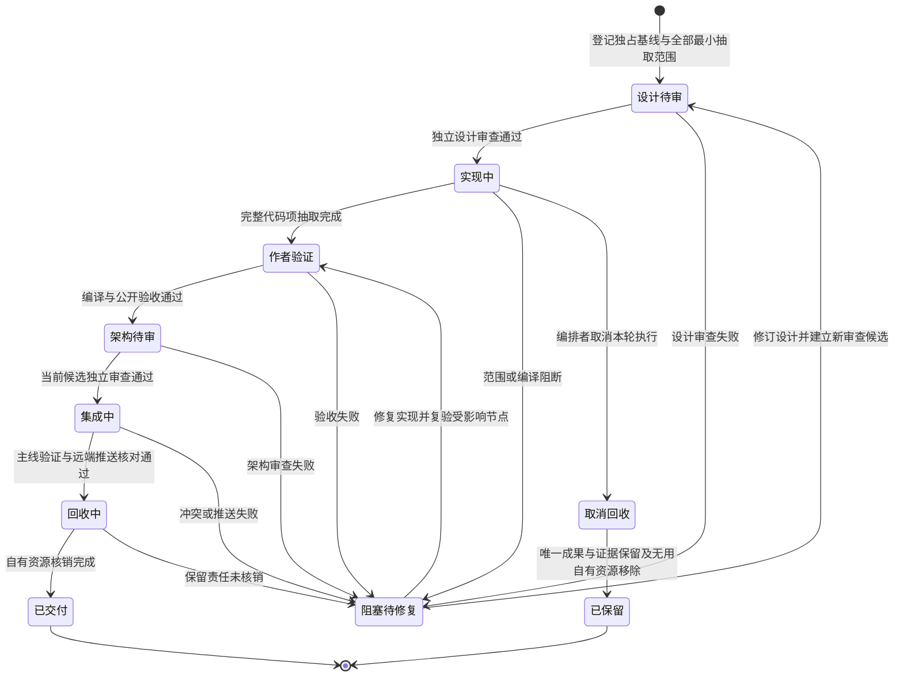

# SDK source line-limit repair v1

*(Historical extraction plan. It names the method group as it stood at base
`61e8c53`; the `retire_cross_project_anchor` path it lists was later deleted by
`collab-pane-route-ownership-20261006.md` revision 8.)*

## Goal

Make the strict `verify-sdk-source-registry` gate pass on `base 61e8c534b5295fb0f60a6634ad3cf99d99f12a4c` without changing the 1500-line default, without changing the DAGpipe module's declared 3500-line exception, and without relaxing the gate's treatment of tracked or untracked SDK source paths.

This is a design artifact for independent review. It proposes source-file extraction only, not behavior changes. No product code has been changed in this task.

## Baseline observation

- Worktree: `/Volumes/Intel/playground/appsdk/sdk-source-limit-diagnosis-20261004`
- Branch: `codex/sdk-source-limit-diagnosis-20261004`
- Base: `61e8c534b5295fb0f60a6634ad3cf99d99f12a4c`
- Exact external tested binary: `/Users/fanzhang/.codex/task-evidence/agentteams/receipts/composed-archive-20261004/retained/appsdk-composed-acceptance`
- Binary SHA-256: `3466d44ee61d8bdd9dbe7c60f33c2badd762b257a20c8232135d1c666f6bea72`
- Raw gate run from the owned source tree: `SDK_SOURCE_LINE_LIMIT:collab/src/identity.rs:1826>1500`, exit `1`.

The gate uses `git ls-files --cached --others --exclude-standard -z`, resolves exactly one active owner per path from `contracts/maps/module-registry.json`, applies each module's `source_line_limit`, and fails fast on the first `.rs` over that limit. The observed first violation is `collab/src/identity.rs`, whose owner is `collab-runtime` with default limit 1500.

## Root cause

Source files that are logically whole modules or test areas accumulated past their owner limit. Pin/transition work did not alter these line counts, so `identity.rs` remains 1826 lines at this base. The line-limit gate is correct; the file layout is what violates the contract.

## Violation inventory (base `61e8c534`)

Only files whose active owner limit is actually exceeded are violations. `dagpipe/src/lib.rs` has 3159 lines but is owned by `dagpipe-runtime`, whose declared limit is 3500, so it is not a violation.

| Path | Lines | Owner limit | Owner module | Blob at base |
|---|---:|---:|---|---|
| collab/src/identity.rs | 1826 | 1500 | collab-runtime | `aafb2567132f1a78365d8fc20c6049154d1862fe` |
| collab/src/identity_tests_part2.rs | 1873 | 1500 | collab-runtime | `ab5e813b994ac3ccc6a501939f79d9d8ff2d3d96` |
| collab/src/server/host_route_registry_tests/part_02.rs | 2838 | 1500 | collab-runtime | `2454b4f4d9175f7c231fa7e67a78965c229b4564` |
| collab/src/server/mod_parts/part_04.rs | 1955 | 1500 | collab-runtime | `845f9700acd34e6f6cc504ab15804f3a43e7c99f` |
| collab/src/server/mod_parts/part_07.rs | 1601 | 1500 | collab-runtime | `9f8b2e86a953932ac67c47ecab45cadc32b04cba` |
| collab/src/server/mod_parts/part_02.rs | 1558 | 1500 | collab-runtime | `dc434740f4d8b8d55ee0dbe27ebdea87baedd6a3` |
| collab/src/main_tests.rs | 1544 | 1500 | collab-runtime | `cf7d46000eab0097f68aed40a3eea4039f430791` |
| collab/src/server/peer_tests/part_08.rs | 1533 | 1500 | collab-runtime | `91ebe1671241b2849eeb53a4ef703ccff73f0ee0` |
| collab/src/main.rs | 1515 | 1500 | collab-runtime | `31f3b9a6bc23390286bc83eccb7b18705a61dde0` |
| rust/tests/cli_smoke/part_17.rs | 1510 | 1500 | verification-tests | `395ed3393d11561807d745a03f3a05e98ebc6acf` |

All ten rows above are real gate violations under strict owner-specific limits.

## Smallest proposed extraction seams

Use existing `include!` conventions, preserving lexical scope, attributes, imports, visibility and test identity. New files stay beside their original source, preserving relative fixture paths. Do not introduce child modules, re-export aliases or widen visibility. Only the oversized `ProjectRuntimeManager` impl needs two impl blocks of the same existing type to move complete associated methods.

Avoid `part20` and `part21` filenames because pin/transition authors reserve them. Proposed names are semantic, not ordinal.

### 1. `collab/src/identity.rs` (1826 -> target <=1500)

Move only the whole-item recovery group at base lines1166-1605 (liveness types, classification, candidate selection and scope rebind) to `collab/src/identity_recovery.rs`; include it at its original position. About440 lines move, leaving about1387. Receipt, binding, persistence, load entrypoints and the existing test module remain in place; private items keep the same lexical visibility.

### 2. `collab/src/identity_tests_part2.rs` (1873 -> target <=1500)

Keep the existing `part2` module/test names. Move a contiguous complete test tail of400-1000 lines to `collab/src/identity_tests_part2_tail.rs`; replace it with an include at the original position. Select a complete test-attribute boundary and preserve helpers; no nested module or duplicate import.

### 3. `collab/src/server/host_route_registry_tests/part_02.rs` (2838 -> target <=1500)

Split immediately before the whole `fenced_master_fixture` item (base approximatelyline1385). Keep the first segment in `part_02.rs`, move remaining items to `host_route_registry_tests/part_02_tail.rs`, and include at the original position. Shared helpers retain lexical scope. Both halves must be below1500 after formatting; do not split an individual test.

### 4. `collab/src/server/mod_parts/part_04.rs` (1955 -> target <=1500)

Move only the first contiguous complete-method group (base lines86-681, `new` through `retire_cross_project_anchor_candidate`) into `mod_parts/runtime_manager_setup.rs`, inside an impl of the same existing type. Include it adjacent to the original impl; remaining methods stay in that original impl. Expected sizes are about600 and1360. Only the extra impl wrapper/include are structural; bodies, attributes and visibility remain unchanged.

### 5. `collab/src/server/mod_parts/part_07.rs` (1601 -> target <=1500)

Move only `record_ordinary_peer_presence_edges` (base lines460-584, approximately125 lines) to `mod_parts/ordinary_presence_edges.rs`, including at its original position. Other handlers stay in place; expected original size is about1477.

### 6. `collab/src/server/mod_parts/part_02.rs` (1558 -> target <=1500)

Move only `append_host_route_record` (base lines1443-1528, approximately86 lines) to `mod_parts/append_host_route_record.rs`, including at its original position. Keep the Server impl/other storage helpers; expected original size is about1473.

### 7. `collab/src/main_tests.rs` (1544 -> target <=1500)

Move adjacent complete live-closure tests totaling at least60 lines to `collab/src/main_tests_live_closure.rs`, including at the original position. Keep imports, fixtures, original test identities and the existing part2 module. Record actual moved test names before editing.

### 8. `collab/src/server/peer_tests/part_08.rs` (1533 -> target <=1500)

Move only the final complete `explicit_send_reports_appserver_wake_rejection_after_durable_commit` test and attribute (base lines1492-1533) to `peer_tests/appserver_wake_rejection.rs`; include at its original position. Other tests stay in place; expected original size is about1492.

### 9. `collab/src/main.rs` (1515 -> target <=1500)

Move only `format_cli_error` (base lines664-691, approximately28 lines) to `collab/src/main_error_format.rs`, including at its original position. Main/run dispatch stays unchanged; expected original size is about1488.

### 10. `rust/tests/cli_smoke/part_17.rs` (1510 -> target <=1500)

Move only the first complete `goal_subscribe_rearms_after_failed_subscribe_and_absent_remote_cancel` test (base lines1-135) to `rust/tests/cli_smoke/goal_subscribe_rearm.rs`; include at its original position in part17. The main include registry stays untouched, avoiding pin/transition-owned part20/21 and main.rs. Expected original size is about1376.

## Roles, events, state

### Roles

- SDK source owners: `runtime-core` owns the existing registry validator; `collab-runtime` and `verification-tests` own the moved files; `sdk-delivery` owns these design/evidence artifacts. No logical owner changes.
- Repair implementer: performs extraction in a separate candidate worktree, not this diagnosis tree.
- Independent reviewer: reviews the design now and the candidate diff later.
- Gate verifier: runs the exact external tested binary from the source tree and records output.

### Events

- `registry_snapshot_loaded`: producer is `contracts/maps/module-registry.json`; consumer is the gate and the design.
- `violation_enumerated`: producer is read-only inspection; consumer is the repair candidate.
- `extraction_committed`: producer is repair implementer; consumer is the black-box suite.
- `registry_gate_green`: producer is exact tested binary; consumer is acceptance.
- `consumer_replay_green`: producer is public consumer harness; consumer is acceptance.
- `cleanup_receipt`: producer is implementer; consumer is the parent orchestrator.

### State machine



The primary owns lifecycle transitions. Retry uses a new candidate/attempt and reuses unaffected evidence; it creates no graph back-edge. Integration failure stops integration. Dirty/unknown resources keep explicit retained obligations.

## Allowed files and owners during implementation

Only the ten enumerated source files, the ten exact new include files above and associated evidence may change. One bounded source-layout unit has one author; root include registries do not change because includes occupy original item positions. `contracts/maps/module-registry.json` stays unchanged; existing collab/** and rust/tests/** ownership covers all new files under the same1500 limit. Additional source paths require primary scope revision before writing.

The graph is owned by `sdk-delivery` via docs/**. It is static repair governance; its Operator names do not claim executable registration. No runtime registry or second delivery cache is added.

## Exact build, fmt, test, and black-box obligations

Run these from the candidate worktree after extraction:

```sh
cargo fmt --manifest-path rust/Cargo.toml -- --check
cargo fmt --manifest-path collab/Cargo.toml -- --check
cargo build --manifest-path rust/Cargo.toml --bin appsdk
cargo build --manifest-path collab/Cargo.toml --bin collab
cargo test --manifest-path rust/Cargo.toml --test cli_smoke goal_subscribe_rearms_after_failed_subscribe_and_absent_remote_cancel -- --exact --test-threads=1
cargo test --quiet --manifest-path collab/Cargo.toml --bin collab identity::tests -- --test-threads=1
cargo test --quiet --manifest-path collab/Cargo.toml --bin collab server::host_route_registry_tests -- --test-threads=1
cargo test --quiet --manifest-path collab/Cargo.toml --bin collab server::peer_tests -- --test-threads=1
cargo test --quiet --manifest-path collab/Cargo.toml --test tmux_recv_e2e -- --nocapture
```

Record actual moved root `tests::` names using `cargo test --manifest-path collab/Cargo.toml --bin collab -- --list`, then run each exact `tests::<name>` with `--exact --test-threads=1`. Every requested filter must execute nonzero tests; a zero-match result is invalid evidence. Do not run all AppSDK CLI tests for a135-line test move. Use harness-owned roots and unset ambient TMUX/TMUX_PANE/session identity inputs; no host registration command runs against canonical host state.

The existing tested external validator may verify candidate source because the validator itself is unchanged:

```sh
/Users/fanzhang/.codex/task-evidence/agentteams/receipts/composed-archive-20261004/retained/appsdk-composed-acceptance verify-sdk-source-registry .
```

The expected success stdout must contain `{"ok":true,"gate":"sdk_source_registry"}`. The strict 1500/3500 rules are not relaxed and untracked source is not ignored.

## Real public consumer harness

The moved AppSDK test uses the real CLI; tmux_recv_e2e is a real isolated CLI/socket consumer. Identity/server development tests supplement public boundaries and do not claim installed daemon or Desktop/TUI acceptance. Record nonzero test counts, fixture scope and cleanup. Run freshly built collab `--help` as an additional deterministic public CLI projection check; this alone is not runtime acceptance.

Positive consumer cases:

- Isolated CLI/socket harness registration/send/receive assertions pass; no host context/init command is requested.
- The exact moved AppSDK public test retains its original assertions.
- Strict source-registry verification of the exact staged candidate returns success for all declared limits.

Negative consumer cases:

- Existing identity/server development refusal assertions remain unchanged.
- In an isolated exact-source archive fixture with fresh local Git index, add one owned1501-line comment-only .rs file under collab/. The same public gate must return nonzero SDK_SOURCE_LINE_LIMIT; remove the fixture afterward. Registry and real host state remain unchanged.

## Platform applicability and cleanup

The collab tests use `std::os::unix::net` in test-only AppServer fixtures. The moved collab test files therefore keep the existing unix-only reality already present at base; CI runs Linux and this design does not broaden APIs. The candidate worktree must run the suite with the same `TMUX`/`TMUX_PANE` isolation used by prior full-suite records and then stop any task-owned tmux server with `tmux -S <socket> kill-server`, verify `list-sessions` returns `no server running`, remove task-owned temp roots, and confirm `git worktree list --porcelain` no longer contains the candidate worktree after parent reclaim.

## Existing behavior graphs remain unchanged

This repair moves source items between files that are internal to the same crate modules. Existing product behavior graphs (`collab-context`, `collab-identity-adjudication`, `sdk-pin-history`, notification graphs, etc.) describe business object flow: registration receipts, identity rebind, notifications, and SDK pin history. Those flows, their owners, and their public behavior are unchanged by extraction, so no existing graph topology changes.

The new graph governs the candidate-admission evidence object, not the whole delivery lifecycle or a product execution. Its final cleanup covers only consumer fixtures/temporary processes and emits a candidate acceptance receipt. Candidate worktree/branch cleanup occurs after exact architecture review, latest-main integration, mainline verification and remote push under the existing delivery contract; candidate acceptance never claims those later actions. It is static only and not registered as an executable graph; no runtime registry change is required for a source-layout repair.

## Known long baseline tests

No full long baseline suite was run in this design-only task, so none is claimed passed. The current known blocking baseline at base `61e8c534` is the registry gate red above. Historical full-suite records in `docs/goals/appsdk-collab-tmux-rewrite-20260923-plan.md` passed at earlier candidate commits, but they are not evidence for this base. Any reviewer must not treat them as current.

## Out of scope

- No product behavior change, no threshold change, no untracked-source ignore.
- No commit, merge, push, install, daemon, OTA, or Collab identity action.
- No file outside `docs/design/sdk-source-limit-repair-v1.md`, `docs/dagpipe/sdk-source-limit-repair.graph.json`, and `docs/evidence/f7bf558-source-limit-20261004/**` is written by this task.
- Pin/transition authors own their separate trees; `part20`/`part21` filenames are avoided.

## Handoff

This design is ready for independent design review. It does not claim a product fix or gate PASS.
