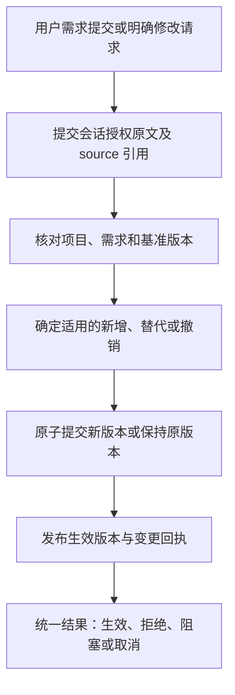
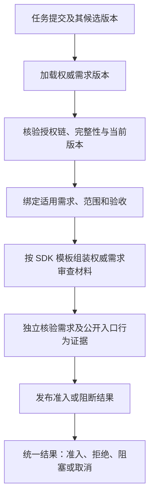
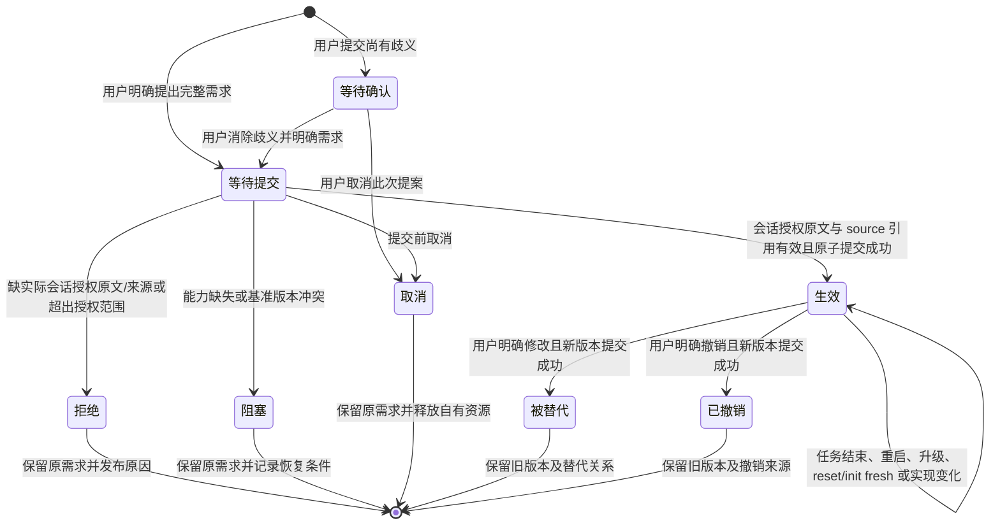

# 用户需求真相锁：设计、现状 gap 与实现合同

日期：2026-10-07（America/Los_Angeles）。

状态：会话授权合同已取得独立设计 PASS，完整持久需求锁已实现于 0.1.0012 候选。唯一 owner、原子历史提交、消费版本、reset 保留和 SDK reviewer 材料已接通，作者公开黑盒正在完成全量验收。最终安装、架构 review、CI、集成及清理状态见 `../evidence/user-requirement-truth-lock-20261007/session-lock-notes.md` 和 session-lock 交付回执。此前 G9/T16 的 0.1.0011 增量已交付，本轮复用它，不另建 review 真源。

授权信任边界：用户的真实会话原文就是授权。执行 agent 按会话记录提交授权原文及 source 引用，独立 reviewer 对照原会话核验变更范围。不要求机器身份认证、签名、独立账号/daemon 或外部权限隔离作为前置条件；AppSDK 不声称能抵抗同 UID 恶意伪造整套文件。

源码核查基线：AppSDK `main` / `c3c0c8df79e69534fe30c92db61328824473d5c0`。当前源码仓库根目录没有 `.appsdk/project.json`，不能把它视为已启用治理的业务项目。后续实现从最新 `origin/main` 建立独立外置 worktree。

## 1. 用户要求与完成目标

用户原文：

> 用户可能需要输入一些需求，只能用户提出修改才能修改，否则永远作为真理存在

含义：已确立的用户需求是项目的规范性真相，持续生效。只有用户明确提出该需求的变更，才能改变其内容、约束、验收标准或有效状态。Agent、reviewer、实现代码、测试结果、任务状态和治理重建都不能自行改变它。

用户后续明确授权边界（原话）：

> 用户在会话里提供授权就行了，你不要做无用的校验，我们不要过度校验。

含义：授权来源是用户在会话中提出的原文，不是独立的机器认证或物理权限隔离。用户提出需求或变更时，其会话原文连同 source 引用即构成授权依据；执行 agent 负责提交这份原文，独立 reviewer 负责对照原会话判断变更范围。机器只做契约内可判定的检查，不额外引入认证层或过度校验。

“永远”指无自动过期和无隐式失效，不指把用户需求当作外部世界的事实判断。发现矛盾、无法实现或与更高优先级安全约束冲突时，显式报告，并阻断受影响操作；不得改写需求来制造一致。非受影响工作继续。

目标：用户输入需求后，系统可建立长期有效的需求版本；读取与验收都绑定该版本；未经授权的更改被拒绝或在消费前识别并阻断；用户明确变更可生效，旧版本与授权来源可追溯。

## 2. 范围、非目标与信任边界

范围：AppSDK 管理项目的用户需求登记、变更授权、版本提交、只读消费、适用 gate、SDK 分发与需求保留。复用现有目标澄清和治理入口，不新增独立调度器或重复真源。

非目标：冻结整个源码仓库；把每句话自动提升为永久需求；改变 Collab 身份恢复；重写 DAGpipe Runtime；新增未经论证的数据库或 daemon；自动治理其他项目；把实现细节全部变成用户需求。

权限角色：

| 角色 | 允许 | 禁止 |
| --- | --- | --- |
| 用户 | 在会话中提交需求；明确修改、撤销或替代指定需求 | 授权不从一般开发动作推导 |
| 执行 agent | 按会话记录提交授权原文及 source 引用；读取、实现、报告冲突 | 自行批准；伪造或替代会话原文；删除或改写已生效需求；以降验收代替修复 |
| 独立 reviewer | 对照原会话核验授权原文与变更范围；核验消费是否匹配需求版本 | 用字符串相似度或机器判定的角色字段冒充用户身份认证；自行批准范围外变更 |
| AppSDK 需求 owner | 校验必要字段与基准版本；单次原子写提交唯一 ledger；提供只读投影 | 从日志、聊天摘要或当前实现反推需求；接受缺原文/来源的裸确认字段 |
| 消费 gate | 读取权威版本；按版本绑定 goal 与消费上下文 | 回写需求以通过验收 |
| AppSDK review 治理 owner | 维护并分发正式 review 模板；从唯一 ledger 加载需求与历史 | 把某台机器的 reviewer Skill 当作项目权威需求或产品模板真源 |

自然语言授权范围的判定属于执行 agent 和独立 reviewer，不用字符串相似度或角色字段充当认证。`authorization.original_text` 与 `source` 缺失时拒绝，不生成生效回执。

AppSDK 不声称能抵抗同 UID 恶意伪造整套文件：拥有同等文件写权限的主体可以整体替换 `.appsdk/requirements.json`。本设计因此不承诺物理防篡改，也不为此增加可被同权限主体一并伪造的哈希校验或独立服务。可保证的边界是：契约内可判定的 malformed/不一致 ledger 与旧消费版本被显式识别并阻断，且这一限制在消费结果中如实声明。

## 3. 原始基线与 gap

下表保留原始源码核查基线。它记录本轮实现前的 gap，不能作为当前能力缺失的判定。

| ID | 当前事实与依据 | gap | 唯一修复责任 |
| --- | --- | --- | --- |
| G1 | `contracts/records/goal-clarification-record.schema.json` 保存原文、理解目标、验收与确认字段 | 单一任务目标记录未提供长期需求集合、逐条版本与明确替代关系 | AppSDK 需求契约 owner；与目标澄清分清职责 |
| G2 | `rust/src/main/registry.rs:696` 校验目标格式；`:785` 仅检查确认状态与确认人/时间非空 | 缺少会话授权原文与 source 引用；裸确认字段不构成授权，也无法绑定修改范围与旧版本 | AppSDK 需求契约 owner（`requirements.rs` 单 owner） |
| G3 | `rust/src/main/compile.rs:1105` 快照包含目标文件；`rust/src/guidance.rs:401` 绑定 `goal_hash` | 改动检测没有证明改动获得用户授权；新建快照也不能授予权限 | 需求版本校验 owner，现有快照只消费其结果 |
| G4 | `rust/src/main/registry.rs:690` 普通校验允许无目标；`rust/tests/cli_smoke/part_10.rs:416` 明确覆盖该契约 | 普通 verify PASS 不是“需求锁已建立”的证明；缺少需求专属状态与强制适用入口 | 需求消费 gate；保留普通项目兼容契约 |
| G5 | `rust/src/main/project.rs:52` 验证 `protected_paths` 声明；`promotion.rs` 等保护冻结产物历史 | 路径声明与产物冻结不证明需求变更来自用户会话；缺少按会话授权原文绑定的变更记录与版本历史 | 需求存储/提交 owner（`requirements.rs` + `.appsdk/requirements.json`） |
| G6 | `rust/src/main/reset_run.rs:83` 的保留列表声明业务源、runtime、active、protected | 未看到已建立的长期需求专属保留与恢复合同；reset 是否保留未来需求须明确并黑盒验证 | 现有初始化/迁移/reset owner |
| G7 | 已有目标未确认拒绝编译/晋级测试；CI 运行源码测试与发布检查 | 未发现会话授权原文/来源提交、缺原文拒绝、撤销、并发及持久化的需求锁完整黑盒矩阵 | 公开 consumer/harness + 现有 gate/CI owner |
| G8 | 当前根目录无 `.appsdk/project.json` | SDK 源码仓库默认不受 managed-project 需求治理，不能把功能存在等同于当前项目启用 | 明确消费项目/隔离 fixture；禁止自动 init 当前仓库 |
| G9 | 现有 AppSDK bundle 分发 review-record/pre-review-validation 契约；现有 ReviewRecord 绑定候选及 map，但未声明权威需求版本与完整 review 材料。上一轮仅更新全局 reviewer Skill | AppSDK 必须拥有正式 review 模板、需求上下文组装、分发与 review 准入/记录绑定；当前全局提示词补充不是产品交付 | AppSDK review 治理 owner + SDK bundle 分发 owner；backend 只执行正式材料并返回证据 |

已存在的目标澄清设计：`docs/design/goal-clarification-contract.md`。需求锁必须与其衔接，不能再制造另一个“当前目标”真源。目标记录描述一次工作的意图；长期需求描述该项目持续生效的约束，目标通过版本引用消费需求。

## 4. 两条独立 SESE DAG

项目 graph：

- `docs/dagpipe/user-requirement-change.graph.json`：一次需求提交或变更对象。
- `docs/dagpipe/user-requirement-consumption.graph.json`：一次任务消费需求对象。

两个来源独立，分别单入口、单出口；不把用户提交与任务执行合成多入口图。提交结果形成不可变版本引用，消费链只读取，不向变更链回写。

图中的 operator 绑定是责任映射；实现由唯一 requirements owner 和既有消费边界执行。DAGpipe CLI 仅验证静态拓扑，没有新增可执行 Runtime Operator。

### 4.1 需求提交/变更 DAG



| 节点 | 输入 → 输出 | owner / 拟定绑定 | 副作用与可验收结果 |
| --- | --- | --- | --- |
| 提交会话授权原文 | 请求对象 → 授权材料 | 执行 agent；`appsdk.requirements.submit_authorization@1` | 提交 `authorization.original_text` 与 `source`；缺原文或来源时材料不完整，无提交能力 |
| 核对基准版本 | 授权材料 → 版本判定 | 需求 owner；`appsdk.requirements.check_base@1` | 读取唯一 ledger 当前版本；错项目或 `base_version` 不符返回明确冲突 |
| 确定变更范围 | 版本判定 → 提交决策 | 需求 owner + 独立 reviewer；`appsdk.requirements.decide_change@1` | 由执行 agent 与 reviewer 对照原会话确定范围；歧义标阻塞，不能推断扩大范围 |
| 原子提交或保留 | 提交决策 → 提交结果 | 需求 owner；`appsdk.requirements.commit_revision@1` | 唯一写节点；单次原子写 `.appsdk/requirements.json`；`cancel` 不改变 ledger |
| 发布回执 | 提交结果 → 最终结果 | 需求 owner；`appsdk.requirements.publish_outcome@1` | 明确新旧版本、效果、`request_id` 与授权引用；失败不得包装成生效 |

Graph 中每个 ARC 携带结构化结论。`eligible=false` 的拒绝/阻塞/取消结果只向终点传递，提交节点不能写入；各节点不隐藏跨节点路由或恢复授权。IO 异常由调用 owner 形成失败结果；图不保证异常后继续执行。不得把授权材料缺失伪装成成功输入。

### 4.2 任务消费/验收 DAG



| 节点 | 输入 → 输出 | owner / 拟定绑定 | 可验收结果 |
| --- | --- | --- | --- |
| 加载版本 | 任务请求 → 权威需求引用 | 需求读取 owner；`appsdk.requirements.load_effective@1` | 从唯一 ledger 加载全部需求及历史；无权威版本（旧项目）时明确返回未建立保护；不能读聊天摘要补齐 |
| 核验版本 | 权威引用 → 版本状态判定 | 需求 owner；`appsdk.requirements.verify_effective@1` | 契约内可判定的 malformed/不一致 ledger 与陈旧消费版本明确阻断；不声称覆盖完整同权限篡改 |
| 绑定范围 | 版本状态判定 → 任务约束 | 目标/准入 owner；`appsdk.requirements.bind_task@1` | 按版本绑定 `goal.requirements_version` 与现有候选 `goal_hash`；合法变更后未更新即判 stale；agent 可缩小实现工作，不能删掉适用验收 |
| 组装 review 材料 | 任务约束 → 正式审查材料 | AppSDK review 治理 owner；`appsdk.requirements.assemble_review_packet@1` | 从唯一 ledger 加载全部需求及历史，不用 agent 填需求内容；agent 只提供 scope/证据，不能漏需求或改原文 |
| 核验审查/行为证据 | 正式审查材料 → 验收判定 | 独立 reviewer + 现有验证 owner；`appsdk.requirements.evaluate_evidence@1` | 逐条核验权威需求及公开结果；材料、需求版本或证据不匹配不能 PASS |
| 发布准入 | 验收判定 → 最终结果 | 现有 gate owner；`appsdk.requirements.publish_admission@1` | 当前阶段准入/阻断；不代替后续 review、merge、安装或交付 |

消费链不负责执行所有业务操作；它是各适用阶段围绕当前需求版本的准入/验收对象流。开发准入检查版本和任务绑定，验收阶段再检查行为证据；不要求尚未开发的代码先提供成功证据。具体阶段适用性复用现有生命周期 owner。goal 是引用，不是需求内容副本：`goal.requirements_version` 指向当前 ledger 版本，`review-context` 从唯一 ledger 加载内容，不把需求正文复制进 goal。

### 4.3 状态机与失败终点



状态机可跨执行发生变更；单次 DAG 不含回边。拒绝/阻塞后新请求使用新执行身份，不能偷偷重用授权。提交成功后取消不能擦除结果（`cancel` 不改变 ledger）；如需撤销，必须是新的明确用户请求。结果未知时先按原请求身份查证，不能盲目再提交。

“生效”没有 TTL。旧版本被替代或撤销也不删除历史。任务关闭、Collab 通知取消、SDK 升级、reset/init fresh 或 worktree 回收不能触发需求失效；reset/init fresh 与普通升级保留 ledger。

## 5. 最小数据与公开接口合同

唯一 owner：`rust/src/main/requirements.rs`。长期唯一 ledger：`.appsdk/requirements.json`，单次原子写同时保存历史与当前版本；不放 task cache，也不放可随 cleanup 删除的 `.appsdk-control`。

公开 CLI：`appsdk requirements <show|history|apply|verify> [project]`，默认为当前项目；`apply --input <file>`。`show`/`verify` 返回保护状态（旧项目未建立时明确报告）；`history` 返回全部需求与历史；`apply` 是唯一写入口。

每条 `apply` 输入：

| 字段 | 必需语义 |
| --- | --- |
| `request_id` | 调用方稳定请求身份；用于重复请求复用与结果未知查证 |
| `requirement_id` | 精确需求身份 |
| `base_version` | 该请求所依据的旧版本；首次为 `0` |
| `operation` | `create` / `replace` / `revoke` / `cancel` |
| `text` | `create` / `replace` 的新规范内容 |
| `authorization` | `{role: user, source: 会话引用, original_text: 用户原文}` |

| 对象 | 必需语义 |
| --- | --- |
| 需求版本 | 稳定项目/需求身份、版本、原始用户内容、当前规范、`source` 引用、前版本、`operation`、创建事实；无自动过期字段 |
| 变更回执 | `request_id`、`authorization` 引用、新旧版本、提交结果或明确原因；可查询以处理重复及结果未知 |
| 任务需求绑定 | 适用需求 ID 与精确版本、候选、范围及验收引用；只读，非第二套需求内容 |

机器只检查契约内可判定的内容：必要字段存在、精确需求身份与 `base_version` 一致、`operation` 合法。自然语言授权范围是否确实由用户提出，由执行 agent 提交 `original_text` 与 `source`、独立 reviewer 对照原会话核验；不用字符串相似度或角色字段充当认证。

写入口须保证：同一 `request_id` 原输入重复复用回执；同 `request_id` 不同内容拒绝；并发 `base_version` 冲突只允许一个合法提交；写入失败保持原子，不留半写状态。`cancel` 不改变 ledger。重试与并发保证只放在唯一提交 owner。

消费合同：`show`/`verify` 返回保护状态；按版本把 `goal.requirements_version` 与现有候选 `goal_hash` 绑定；`review-context` 从唯一 ledger 加载全部需求及历史，不接受 agent 自行填写需求内容。合法变更后 `goal.requirements_version` 未更新即判定 stale。`goal` 是需求版本的引用，不是需求内容的副本。

普通用户新增需求不需要重复确认明显且完整的原指令。需要 agent 解释或推导的条目保持待确认；不得将 agent 推导直接升格为真相。新的需求与既有需求冲突时，要求用户明确被替代范围；不能凭“较新的一条消息”自动废弃所有旧需求。

兼容：原 `.appsdk/goal.json` 是任务目标，不静默迁移成长期需求；无 `source` 的历史记录标未确认。无需求锁的旧项目明确报告未建立保护，不自动初始化或锁死。`reset` / `init fresh` 与普通升级均保留 `.appsdk/requirements.json`。

## 6. 实现依赖、文件责任与停止条件

### 6.1 编码前能力确认与设计准入

必须证明以下能力，并写入独占 run notes：

1. 会话授权原文与 source 引用的提交入口，以及执行 agent 与 reviewer 的分工方式。
2. 唯一 ledger `.appsdk/requirements.json` 的单次原子写、`base_version` 冲突与 `request_id` 幂等行为。
3. 最小真实 consumer/harness、合法与畸形输入、公开读取与写入失败的验证方法。
4. AppSDK 源码开发、候选组合、构建、安装、现有 gate、交付及资源回收入口。

不要求机器认证用户身份或建立外部权限隔离；这些不是编码前前置条件。缺必要能力或独立 DAG review 未 PASS 时，不写产品代码；保留具体 blocker、责任方和可执行下一步。

### 6.2 当前可用增量

先打通一个 AppSDK 管理项目中的最小真实主线：用户会话提出需求 → 执行 agent 提交原文及 source → 原子持久化生效版本 → agent 只读消费 → 缺会话原文的修改被拒绝 → 用户明确变更生效 → 公开入口验收。

增量内先实现最少对象和唯一 owner，不把界面优化、搜索、批量导入插入主线。其后按依赖完善历史兼容、reset/升级保留、现有 gate 全接线及分发；总目标验收不降低。实现前重新划定当前增量及完成条件，不预设固定迭代次数。

### 6.3 责任与候选改动面

| 工作 | 候选文件/模块 | 依赖及边界 |
| --- | --- | --- |
| 需求唯一 owner 与 ledger | `rust/src/main/requirements.rs`、`.appsdk/requirements.json` | 唯一提交/读取 owner；单次原子写；不新增第二套需求真源 |
| 需求契约与 CLI | `rust/src/main/cli` 的 `requirements` 子命令、必要 JSON 输入校验 | `appsdk requirements <show|history|apply|verify>`；`apply --input` |
| 消费 gate | `compile.rs`、`review_gates.rs`、`lifecycle_chain.rs`、`promotion.rs`、`guidance.rs` 的受影响入口 | 调用同一需求 owner；按版本绑定 goal 与条件性消费版本；不改无关生命周期 |
| SDK review 模板与组装 | SDK 正式资源、bundle 分发、review context producer、`review_gates.rs` 与 ReviewRecord 验证 owner | `review-context` 从唯一 ledger 加载全部需求及历史；不能仅改全局 Skill |
| 保留与兼容 | `init.rs`、`reset_run.rs`、`reset_validate.rs` 与对应 migration owner | `reset`/`init fresh` 与普通升级保留 ledger；无锁旧项目保留兼容 |
| SDK 分发 | 现有 bundle、模板和资源分发 owner | 新契约从真源分发；不手写生成镜像；按现有版本协议更新 |
| 黑盒与接线 | `rust/tests/`、现有消费 harness、适用 CI | 从公开入口断言外部结果；不以源码字符串测试代替 |

表格是预计改动面，不授权重写所有文件。最终文件所有权在查真实调用链后缩小；实现和独立审查由不同执行者承担。同层无依赖的只读确认可并行；涉及同一提交真源的实现不得重叠写入。

## 7. 黑盒验收矩阵

所有证据绑定精确候选、真实入口、输入、必要环境、可观察结果和副作用。以下为测试合同，执行结果见 session-lock 当前交付回执与公开 CLI 回归日志。

| 用例 | 输入/操作 | 必需外部断言 |
| --- | --- | --- |
| T1 首次确立 | 真实用户明确提交完整需求 | 公开读取返回生效版本、原文与来源；任务可绑定 |
| T2 正常消费 | Agent 提交符合需求的任务与公开行为证据 | 适用阶段准入；需求内容未变 |
| T3 无授权修改 | Agent 直接调用修改/删除/撤销入口 | 明确拒绝；当前版本及历史不变 |
| T4 缺授权原文 | agent 提交裸 `confirmed_by` 或缺少实际会话授权原文/`source` 的输入 | 拒绝；无生效回执；不宣称机器识别角色 user 伪造 |
| T5 真实修改 | 用户明确修改指定条目 | 新版本生效；旧版本保留；其他条目不变 |
| T6 授权不匹配 | 错项目、错需求、扩大范围或基准版本不符 | 拒绝或冲突；原需求持续有效 |
| T7 失败不降验收 | 实现无法达标，agent 修改验收或称需求失效 | 修改拒绝；验收失败显式报告 |
| T8 持久生效 | 任务结束、重启、升级、治理 reset、清理任务资源 | 有效需求与历史保留；reset 不静默重新确认或撤销 |
| T9 契约内不一致 | 契约范围内的 malformed/不一致 ledger 与旧消费版本 | 公开消费 gate 明确识别并阻断；不承诺检测完整同权限篡改 |
| T10 重复与并发 | 重复请求、同身份变内容、两个旧版本并发修改 | 相同请求复用结果；变内容拒绝；并发只一个合法提交 |
| T11 写入中断 | 在真实提交边界制造写失败或响应丢失 | 无半生效状态；公开查证原请求，不重复生效 |
| T12 取消与撤销 | 提交前取消；提交后用户明确撤销 | 前者保留原需求；后者新增撤销版本并保留历史 |
| T13 冲突与授权材料缺失 | 矛盾需求、歧义变更、缺会话授权原文或 `source` | 明确等待/阻塞；不自选赢家、不用伪造原文继续 |
| T14 旧项目 | 无长期需求锁或仅有历史目标记录 | 报告未建立保护；不伪称已锁定、不自动建立授权基线 |
| T15 消费版本更新 | 用户合法改版后复用旧候选、旧证据或旧目标绑定 | 受影响消费明确陈旧；按新版本重验，不能修改原需求 |
| T16 reviewer 核验 | 通过完整提示词及公开 review consumer/harness 审查合法变更、无授权改动和必需来源缺失 | 需求来源/版本逐条核验；合法情形无相应阻断；违规或必需缺证据不能 PASS；详见 7.1 |

不要求无关项目全局停止。新功能的错误在需求写入/消费边界显式返回，不能因可隔离的失败 crash 整个服务。T4/T9 必须与实际授权边界一致；不承诺覆盖同权限主体，也不宣称机器识别角色 user 伪造。

### 7.1 reviewer 完整提示词与核验合同

用户补充：权威需求审查属于 AppSDK 治理，执行 agent 必须根据该项目的权威需求把 review 模板中的相关材料组装完整。AppSDK 源码及 SDK bundle 是正式模板和治理合同的真源；项目唯一 ledger `.appsdk/requirements.json` 是实际需求的真源。当前全局 Codex/AGY Skill 只承担 backend 适配和既有输出/裁决，不能替代 SDK 模板、分发或准入。

正式接线：SDK 维护规范模板并随 bundle 分发 → agent 调用 AppSDK 公开入口从唯一 ledger 加载需求与版本、组装候选 scope/授权原文与 source 引用/证据 → AppSDK 校验必要字段与版本绑定且未漏需求 → 独立 reviewer 对照原会话核验授权范围 → AppSDK 将核验结果与同一需求版本/候选绑定，准入或阻断。公开入口为 `appsdk requirements` 与 `review-context`；禁止为凑文档手写已有分发生成镜像。

模板区分 SDK 固定的核验义务与项目需求上下文。agent 可提交 scope 和证据引用，需求内容及版本必须从唯一需求 owner 加载，不能自由填写一份替代需求。生成的完整提示词是派生审查产物，不是新的需求真源；它必须能回链权威版本。任何 backend 均消费这份正式材料，不能依赖本机全局 Skill 恰好包含相同文字。

每次独立设计或架构 review 的完整提示词须提供或明确引用可读材料：

| 输入 | 本任务要求 |
| --- | --- |
| 权威需求 | 用户原文及 `source` 引用、需求 ID/精确生效版本；本设计第 1 节转录原文，实际内容以唯一 ledger 为真源 |
| 本次 scope | 精确候选/base、适用需求条目、允许/禁止路径、验收标准 |
| 需求变更 | 修改前后版本与用户明确变更指令/来源；无指令时没有需求修改授权 |
| 设计与实现 | 本设计、两份 graph、唯一 owner 和受影响调用链 |
| 验证证据 | 设计 review 读取能力与设计验收路径；实现后 review 读取作者已通过的开发/E2E、T1–T16 与必要运行证据 |

派单明确要求 reviewer：独立读取唯一 ledger 需求及 `source`；逐条核验设计/实现/证据；对照原会话与前一版本核验需求变更范围；记录所查版本和授权依据。不得用作者摘要或当前代码替代权威需求，也不得自行批准需求修改。

未经授权修改/撤销需求、降低验收或违反当前权威需求，必须产生阻断结果。当前契约所必需的需求来源、版本或变更授权原文缺失，同样不能得到 PASS。backend 适配优先复用现有 evidence 字段，AppSDK ReviewRecord/关联证据必须能够核验审查需求版本与候选匹配；只在现有合同无法表达时扩展字段，不另建 review 数据库。

T16 AppSDK review 治理：通过 SDK 公开资源/组装入口，从新建消费项目生成正式完整提示词，证明权威需求、版本、授权、scope 与验收证据齐全，且不依赖当前机器的全局 reviewer Skill。对漏需求、缺来源、陈旧绑定和未经授权改需求，AppSDK review 准入/记录 gate 必须阻断；合法材料经独立 review 后可通过相应 gate。记录 SDK 模板版本、完整提示词、需求引用、reviewer 输出和 AppSDK 核验结果。单独测试 Codex/AGY 字符串拼接不能代替该产品验收。

reviewer 是需求消费的独立质量核验者，不是需求写入 owner。沿既有 review 生命周期补齐模板组装与材料核验节点，不把 review 结果当作用户授权，不增加第三套需求真源。

### 7.2 执行增量与当前主线

用户要求使用新建 gcm worker 编排。首轮 G9/T16 模板、上下文和 review gate 已交付于0011；本轮0012完成G1–G8长期版本、原子提交、消费绑定和保留链。需求来源原文与 source 引用由执行 agent 提交，reviewer 对照原会话核验。

编码前由本设计冻结唯一 owner（`rust/src/main/requirements.rs`）、ledger（`.appsdk/requirements.json`）、公开 CLI 与消费绑定；parent 冻结当前增量的能力证据及修订 DAG，独立设计 reviewer PASS 后再派实现。parent 负责最终集成/验收，各 worker 拥有互不重叠的范围和独立记录。新增代码仍在最新 origin/main 的外置独占 worktree 中开发。

## 8. 实现后的交付终点

沿全局 AGENTS 和项目适用流程完成：独立外置 worktree → 能力确认与独立设计 review PASS → 最新 main 候选 → 实现和 debug → 开发测试与真实公开入口 E2E → 适用构建、安装及受影响运行验证 → 独立架构 review PASS → 适用 CI 与 clean main 集成/远端回执 → 自有资源回收。

AppSDK CLI 安装使用 `scripts/install-global-appsdk.sh`。只有实际影响目标 daemon 才进入其已声明维护通道；不能因本任务重启无关 Collab 或其他服务。具体授权沿现有规则，不把文档当作新的 lifecycle 批准。

完成 iff：全部适用 T1–T16 有公开入口证据；需求写入唯一 owner 与 `.appsdk/requirements.json` 单一原子 ledger 成立；消费/保留链已接通；旧版本可查；reviewer 对照原会话的授权核验与阻断证据齐全；源码、产物和运行证据绑定准确；适用 review、CI、集成及资源回收收口。图验证、单测或规范文本单独通过均不算功能完成。完成 iff 不含机器身份认证或物理权限隔离——它们不在契约内。

## 9. 本轮设计产物与核查

本轮仅修订本文件、两份设计 graph 及 `docs/goals/user-requirement-truth-lock-goal.md`，把身份认证/物理权限隔离前置要求替换为会话授权信任边界。没有产品代码改动，没有独立设计或架构 review PASS。

验证命令：

```sh
dagpipe graph validate docs/dagpipe/user-requirement-change.graph.json
dagpipe graph validate docs/dagpipe/user-requirement-consumption.graph.json
dagpipe graph inspect docs/dagpipe/user-requirement-change.graph.json
dagpipe graph inspect docs/dagpipe/user-requirement-consumption.graph.json
git diff --check
```

结果与阶段结论保存在 `docs/evidence/user-requirement-truth-lock-20261007/`。拓扑 PASS 仅证明图结构；本文件的会话授权信任边界是设计合同，实际实现仍待开发与验收。
