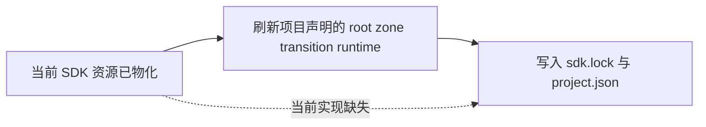
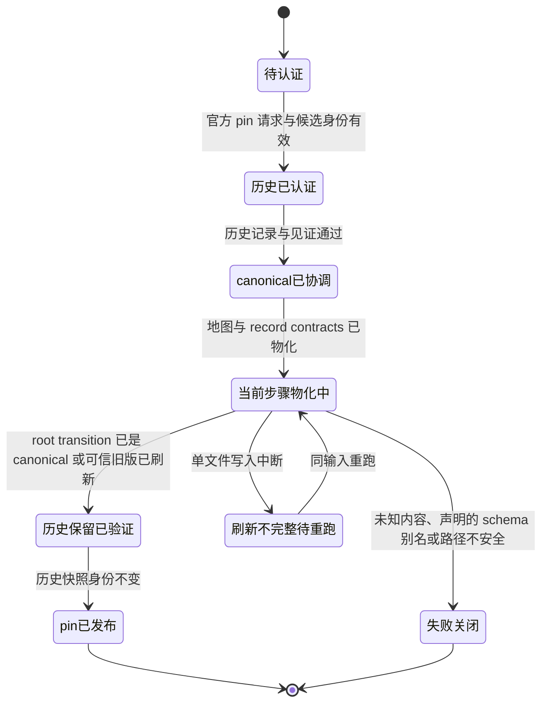

# 1a21b0c bounded transition-refresh diagnosis

Status: `DIAGNOSIS_COMPLETE`, `PRODUCT_FIX_NOT_APPLIED`, `INDEPENDENT_DESIGN_ADMISSION_PENDING`.

This report is restricted to diagnosis and an owner-correct design proposal. It does not claim a transition fix, installed SDK, Teams admission, BB acceptance, or MVP completion.

## 结论摘要

Proven result:

- The complete AgentTeams `de099b79` archive was extracted unchanged into an isolated fixture.
- The stopped-writer candidate CLI reproduced the public sequence: `pin-lock` exited `0`, then ordinary `verify` exited `1` with `INVALID_DECLARED_ZONE_CONTRACT`.
- The first omitted publication is in `pin_lock`: it refreshes `contracts/records/**` and `.appsdk/contracts/**`, but it does not refresh the project-declared root zone-transition runtime.
- The final validator is a symptom. In a separate copied fixture, replacing both root transition runtime files with the current source canonical runtime made `pin-lock` and `verify` both exit `0`.
- The reproduced legacy root runtime hash is `4568668437b4e0b44db4709d27e31c2783c8a6e4ccd828273a4675775f69ca1f`; the current canonical runtime hash is `ae910c4426c8bccc22c9e2256e8ca9842eb39c2caa783428afec5c9a2d44c5d5`.
- The only structural difference in the reproduced failure is the `playground -> active` transition: the old runtime has 13 `record_required` entries and omits `CollabLiveClosureRecordWhenParallel`; the current canonical runtime has 14 entries and includes it.

Historical distinction:

- Closed bug `8dc512f` fixed the default declaration used by `init` for new/source workspaces: it changed the default pointer from the legacy alias to the canonical runtime path.
- Current bug `1a21b0c` is different: the reproduced existing project already declares the legacy alias, and that alias contains an old runtime document. The refresh path leaves both the declared alias and its canonical sibling stale.
- The repository's source alias `contracts/transitions/zone-transition-manifest.json` is a JSON Schema, hash `6b4b5464f862e5b34ee0424135c13b9d8fc8e1158f1718d83ed33211610b6916`. It is not the reproduced legacy runtime. The refresh proposal must reject that schema-shaped alias rather than rewrite it.

No product source, test, contract, manifest, or release metadata was modified by this diagnosis. The proposal below requires independent design admission before implementation.

## 输入与隔离边界

| Item | Value | Verification |
| --- | --- | --- |
| Worktree | `/Volumes/Intel/playground/appsdk/1a21b0c-transition-diagnosis-20261003` | task-owned |
| Branch | `codex/1a21b0c-transition-diagnosis-20261003` | task-owned |
| Base commit | `bb9168d86342c7cfe910e1124b25e6bb7a8cffd9` | `git rev-parse HEAD` |
| Archive source | `/Volumes/Intel/playground/appsdk/a7cc2a4-pin-impl-20261003/docs/evidence/a7cc2a4-pin-impl-20261003/fixture-agentteams-de099b79.tar.gz` | source hash checked |
| Archive copied to | `.tmp/input/fixture-agentteams-de099b79.tar.gz` | copy hash checked |
| Archive SHA-256 | `2d91c66612c307e2ba76ceba188ca613e557840d69b9ef1568bb33825e68db50` | source and copy match |
| Candidate binary source | `/Volumes/Intel/playground/appsdk/a7cc2a4-pin-impl-20261003/.tmp/candidate/appsdk` | source hash checked |
| Candidate binary copied to | `.tmp/input/appsdk-candidate` | copy hash checked |
| Candidate binary SHA-256 | `86b7228db3e67495e922bd3ec092541a6384fc0bc8f6edd981b432ab1154dacc` | source and copy match |
| Parent-provided candidate tree | `tree93bec4fd39dcc1d3fab588e2830c622102f908c1` | not independently re-derived in this diagnosis |

The candidate binary is diagnosis input only. It is not the canonical installed product and was not installed, restarted, or promoted. The separate candidate worktree reports HEAD `bb9168d86342c7cfe910e1124b25e6bb7a8cffd9`; its candidate changes are outside this task's write boundary, so this report records the parent-provided tree identity as unverified rather than reconstructing it.

Both public runs used isolated state:

```text
APPSDK_HOME=$PWD/.tmp/appsdk-home-original
TMPDIR=$PWD/.tmp/tmp-original

APPSDK_HOME=$PWD/.tmp/appsdk-home-intervention
TMPDIR=$PWD/.tmp/tmp-intervention
```

The retained input archive contains 1044 regular-file entries and 171 directory entries, counted from `tar -tvzf` entry types (1215 total). These are pre-pin input counts, not a count of generated files after pinning. The former 1085-file statement had no retained counting method and is corrected here and in both receipts. Before the intervention, `diff -qr` reported no difference between the two extracted trees.

## 复现事实

### Original fixture

Pre-pin project state from the archive:

| Field | Value |
| --- | --- |
| SDK version | `0.1.6` |
| Declared zone transition path | `contracts/transitions/zone-transition-manifest.json` |
| Record contract count | `19` |
| Declared root file hash | `4568668437b4e0b44db4709d27e31c2783c8a6e4ccd828273a4675775f69ca1f` |
| Canonical sibling hash | `4568668437b4e0b44db4709d27e31c2783c8a6e4ccd828273a4675775f69ca1f` |

Public command results:

| Command | Exit | Raw result | Evidence |
| --- | --- | --- | --- |
| `pin-lock <fixture> --binary .tmp/input/appsdk-candidate` | `0` | `pinned .../.tmp/input/appsdk-candidate` | [original-pin-lock.log](logs/original-pin-lock.log) |
| `verify <fixture>` | `1` | `INVALID_DECLARED_ZONE_CONTRACT` | [original-verify.log](logs/original-verify.log) |

After `pin-lock`, the project advanced to SDK `0.1.0010` and 20 record contracts, but the declared transition path remained `contracts/transitions/zone-transition-manifest.json`. Both root transition files remained byte-identical to the pre-pin legacy runtime:

| Path | Hash before | Hash after | Result |
| --- | --- | --- | --- |
| `contracts/transitions/zone-transition-manifest.json` | `456866...ca1f` | `456866...ca1f` | unchanged |
| `contracts/transitions/zone-transition.manifest.json` | `456866...ca1f` | `456866...ca1f` | unchanged |

Historical migration and map identities were preserved:

| Path | Archive hash | Post-pin fixture hash | Result |
| --- | --- | --- | --- |
| `.appsdk/migrations/0.1.5-to-0.1.6/record.json` | `df2dbe9181c1826411d6f1a41ce25f8d74113e6aba13a01abe78eabb51ca79bc` | same | unchanged |
| `.appsdk/migrations/0.1.5-to-0.1.6/maps/resource-map.json` | `44e8135acede8ae3bf4aa7f5aa5c4c2f62cdef5abc2ea9f8f43b873f5976f9c8` | same | unchanged |
| `.appsdk/migrations/0.1.5-to-0.1.6/maps/function-map.json` | `5a89f81462ad34d831bf1da9e82d690a1f9653added723cb4a99618149a3d16e` | same | unchanged |
| `.appsdk/migrations/0.1.5-to-0.1.6/maps/mainline-call-map.json` | `b6c41f115941405eeef0116ef602b390d04b6080fdf284b3a1b14a47fdd97d03` | same | unchanged |
| `.appsdk/migrations/0.1.5-to-0.1.6/maps/verification-map.json` | `21ae8fcd3aa3d017321e5bb5ee3a9606fdf561f9d69348802f1bcd1a12bef3a7` | same | unchanged |

The new current-step migration record was:

```text
.appsdk/migrations/0.1.0009-to-0.1.0010/record.json
ee27070fb3c96e7dc1daed27593cbe3a4a020b76addee26812a56ed1e19e097e
```

### First structural difference

The old declared runtime and the current canonical runtime differ at the `playground -> active` transition:

```text
old record_required: 13 entries
new record_required: 14 entries
missing old entry:   CollabLiveClosureRecordWhenParallel
```

The canonical source change that introduced this requirement is `ed649d9` (`fix(contracts): require parallel live closure in zone and promotion contracts`). The validator's final `INVALID_DECLARED_ZONE_CONTRACT` is therefore a downstream symptom of stale declared content, not the first failing owner.

## 因果干预

The intervention was deliberately limited to one factor: replace both root transition runtime files in a separate copied fixture with the current source canonical runtime.

```text
source: contracts/transitions/zone-transition.manifest.json
sha256: ae910c4426c8bccc22c9e2256e8ca9842eb39c2caa783428afec5c9a2d44c5d5
targets:
  .tmp/fixture-intervention/contracts/transitions/zone-transition-manifest.json
  .tmp/fixture-intervention/contracts/transitions/zone-transition.manifest.json
```

No validator, candidate binary, archive, migration record, snapshot, or map was changed.

| Command | Exit | Result | Evidence |
| --- | --- | --- | --- |
| `pin-lock <intervention fixture> --binary .tmp/input/appsdk-candidate` | `0` | `pinned .../.tmp/input/appsdk-candidate` | [intervention-pin-lock.log](logs/intervention-pin-lock.log) |
| `verify <intervention fixture>` | `0` | JSON with `command_ok:true`, `baseline_status:"current"`, `stage:"contract_bound"`, `reason:"delivery_not_evaluated"` | [intervention-verify.log](logs/intervention-verify.log) |

Causal conclusion:

- Changing the declared root runtime content alone removes the reproduced failure.
- The validator is not the root cause and must not be relaxed.
- The missing publication is in the refresh path, not in the final validator.

## Owner trace

The unique owner of the missing publication is the `pin_lock` current-step materialization path.

| Layer | Current behavior | Source |
| --- | --- | --- |
| `pin_lock` entry | Calls record-contract refresh, map migration, then bundle resources, then lock/project publication | `rust/src/main/reset_governance.rs:68-131` |
| Record-contract refresh | Filters only `contracts/records/` | `rust/src/main/migration.rs:1263-1265` |
| Generic contract refresh | Can write any bundle resource path, but is not called for root transition runtime | `rust/src/main/migration.rs:1210-1261` |
| Bundle projection | Writes `.appsdk/contracts/**`, including `.appsdk/contracts/transitions/zone-transition.manifest.json` | `rust/src/main/governance.rs:243-289` |
| Root transition bootstrap | Writes root canonical and alias only when absent; never overwrites | `rust/src/main/governance.rs:322-390` |
| Non-fresh `init` | Explicitly leaves project-owned root contracts untouched | `rust/src/main/init.rs:984-994` |
| Validator | Accepts canonical or legacy alias declaration, then compares the declared root runtime to the embedded canonical runtime | `rust/src/main/governance.rs:1277-1324` |
| Canonical sibling check | Requires `zone-transition.manifest.json` beside the declared file | `rust/src/main/governance.rs:1453-1456` |

The first omitted publication is the root transition runtime refresh inside `pin_lock`. The `.appsdk/contracts` projection is present after `pin_lock`, but it is not the project-declared root file. `bootstrap_contracts` cannot repair an existing project because it refuses to overwrite an existing root file.

## 复用现有 DAG

No second graph or governance skeleton was introduced. The existing graph was validated statically:

```text
valid DAG: appsdk-sdk-pin-history@0.1.0 (6 nodes, 5 edges, 6 waves)
operator bindings are syntactically present; project compile() remains the authoritative registry/schema/effect gate
```

Evidence: [sdk-pin-history-graph-validate.log](logs/sdk-pin-history-graph-validate.log)

### 中文业务 DAG


### 当前步骤中的缺口



The missing business edge is inside `物化当前步骤`: current SDK resources are materialized, but the project-declared root zone-transition runtime is not refreshed before pin publication.

### Graph-to-source mapping

| Graph node ID | 中文业务标签 | Source owner |
| --- | --- | --- |
| `load_and_authenticate_request` | 接收并认证官方 pin 请求 | `reset_governance.rs::pin_lock` preflight, binary digest, project version |
| `authenticate_historical_record` | 认证历史迁移记录 | `migration.rs` migration record and bundle-witness checks |
| `reconcile_canonical_history` | 协调历史与当前 canonical 资源 | `migrate_governance_maps`, `install_current_record_contracts` |
| `materialize_current_step` | 物化当前步骤 | `install_bundle_resources`, `write_sdk_witness`, lock/project write; root transition refresh is missing |
| `verify_immutable_retention` | 验证不可变历史保留 | migration record, snapshot, and map identity checks |
| `publish_pin_and_final_outcome` | 发布 pin 与最终结果 | `atomic_write_json` lock write and `write_project` |

The graph remains a single-source/single-sink design. The proposal adds an implementation edge inside `materialize_current_step`; it does not change the graph topology or unrelated map migration behavior.

## 状态机



The retry state is outside the static DAG and starts a new execution attempt. It does not create a graph cycle.

## 官方刷新提案

### Owner and scope

Recommended minimal source scope:

| Scope | Change |
| --- | --- |
| `rust/src/main/migration.rs` | Add `install_current_transition_contracts` and a closed trusted-legacy digest classifier near `install_current_record_contracts` |
| `rust/src/main/reset_governance.rs` | Preflight root transition paths before any pin mutation; publish the admitted refresh in current-step materialization before final lock/project publication |
| `rust/src/main/producer.rs` | Repair staging cleanup inside the existing atomic writer before its failure exit; preserve the unique implementation and caller signature |
| `rust/src/main/governance.rs` | No change; do not relax the validator |
| `rust/src/main/init.rs` | No change in this bug; non-fresh `init` remains non-destructive |
| `rust/tests/cli_smoke/part_09.rs` and a small test fixture | Add black-box refresh, unknown-content, schema-alias, and idempotence coverage |

This is a content refresh, not a declaration migration. The project's `governance.zone_transition_contract` value stays as declared, including the legacy alias. Both supported declaration paths remain valid.

### Supported paths

```text
canonical runtime:
  contracts/transitions/zone-transition.manifest.json

legacy runtime alias:
  contracts/transitions/zone-transition-manifest.json
```

The declared path must be one of those two paths. The refresh set is:

```text
declared path
plus the canonical sibling when it is different from the declared path
```

The canonical sibling must always exist. A non-declared legacy alias is outside the refresh set: leave it byte-identical, including when it is the source JSON Schema. Do not create a non-declared alias if it is absent.

### Trusted legacy provenance

The refresh must classify existing bytes, not path names or JSON shape.

| Class | Condition | Action |
| --- | --- | --- |
| Current | Bytes equal the embedded canonical runtime | No-op |
| Trusted legacy | SHA-256 is in the closed official-predecessor allowlist | Eligible for refresh |
| Unknown | Any other bytes in the refresh set, including user edits and declared schema-shaped alias content | Fail closed; no overwrite |
| Missing | File absent | Create canonical bytes only for the declared path or canonical sibling |
| Unsafe | Symlink, directory, or non-file | Fail with the existing path-safety error |

The reproduced trusted predecessor is:

```text
sha256:4568668437b4e0b44db4709d27e31c2783c8a6e4ccd828273a4675775f69ca1f
```

That digest is required in the initial allowlist for this bug. The allowlist is closed and versioned. Before implementation is accepted, the source scope must enumerate every officially shipped predecessor that the supported SDK range can still contain and add a fixture for each allowlisted digest. The source alias hash `6b4b...` and any structural "looks like a runtime" heuristic must not be accepted.

### Atomic refresh algorithm

```text
1. Before any pin mutation, resolve the declared path and canonical sibling.
   Do not include a non-declared legacy alias in the refresh set.
2. Preflight every path in the refresh set:
   - hash bytes;
   - classify current, trusted legacy, or unknown;
   - fail before any write on unknown or unsafe content.
3. Build the write list in deterministic order:
   - non-declared sibling first;
   - declared path last.
4. For each eligible path, write canonical bytes with the single existing
   atomic_write_bytes implementation (temporary sibling + rename), after
   fixing that owner's error path in producer.rs as specified below.
5. On write or rename failure, that helper removes its own staging sibling
   before calling fail(). The transition caller never catches process::exit.
   Preserve the target where rename did not commit; preserve the first error.
6. Continue the existing lock/project publication only after both
   transition paths are current.
```

The declared path is committed last. This gives the best single-file crash order: if the process stops between writes, the declared contract is not silently switched ahead of its canonical sibling. The design does not claim multi-file transactionality; each file is atomically replaced, but the pair is not a filesystem transaction. A rerun with the same trusted input converges.

### Atomic-write owner and scoped correction

The current `rust/src/main/producer.rs::atomic_write_bytes` calls `fail()` directly on write or rename failure. Since `fail()` exits the process, caller-side cleanup is unreachable. Independent r1 review correctly rejected the former caller-cleanup promise.

The minimal correction stays in that existing shared writer: retain its signature, staging-name generation, symlink refusal and temp-plus-rename algorithm; replace the two immediate failure exits with cleanup of only its own staging path before the same explicit failure. A missing staging file needs no cleanup. If cleanup itself fails, report both the original write/rename failure and the staging path/cleanup failure, retain that owned resource obligation, and do not publish a success receipt. Do not add a second writer, fallible API wrapper, transition-specific atomic implementation or generic recovery framework. The existing writer remains the single implementation used by all callers.

This necessarily adds `rust/src/main/producer.rs` to this fix's allowed source scope. Its existing SDK witness and manifest callers need focused regression coverage because they share the implementation; their business behavior and error contract remain unchanged. The read-only diagnosis has not modified this source.

The refresh path preflight must run before `reconcile_authoring_bundle_manifest` or historical migration steps can mutate `project.json`, not merely before the final lock write. This makes the stated unknown-content/no-project-write terminal true for every supported input version. Root transition publication still belongs to the current-step pin materialization before final lock/project publication; the preflight and publication share one refresh plan, not two registries or guessed validators.

### Failure and cleanup terminals

| Terminal | Result | Retained evidence |
| --- | --- | --- |
| Success | Both supported existing paths are canonical; lock/project published; ordinary verify exits 0 | Hashes and command output |
| Preflight failure | No transition write; original bytes and lock/project unchanged; non-zero exit | `SDK_TRANSITION_CONTRACT_UNKNOWN_CONTENT:<relative>` or existing path-safety error |
| Write failure | Do not publish lock/project; the writer removes its own staging before explicit failure; leave already-committed sibling and untouched target for diagnosis; cleanup failure is explicit and retained | First write/rename error, plus staging path/cleanup error when applicable |
| Interrupted pair | A sibling-current/declared-legacy pair fails verify; rerun from the same trusted input converges; no silent fallback | Exact hash pair, unchanged lock/project before resume, no staging residue after successful resume |
| Idempotent success | Second `pin-lock` changes no transition bytes | Before/after hashes |

No validator relaxation, fallback, dual path, or silent cleanup is permitted.

### Explicit side effects

- Writes only the two root transition paths described above.
- Preserves `governance.zone_transition_contract` as declared.
- Leaves `.appsdk/migrations/**` historical records, snapshots, and maps unchanged.
- Leaves `.appsdk/contracts/**` to the existing `install_bundle_resources` owner.
- Leaves the validator and all record-contract migration behavior unchanged.
- Does not change `init` behavior in this bug.

## Regression and acceptance scope

Minimum black-box tests:

| Test | Public input | Required result |
| --- | --- | --- |
| Trusted legacy refresh | Complete archive with both root files at `456866...`; run `pin-lock`, then `verify` | `pin-lock` exits 0; both root files become `ae910...`; declared path remains legacy alias; `verify` exits 0 |
| Historical retention | Hash the historical record and four snapshots before and after `pin-lock` | All five hashes remain byte-identical |
| Unknown content rejection | Replace one root transition with unknown bytes; run `pin-lock`, including a supported legacy SDK input that otherwise writes project metadata early | Non-zero exit before any pin mutation; bytes unchanged; lock/project unchanged; no overwrite |
| Declared schema alias rejection | Declare the alias path and put source-schema content at that path; run `pin-lock` | Non-zero unknown-content result; schema bytes unchanged |
| Non-declared schema alias preserved | Declare canonical and place source-schema content at the alias path; run `pin-lock`, then `verify` | `pin-lock` exits 0; alias hash unchanged; `verify` exits 0 |
| Idempotence | Run `pin-lock` twice on a refreshed project | Second run changes no transition bytes |
| Both declaration paths | Repeat the trusted-legacy refresh with canonical and legacy-alias declarations | Both supported declarations verify successfully |
| Write-failure cleanup and partial-pair recovery | In a current public CLI fixture with the genuine trusted legacy runtime bytes, make the declared target immutable using an owned filesystem fixture; run `pin-lock` so the sibling commits and declared rename fails; restore only the owned fixture restriction and rerun | First run exits nonzero with original failure; no staging residue; SDK lock/project byte-identical; sibling canonical and declared legacy; second run converges and `verify` succeeds |
| Existing writer callers | Public init/SDK witness and authoring manifest producer regressions on the modified shared writer | Existing success outputs preserved; failure remains explicit; no second atomic-write implementation |

Write-failure injection must act at the public filesystem boundary, never mock `fs::rename` or add a production test switch. On this macOS host, a task-owned immutable-file fixture can make rename fail after staging is written. The fixture must prove the restriction is effective, retain before/after lock/project/staging/hash evidence, and undo its own restriction in `finally`; unavailable filesystem support is an explicit capability blocker. Test artifacts may use the host temporary filesystem; product code remains in the external worktree.

The host capability has now been exercised: an owned immutable target causes real `rename` to fail with `EPERM`, keeps its original bytes and leaves a removable owned staging file; restoring the fixture flag and removing all probe files succeeds. See [write-failure-capability.json](receipts/write-failure-capability.json). This proves the fault-injection capability only, not the SDK writer fix or public pin regression.

The partial-pair case uses the observable state left by that real write failure, rather than claiming a timed kill hit a specific private instruction. It verifies the same supported sibling-current/declared-legacy input state that an interruption between the atomic commits leaves. No actual SIGKILL test is claimed by this design. Both failed and successful rerun commands retain their exact input and side-effect evidence.

Targeted commands for the implementation candidate:

```text
cargo test --manifest-path rust/Cargo.toml --test cli_smoke pin_lock_refreshes_trusted_legacy_zone_transition_contracts -- --exact
cargo test --manifest-path rust/Cargo.toml --test cli_smoke pin_lock_rejects_unknown_zone_transition_content -- --exact
cargo test --manifest-path rust/Cargo.toml --test cli_smoke pin_lock_rejects_schema_shaped_zone_transition_alias -- --exact
cargo test --manifest-path rust/Cargo.toml --test cli_smoke pin_lock_preserves_non_declared_schema_alias -- --exact
cargo test --manifest-path rust/Cargo.toml --test cli_smoke pin_lock_refresh_is_idempotent_and_preserves_migration_history -- --exact
cargo test --manifest-path rust/Cargo.toml --test cli_smoke pin_lock_cleans_failed_transition_staging_and_resumes_partial_pair -- --exact
dagpipe graph validate docs/dagpipe/sdk-pin-history.graph.json
git diff --check
```

The archive-level acceptance command remains the real public sequence:

```text
<candidate> pin-lock <isolated fixture> --binary <candidate>
<candidate> verify <isolated fixture>
```

Expected result: both commands exit `0`; `verify` reports `command_ok:true` and does not require `delivery_assessed:true` for the contract-bound stage.

## Proven facts, hypotheses, and non-goals

Proven facts:

- The public failure reproduces on the unchanged archive.
- The stale root transition runtime is the missing publication factor.
- The intervention makes ordinary `verify` pass without changing the validator.
- Historical migration records and snapshots remain byte-identical after the original `pin-lock`.
- The closed bug `8dc512f` addressed a different declaration-selection problem.

Hypotheses requiring implementation-time proof:

- The exact official-predecessor allowlist may need more than the reproduced `456866...` digest to cover all supported SDK ranges.
- A crash between the two per-file atomic writes can leave a mixed pair; rerun convergence is the minimal proposed recovery, not a claim of multi-file transactionality.
- Whether non-fresh `init` should also refresh root transition content is a product scope decision. It is not required by the reproduced pin-lock failure.

Non-goals:

- No product fix, test change, contract rewrite, validator relaxation, install, daemon operation, merge, push, or OTA.
- No second graph or governance skeleton.
- No hand-edit of production governance or migration records.
- No claim of Teams admission, BB acceptance, or MVP completion.

## Evidence index

- [Original pin-lock output](logs/original-pin-lock.log)
- [Original verify failure](logs/original-verify.log)
- [Intervention pin-lock output](logs/intervention-pin-lock.log)
- [Intervention verify output](logs/intervention-verify.log)
- [Existing graph validation](logs/sdk-pin-history-graph-validate.log)
- [Run notes](run-notes.md)
- [Original reproduction receipt](receipts/original-reproduction-receipt.json)
- [Intervention receipt](receipts/intervention-receipt.json)
- [Targeted checks receipt](receipts/targeted-checks-receipt.json)
- [Cleanup receipt](receipts/cleanup-receipt.json)
