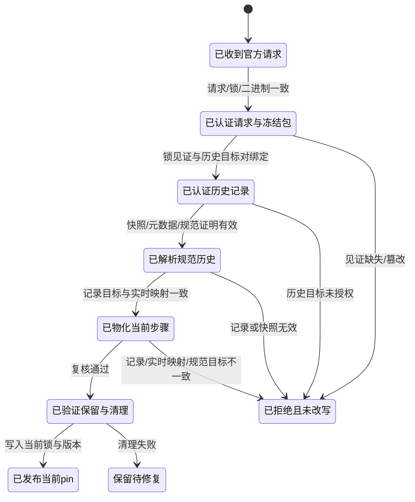

# AppSDK pin diagnosis and corrected design - a7cc2a4 / 852c3ac

## Scope and identity

- Upstream issue: `a7cc2a4` - `pin-lock` rejects a preserved historical migration after SDK bundle target changes.
- Local prerequisite: `852c3ac` - restore the official AppSDK pin and witness for local MVP gates.
- Worktree: `/Volumes/Intel/playground/appsdk/a7cc2a4-pin-diagnosis-20261003`, branch `codex/a7cc2a4-pin-diagnosis-20261003`, assigned AppSDK base `e4479efaee9be8817f52298812342ec1aa80a3bb`.
- AgentTeams input is read-only at `/Volumes/extension/code/AgentTeams`, baseline `de099b79f153e6fd220b98d5ee89f4777b7cfb53`, tree `c8ec9ba3d97d922f6c13262009aa71295cd0075c`.
- Allowed tracked writes: `docs/evidence/a7cc2a4-pin-diagnosis-20261003/**` and `docs/dagpipe/sdk-pin-history.graph.json`. Product source, tests, manifests, global installs, AgentTeams, Collab, credentials, commits, merges and pushes are out of scope.

## Observed public outcome

An unchanged archived genuine fixture reproduces the first public rejection:

```sh
env APPSDK_HOME=<task-owned-registry> \
  "$(command -v appsdk)" pin-lock \
  <fixture-genuine> --binary "$(command -v appsdk)"
```

Observed: exit 1, stderr `INVALID_SDK_MIGRATION_RECORD`. The fixture bytes did not change and no registry files were created.

Fixture identity is bound to the AgentTeams baseline commit; primary enumeration confirmed 14 archived genuine input files, each byte-identical to its blob in `de099b79f153e6fd220b98d5ee89f4777b7cfb53`. The archive under `fixture-genuine/` remains unchanged. Earlier author summaries counted 15; that count was incorrect and did not indicate an extra preserved file.

## Full public pin flow for the genuine history

Public entrypoint: `reset_governance.rs::pin_lock`.

1. Authenticate the request: project root safety, mutation worktree, `.appsdk` symlink checks, project version admission, lock bundle witnesses, binary digest and `--binary` equality, then reconcile the authoring bundle manifest.
2. Historical record validation: `pin_lock` invokes `migrate_governance_maps` for `0.1.5-to-0.1.6`; the existing record branch validates through `assert_sdk_migration_record` while the step is not the current live target.
3. Canonical target selection: `assert_sdk_migration_record` compares each record map's canonical target with the current embedded manifest target and currently has only two narrow exceptions. For the genuine record the historical canonical target differs from the current manifest target, so the first observed rejection is `INVALID_SDK_MIGRATION_RECORD`.
4. Current-step migration/materialization: after historical validation, `pin_lock` walks later steps and then calls `migrate_governance_maps` for `0.1.0009-to-0.1.0010`. The independent r1 review predicted this step would fail on `SDK_MIGRATION_TARGET_MAP_MISMATCH`; the owned public-CLI probe below refutes that prediction for a full baseline copy with only the first guard intentionally bypassed in the copied record. The observed probe writes a current record whose `target_digest` equals the unchanged custom live-map hash, keeps canonical target provenance, and reaches the migration's final target-map assertion successfully.
5. Pin/version publication: after record/live-map agreement, `pin_lock` writes the current lock, project SDK version and resources. Ordinary `verify` is the next public step and must pass after the separate historical zone-contract alias dependency is closed.

Status is explicit: step 3 is observed on the unchanged archive. Step 4 is observed on a clearly labeled owned synthetic fixture whose copied historical `canonical_target_digest` values were set to each own `target_digest` only to bypass the first guard; that mutation is diagnostic evidence and is not a legitimate input. Pin/version publication is observed on the same probe, but ordinary `verify` is not green there because of the separate zone-contract alias dependency recorded below.

## Root-cause scope and limits

- Unique owner: migration reconciliation in `rust/src/main/migration.rs` (`assert_sdk_migration_record` and `migrate_governance_maps`) plus the embedded migration manifest consumed by `sdk_map_migration_manifest`.
- Confirmed necessary decision: authenticate an old record's canonical target against a pair-bound historical allowlist and a lock-witnessed old bundle.
- Reviewed and refuted hypothesis: current-step migration does not currently produce `SDK_MIGRATION_TARGET_MAP_MISMATCH` for the copied baseline. `migrate_governance_maps` records the actual live custom hashes and retains canonical provenance; the final live-target check accepts that combination. The implementation still must preserve the agreement among legitimate custom maps, immutable historical provenance, the current record target, the live maps and the current project version, without adding broad old-version acceptance or a second reader.
- Not accepted: broad old-version acceptance, validation removal, fake digests, a second migration reader, unconditional `bundle_transition` acceptance, or bypassing a guard to claim the genuine behavior is repaired.
- Limits: no product source or test change, no install/daemon change, no commit/push/merge, no upstream/Teams/U7 closure. This report is diagnosis plus corrected design for independent review.

## Corrected minimal design

Decision 1: historical provenance must be explicit, immutable and pair-bound.

- Add to the embedded `contracts/migrations/sdk-0.1.5-to-0.1.6.json` a per-map `historical_target_digests` array.
- Each entry is a pair `{bundle_digest, target_digest}`. `bundle_digest` must equal the old lock/record bundle and `target_digest` must equal the record's historical canonical target.
- The existing validator consumes it only when `migration_bundle_transition_digest` returns a witness and the record has explicit custom source/target bindings. Unknown or absent history fails closed with a typed error such as `SDK_MIGRATION_HISTORICAL_TARGET_UNAUTHORIZED`.

Reviewed hypothesis, not a required change: current-step materialization already keeps the observed invariant in the synthetic probe. Custom live maps are preserved and the current-step record's `target_digest` equals those bytes, with canonical target digests retained as provenance. A future implementation must preserve this invariant and keep `migrate_governance_maps` as the sole owner. There is no evidence for a fallback path, dual reader, invented digest, or deletion of live-target verification.

Concrete manifest shape:

```json
{
  "maps": [
    {
      "name": "resource-map.json",
      "source_digest": "sha256:67f189bf...",
      "target_digest": "sha256:6cbb62a7...",
      "historical_target_digests": [
        {
          "bundle_digest": "sha256:e9a816589ce03740b30bf847be4fbb6c4203c70d39b11ada2b723dc966d0a091",
          "target_digest": "sha256:f6ff22e82ace1fd33cb92b520f1332f323a87d0ea40a6a6464159c274baf5eca"
        }
      ]
    }
  ]
}
```

Equivalent entries for the other three maps:

- function-map.json: `bundle_digest = e9a8165...`, `target_digest = 5ea77dd1...`
- mainline-call-map.json: `bundle_digest = e9a8165...`, `target_digest = e8b576c6...`
- verification-map.json: `bundle_digest = e9a8165...`, `target_digest = 8c05c47c...`

Public-CLI probe of the r1 second-stage finding:

The probe is task-owned and separate from the genuine archive. It extracts full AgentTeams baseline `de099b79f153e6fd220b98d5ee89f4777b7cfb53`, keeps the baseline `module-registry.json`, and changes only the copied historical record by setting each `canonical_target_digest` to that map's own historical `target_digest`.

```sh
env APPSDK_HOME=<task-owned-registry-baseline> \
  <runtime/probe-target/debug/appsdk> pin-lock \
  <runtime/probe-baseline-1> \
  --binary <runtime/probe-target/debug/appsdk>
```

Observed: exit 0, stdout `pinned ...`. The baseline registry digest is `e02c62e52b81c230eceb3745f713148f3629490f519e531b7d4fae09bf05cd0b`. The current record is official for that synthetic input: project and lock reach `0.1.0010`; lock `previous_bundle_digests` retains the old bundle; the new record's four `target_digest` values equal the unchanged live custom hashes `44e8135a...`, `5a89f814...`, `b6c41f11...` and `21ae8fcd...`; and each canonical target remains the current canonical target. The final target-map verification succeeds.

The committed `fixture-genuine` archive omitted the real `module-registry.json`; a copy from that subset stopped correctly at `MISSING_GOVERNANCE_MAP:module-registry.json`. The full baseline probe is therefore the valid test of the second-stage hypothesis. Ordinary `verify` on that synthetic probe later fails with `INVALID_DECLARED_ZONE_CONTRACT`, a later zone-contract check unrelated to target-map agreement.

That later failure is a distinct unresolved dependency for the future green path: the historical project declares `contracts/transitions/zone-transition-manifest.json`, while pin publication installs the canonical `contracts/transitions/zone-transition.manifest.json`. The current validator rejects the historical alias at `rust/src/main/governance.rs:1280-1324`. The corrected design therefore does not claim that the historical pin path can end in a green ordinary `verify` until the implementing author either binds the historical alias through the same unique zone-contract owner or documents a separately authorized canonical-path migration. This is separate from target-map authorization and must be closed by public evidence, not assumed.

Future binding paths, decisions and non-decisions:

- New records generated by the current binary use the current manifest target and need no history entry.
- A future legitimate target refresh adds a new history tuple for the old bundle and old target digest; it must not edit old records.
- No second migration reader may be added; `migration.rs` remains the only materialization/validation owner.
- The graph file remains `docs/dagpipe/sdk-pin-history.graph.json`; manifest registration in `docs/dagpipe/manifest.json` is the implementing change.
- Public CLI tests remain in `rust/tests/cli_smoke/part_08.rs` plus the focused negative suite; product tests are modified only by the implementing author after this design passes review.
- The separate historical zone-contract alias dependency belongs to the existing canonical zone-contract owner in `rust/src/main/governance.rs` (accepted aliases at lines 1280-1324) and the project field `governance.zone_transition_contract`; it must not be folded into the historical target allowlist or handled by a second migration reader.

## Genuine current-version upgrade path

Input facts that distinguish immutable provenance from legitimate upgrade output:

- `.appsdk/project.json` original SDK version witness before pin publication
- `.appsdk/sdk.lock` original old-bundle witness
- `.appsdk/migrations/0.1.5-to-0.1.6/record.json`, its four snapshots and the four retained custom live maps
- The full AgentTeams baseline also includes `.appsdk/maps/module-registry.json` SHA-256 `e02c62e52b81c230eceb3745f713148f3629490f519e531b7d4fae09bf05cd0b`; the committed `fixture-genuine` evidence archive is a 14-file subset, not the full historical project.

On a successful upgrade, pin publication legitimately changes `.appsdk/project.json`, `.appsdk/sdk.lock`, `.appsdk/sdk-resources.json`, the installed historical migration manifest and bundle resources. Historical provenance that must remain fixed is the original `0.1.5-to-0.1.6` record, the four historical snapshots, the four live custom maps, and the full baseline `module-registry.json` as the original project input.

The preserved custom live-map digests are `44e8135a...` (resource), `5a89f814...` (function), `b6c41f11...` (mainline-call), and `21ae8fcd...` (verification). They are intentionally different from the current canonical target digests (`4269569f...`, `45f5819b...`, `9e9a21ba...`, `50c066c1...`) and from the historical 0.1.6 canonical targets (`f6ff22e8...`, `5ea77dd1...`, `e8b576c6...`, `8c05c47c...`). The observed current-step invariant must remain live authority for `target_digest`, while canonical target digests remain immutable provenance.

Legitimate new/current materialization produced by pin-lock:

- A current-step migration record for `0.1.0009-to-0.1.0010` is expected when the genuine project advances from `0.1.6` to `0.1.0010`.
- That new record is official and may be new; it is not required to be byte-identical to a pre-existing file.
- Its source/target digests must agree with the live maps actually installed by the same owner, and final `verify` must pass.

This path is the reason the report no longer claims "all records unchanged". Only the historical genuine record/snapshots/custom maps are immutable; the current-step record is a legitimate new artifact of the upgrade.

## Chinese business DAG and state machine

Business DAG:


State machine:



Owner/operation mapping:

| Chinese business stage | Current owner | Implementation change |
|---|---|---|
| 收到官方 pin-lock 请求 | `reset_governance.rs::pin_lock` | no behavioral change |
| 认证请求与冻结包 | bundle witness helpers in `migration.rs` | no new reader |
| 认证历史记录与锁见证 | `assert_sdk_migration_record`, `migration_bundle_transition_digest` | consume `historical_target_digests` pair |
| 解析规范历史 | `sdk_map_migration_manifest` and per-map manifest loop | validate history pairs; preserve canonical target provenance |
| 物化当前步骤 | `migrate_governance_maps` and `install_governance_maps` | preserve the existing record/live-map invariant; no extra materialization path |
| 复核保留与清理 | final `assert_sdk_migration_record(..., true)`, `assert_governance_maps`, staging cleanup | unchanged; cleanup failure is an explicit retention terminal |
| 发布当前 pin 与版本 | `pin_lock` lock/project write and `verify` | unchanged |

## Regression and black-box acceptance plan

All public-CLI commands below must run with `APPSDK_HOME` and `CARGO_TARGET_DIR` set to task-owned paths. They are planned for the implementing author; none are claimed as passed in this turn.

The red and green commands below must use the full historical AgentTeams project at `de099b79f153e6fd220b98d5ee89f4777b7cfb53`, including `.appsdk/maps/module-registry.json`. The committed 14-file `fixture-genuine` subset is valid for reproducing the historical target guard, but is not a valid input for the final `pin-lock` and `verify` path.

Red-to-green on full genuine unchanged input:

```sh
env APPSDK_HOME=<task-owned-registry> <candidate-appsdk> pin-lock <full-agentteams-baseline> --binary <candidate-appsdk>
env APPSDK_HOME=<task-owned-registry> <candidate-appsdk> verify <full-agentteams-baseline>
```

Expected after a correct candidate: with the historical guard admission implemented, `pin-lock` exits 0, project ends at SDK `0.1.0010`, historical record/snapshot/custom map bytes stay unchanged, and the new current-step record agrees with installed live maps. Ordinary `verify` must also exit 0 only after the distinct historical zone-contract alias dependency above is closed by the implementing author. These expectations are a test contract, not current evidence.

Existing historical/current positives and each tamper negative remain fail-closed:

- `pin_lock_accepts_historical_custom_target_different_from_canonical_target`
- `pin_lock_preserves_historical_custom_maps_with_bundle_witness`
- all existing `pin_lock_rejects_*` cases

New planned tamper negatives on the genuine archive (one at a time, each must exit non-zero and not rewrite tampered or genuine inputs):

- replace one `canonical_target_digest` with an unlisted valid SHA-256
- remove or alter one migration snapshot
- make one canonical metadata digest malformed
- change one live `.appsdk/maps` file without changing the record
- remove the previous-bundle witness from `sdk.lock`
- create a current-step record whose target digest differs from the installed live map

Commands to run after implementation:

```sh
cargo test --manifest-path rust/Cargo.toml --test cli_smoke pin_lock_accepts_historical_custom_target_different_from_canonical_target -- --exact
cargo test --manifest-path rust/Cargo.toml --test cli_smoke pin_lock_preserves_historical_custom_maps_with_bundle_witness -- --exact
cargo test --manifest-path rust/Cargo.toml --test cli_smoke pin_lock_rejects -- --test-threads=4
dagpipe graph validate docs/dagpipe/sdk-pin-history.graph.json
```

## Evidence and cleanup

Kept:

- `docs/evidence/a7cc2a4-pin-diagnosis-20261003/report.md`
- `docs/evidence/a7cc2a4-pin-diagnosis-20261003/run-notes.md`
- `docs/evidence/a7cc2a4-pin-diagnosis-20261003/fixture-genuine/**`
- `docs/evidence/a7cc2a4-pin-diagnosis-20261003/fixture-positive-current/**`
- `docs/evidence/a7cc2a4-pin-diagnosis-20261003/positive-control-binary-cleanup.json`
- `docs/evidence/a7cc2a4-pin-diagnosis-20261003/probe-consistency-receipt.json`
- `docs/dagpipe/sdk-pin-history.graph.json`

Removed previously: task-owned cargo target and the rebuildable positive-control `sdk.bin` copy. In this second author turn, temporary owned probe inputs and registries were captured in `probe-consistency-receipt.json` and then removed; the task-owned probe target build cache was removed with `cargo clean --target-dir`. No process, daemon, global binary, skill, registry or SDK install was changed. The worktree and candidate remain for parent review.

No source fix is implemented, no genuine behavior is claimed repaired, no upstream/Teams/U7 closure is claimed, and no independent architecture review PASS is claimed.
