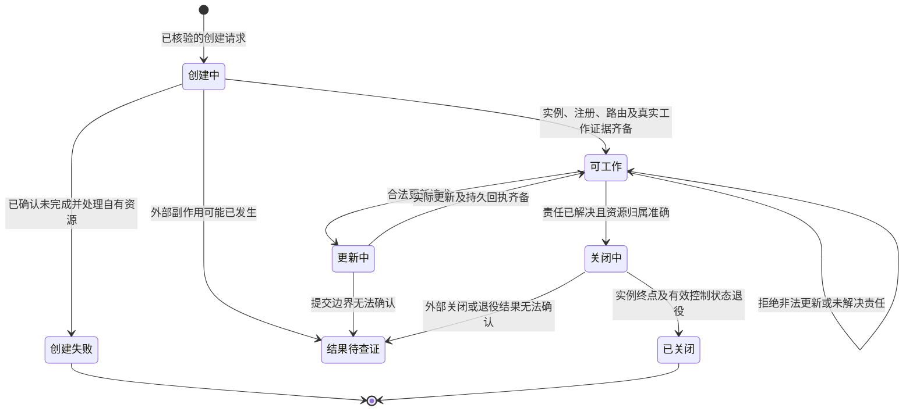

状态：**BLOCKED（必需能力事实待补）**

本计划可以派发隔离能力观测和设计校正任务。当前不能派发批准恢复或 peer CRUD 产品实现。F1 的首次偏离已确认，但本轮先补最小能力事实，再冻结当前实现增量。四项总目标和 A1–A12 总验收保持完整。

BLOCKED 的原因是证据缺口，不是已证明宿主不支持。当前没有真实创建、工作、更新、关闭的完整 runtime 回执。批准恢复也没有生产入口及 live 成功证据。不能用 `cfg(test)`、mock、记录关闭或原生 API ACK 补足这些缺口。

## 1. 输入绑定与规划边界

| 项目 | 绑定 |
|---|---|
| 任务 | `collab-context-identity-peer-crud-remediation-20261008`，首次独立规划 |
| 源码位置 | `/Volumes/Intel/playground/appsdk/collab-context-identity-peer-crud-20261008` |
| 输入 SHA | `3dfdaf8503b7a6f6a76651a1e282c038b6648c3a`；本 planner 只读核对 HEAD 一致 |
| observation | `/Volumes/Intel/playground/appsdk/.worker-runs/collab-context-identity-peer-crud-20261008/observation.md` |
| 目标真源 | `/Users/fanzhang/Documents/github/appsdk/docs/goals/collab-context-identity-peer-crud-remediation-20261008.md` |
| 历史审计 | `/Users/fanzhang/Documents/github/appsdk/docs/evidence/collab-capability-audit-20261008/audit.md`，绑定旧 SHA，按最新证据逐项校正 |
| 前一 accepted plan | 无 |
| 规划正文保存 | 由父 CLI 保存到本任务 `planner/plan.md` |
| 本 planner 权限 | 只读产品；不实现、不 commit、不安装、不重启、不注册、不接管身份 |

已读取指定 observation、目标、全局 AGENTS、Plan 合同、`coding-principals/SKILL.md` 和审计。已读取相关身份设计、master 授权合同、context/authority/pane-route/subscription/consumption 图、manifest、当前入口和 owner 源码。已读取项目 `note.md`、前次 master 修复节点笔记，以及 `codex-orchestrator`、`dagpipe-runtime`、`user-correction-alignment` 和交付合同。

本 worktree 根没有项目 `AGENTS.md`。本次遵守用户提供的全局规则和当前任务合同。没有读取或继承父 transcript。模型/provider 的实际启动绑定由父 CLI 启动记录核对，不能用 planner 自报替代。

## 2. 总目标与当前判断

最终交付必须同时完成：

1. 一次 `collab context` 完成可自动完成的身份确认、恢复和注册。缺事实时返回准确来源、格式和一次补交动作。身份裁决由 daemon 执行。
2. 普通 peer 和 master 都有具体用户批准的覆盖恢复路径。该路径不先依赖失效的旧 credential、旧 binding 或 `me()`。
3. 当前 master 能创建真实可工作的 peer，读取状态，执行明确允许的更新，并关闭本操作管理的真实实例及有效注册、binding、route。
4. context、help、MCP 和源 Skill 描述同一可执行流程。正式安装刷新全局 Skill。
5. 消除 F1 空成功。完成源码、公开接口、installed/live、独立 review、main/remote 和自有资源清理证据。

**普通注册、批准身份恢复、master grant 变更、managed runtime 生命周期是不同控制对象。** 它们可以共享事务工具，不能互相冒充。

### 2.1 最新事实、历史结论和未知

| 类别 | 判断与依据 |
|---|---|
| 当前源码事实 | `main.rs` 的 `Cmd::Subagent` 对 Start 拒绝，对 List/Status 发观察请求，其余动作直接 `Ok(())`。这是 F1 的首次偏离。 |
| observation 的 installed 事实 | 不存在 child 的 close 返回 exit 0、空输出；start 明确 unsupported。installed 字节与输入 SHA 尚未证明等价。 |
| PR17 当前事实 | `handle_worker_close` 已允许有 transport、无未完成任务、presence 为 Missing 的目标无快照关闭。必须保留此路径。 |
| 当前剩余关闭缺口 | Present/Unknown 且没有匹配快照仍被拒绝；snapshot 生产者仍 unsupported。`WorkerClosed` 本身不能证明真实实例终止，也不能单独证明完整 route/binding 退役。 |
| 当前创建缺口 | `subagent::launch` 及相关 launch helper 位于 `cfg(test)`。生产 Start 未调用它。 |
| Native 静态能力 | adapter 有生产 `verify_candidate`、`thread/start`、`thread/archive`、读取和通知 helper。静态存在不能证明选定真实宿主可用。 |
| **对父观察的校正** | 通知链并非整体 tmux-only。`notification_sink()` 返回 `appserver_notification_sink`，生产构造器安装 `default_appserver_notification_sink()`，其中有 AppServer、Tmux、DSH 分支。 |
| 仍存在的 transport 冲突 | subagent observe 要求 tmux；`default_appserver_thread_archive()` 对 **Tmux 和 AppServer** 都返回“tmux has no … archive operation”。这与 Native archive helper 冲突。 |
| 批准恢复缺口 | `IdentityContext` 只有 facts。CLI `--provide` 只有四个 scalar，并先在客户端裁定冲突。普通 daemon 路径先执行旧 resolver，再 Register。 |
| 有效既有机制 | typed `MasterGrant`、`GlobalRuntimeBound`、`GlobalMasterGranted/Revoked`、route set/retired、`GlobalRuntimeBindingRollback`、`Registered`、`WorkerClosed`、`SubagentUpdated`、command receipt、sequence/revision。 |
| 必需未知 | 真实宿主可工作的创建/更新/关闭方法；profile/provider 与 thread 创建参数的实际映射；外部创建结果未知时的查证能力；批准恢复的最小可靠跨持久化边界。 |

### 2.2 新发现的能力探针失败

本 planner 发现并读取了：

- `native-capability/probe.py`
- `native-capability/receipt.json`
- `native-capability/server.log`

回执记录 PID 63021、exit 1、`calls=[]`、`inference_tested=false`。日志明确指出 `app-server` 不接受 `--profile`。探针使用了：

```text
/opt/homebrew/bin/codex --profile gcm app-server --listen ...
```

因此，本次失败只能判定为**探针启动参数错误**。不能判定 Native API 不支持，也不能判定配置或推理不可用。应修探针后做一次新观测，保留原回执。

本 planner 只读调用的当前 help 确认存在：

```text
codex app-server --listen <URL>
codex app-server generate-json-schema --out <DIR>
```

没有执行启动、RPC 或其他写动作。

## 3. 目标校正

没有旧 accepted plan。以下校正针对历史审计和父判断。

1. **撤回“所有 worker close 都依赖无法产出的 snapshot”。**  
   PR17 已补 Missing 路径。保留 no-self-close、非空 reason、master 权限、unfinished task 和重复关闭回执合同。

2. **撤回“生产通知整体 tmux-only”。**  
   已有正式 transport 分支。后续只修真实缺口，不另建通知实现。

3. **保留“Native launch 未进入生产”的判断。**  
   不能把测试 launch 解除条件编译后直接交付。它还包含 profile probing、多次 cleanup 和跨 owner 持久化步骤。必须先证明选定链可工作。

4. **不把当前失败 probe 当宿主能力结论。**  
   首个错误发生在命令参数解析，尚未到 RPC。

5. **调整“立即修 F1”为“先完成短能力观测，再冻结 F1 增量”。**  
   F1 是首个可用产品增量的合理候选。但当前 CLI/MCP 与后续生命周期合同共享入口。短观测必须先明确真实支持项和失败边界，避免接通记录关闭后误称 CRUD 完成。

6. **不以 unsupported 或 record-only 缩减 CRUD。**  
   这些状态可以作为真实失败或局部历史记录回执。它们不能通过 A6–A8。

7. **批准身份恢复与 master 授权继续分离。**  
   恢复原 master 身份不能隐式 promote/clear。显式替换 grant 才进入授权 owner。离线或 Unknown incumbent 不决定 grant 是否存在。

## 4. DAG 与终点合同

本轮只做图校正提案。父任务安排设计 owner 落盘并校验。本 planner 未执行图校验，不标 PASS。

### 4.1 context 对象流

保留现有六节点 SESE 结构。更新 `identity_gate` 的语义和终点，不新建第二套身份图。


`返回本次调用结果`包含以下明确终点：

- 已登记：完整快照，内部 credential receipt 不进入公开输出。
- 缺事实：准确字段、真实来源、格式和补交模板；不产生身份或 route 副作用。
- 需批准：具体目标、scope、冲突和批准内容；不自动选人。
- 拒绝：原 typed 原因，无成功投影。
- 部分提交或结果未知：准确提交边界、稳定对象标识和读取动作。
- 提交前取消：无控制状态变更。
- 提交后断连：提交不被客户端断连撤销；按原对象查证。

补资料和批准提交都是新 invocation，不在静态 DAG 中画回边。

### 4.2 peer 生命周期对象流

确认没有可复用生命周期图后，才新增一个最小图并登记 manifest。不得把独立来源拼成多入口图。


每个宿主动作明确成功、拒绝、未执行、结果未知、取消及自有资源清理终点。



“结果待查证”是拟议 typed 生命周期状态，不是业务消息、日志或快照中的控制真源。它能否用现有 `Record` 和 receipt 表达，必须由本轮观测确认。

### 4.3 既有图修订边界

- `collab-context.graph.json`：批准恢复终点、daemon 裁定输入、实际提交边界；清理过时“待实现”描述。
- `collab-master-authority.graph.json`：保留 Empty/Assigned、精确 scope 和唯一 grant owner。批准身份恢复不复制 authority 实现。
- `collab-pane-route-reconcile.graph.json`：区分普通 pane 资源重新发布与具体身份覆盖批准。不得让 pane claim 替换成为 credential 覆盖旁路。
- subscription 图：保留 daemon 默认 lease owner及显式 unsubscribe 语义。
- consumption 图：继续只消费 mailbox，不修改身份、route 或 transport。
- 新生命周期图：仅在现有图确实缺失时补入。

图校验入口：

```sh
/Users/fanzhang/.cargo/bin/dagpipe graph validate docs/dagpipe/collab-context.graph.json
/Users/fanzhang/.cargo/bin/dagpipe graph validate docs/dagpipe/collab-master-authority.graph.json
/Users/fanzhang/.cargo/bin/dagpipe graph validate docs/dagpipe/collab-pane-route-reconcile.graph.json
/Users/fanzhang/.cargo/bin/dagpipe graph validate docs/dagpipe/collab-subscription-lifecycle.graph.json
/Users/fanzhang/.cargo/bin/dagpipe graph validate docs/dagpipe/collab-notification-consumption.graph.json
```

新增图单独校验。拓扑校验不证明真实副作用、幂等或工作完成。

## 5. 最小方案选择：供能力确认后设计审查

以下是**设计提案**。不是已实现参数，也不是当前可运行命令。当前不授权 worker按这些提案写产品代码。

### 5.1 批准恢复接口

继续使用 `context --provide`。不新增 restore 命令或通用 force。

拟议补交对象增加一个 typed 批准裁决项，最少表达：

- 目标 peer 身份；
- 精确 project/app scope；
- 本次操作是恢复该身份，还是同时明确替换 master grant；
- 用户批准文本；
- 被覆盖 binding 的明确身份或代际条件。

因果理由：

- 目标字段解决“恢复谁”，不能由 agent 猜测。
- scope 防止跨项目接管。
- 明确操作防止身份恢复隐式赋权。
- 当前绑定条件防止批准后状态已变仍覆盖新 owner。
- 自动观察和补交事实分别提交 daemon，防止客户端先丢掉冲突证据。

CLI 只做语法解析、事实采集和公开输出。daemon 在现有 host-local identity owner 内处理批准入口。该入口不能先调用失败的 resolver 或 `me()` 才接受裁决。仍需核验当前调用者事实、新端点所有权和 scope。

**credential 最小选择：**优先由 daemon 恢复目标 reducer 中现有合法 credential，并修复本地 receipt。失效的本地 token不作为批准入口的前置身份凭据。若目标 reducer credential 本身必须更换，须先证明现有事件能表达旧 credential 失效与新 credential 提交。不得临时 mint 一个新 peer 掩盖旧身份错误。

### 5.2 peer 生命周期接口与 owner

优先使用现有 worker/peer 管理边界。subagent 可以保留为兼容适配入口，但不能成为第二个生命周期 owner。

拟议最小 Update 是**经 daemon 验证的同主体端点重绑**。它必须实际改变运行实例的绑定，保留 peer ID、任务、mailbox 和权限归属。不是改描述文字。

不可变字段：

- peer/agent ID；
- project scope；
- task 和 worktree owner；
- mailbox 归属；
- runtime 管理归属。

profile/model 切换不纳入这个最小 Update，除非能力观测证明本次创建链必需该操作，并完成单独的真实更新合同。

Native 创建是优先调查方向，原因是生产 adapter已有直接 API。选择它不能豁免 tmux/DSH 已声明且受影响的合同。实际宿主矩阵仍待 O1。

### 5.3 控制数据与事务

| 控制对象 | 唯一 owner | 复用 |
|---|---|---|
| 身份选择及批准裁定 | `ProjectRuntimeManager::identity_context` | resolver、既有 host admission |
| 注册及 binding | 现有 Register transaction | `Registered`、`GlobalRuntimeBound`、generation fence |
| host route | 现有 route transaction | route set/retired、既有错误和 rollback 合同 |
| master grant | 现有 authority transaction/reducer | `GlobalMasterGranted/Revoked` |
| managed 实例归属及生命周期 | 一个正式 peer 生命周期 owner | 现有 typed `Record`、`SubagentUpdated`，按观测确认必要扩展 |
| 关闭历史 | 现有 worker closure owner | `WorkerClosed`、`WorkerCloseReceipt` |
| 持久操作结果 | 现有 command commit owner | `CommandId`、`OperationId`、command receipt、sequence/revision |
| mailbox 与消费 | 现有 message/consumption owner | 不迁移、不删历史、不用于身份决策 |

现有注册不是一个覆盖所有存储的原子事务。身份设计已说明 project 注册、host route 发布和本地 receipt 存在不同提交边界。新合同必须逐项标出。不能用一个“原子恢复”标签掩盖实际边界。

### 5.4 幂等、外部副作用与错误

- 同锚点普通 context 复用现有身份和注册结果。
- 批准恢复重复提交不能重复签发 credential 或重复延续 grant。先核对 existing command receipt 是否能表达同一意图。
- 创建必须在外部调用前有稳定创建意图。复用既有 command/operation ID 和 typed lifecycle record。
- **创建 RPC 发出后、thread ID 回来前断连**是关键未知边界。当前 helper没有展示可查证的创建幂等合同。必须确认宿主是否能按原控制标识查证。不能仅靠成功后保存 thread ID 宣称已解决。
- 状态 unknown 时停止该对象的重放。返回原标识及准确查证动作，不再建一个 thread。
- Close 先校验资源归属、责任和 no-self-close。真实宿主关闭成功与控制退役成功分别记录。
- Native `thread/archive` 的 ACK 不能自动证明工作已终止。需证明活动 turn/写者及后续工作能力达到所冻结的关闭终点。
- 共享 AppServer 进程不能作为单个 peer 的清理对象。
- snapshot 暂时保留。只有设计 review确认它没有独立保障作用，且责任、宿主关闭和历史证据已覆盖合同后，才删除 Present/Unknown 的死前置及无消费者残留。
- 局部 API、持久化或通知失败只停止受影响操作。其他项目和无关请求继续。不能使用跨 transport fallback。

## 6. 当前可执行增量：补能力事实与设计边界

共同路径定义：

```text
W = /Volumes/Intel/playground/appsdk/collab-context-identity-peer-crud-20261008
R = /Volumes/Intel/playground/appsdk/.worker-runs/collab-context-identity-peer-crud-20261008
E = W/docs/evidence/collab-context-identity-peer-crud-remediation-20261008
```

父任务负责建立 worker 独占记录目录，并按 `codex-orchestrator` 启动 fresh GCM 观察者。本 planner不派子 agent。不得用待修复 `collab subagent` 调度。

### O1 — 真实 runtime 能力观测

**依赖：**父任务接收本 BLOCKED 计划。  
**唯一 owner：**一个 runtime 观察者。  
**允许写入：**`R/native-capability/` 的探针、独占 home、schema、consumer、原始回执和节点笔记。  
**产品目录：**只读。  
**禁止：**生产 Collab 状态、当前 Desktop thread、既有 tmux pane、共享 AppServer、全局配置、凭据正文、其他任务资源。

操作步骤：

1. 读取现有失败回执和日志。记录“参数解析失败，RPC 未执行”。
2. 用 `apply_patch` 只改 probe 启动参数。移除无效 `--profile gcm`。不顺带重写产品协议。
3. 从当前 CLI 生成 schema。按 schema和已读配置确定真实 thread/turn 输入。配置只记录非秘密选择及来源，不复制秘密。
4. 启动自己拥有的 AppServer。使用独占 `CODEX_HOME`、socket 和 consumer cwd。清除父 session/thread/tmux 环境。
5. 真实执行 create → read → 工作 → 合法 update候选 → close。保留 request、response、thread/turn ID、cwd和终点。
6. 真实工作至少完成一个有唯一 nonce 的回合，并在宿主读回结果。仅 thread/start、turn/start ACK 不合格。
7. 验证 archive/关闭之后的真实状态和责任。证明没有关闭共享服务。
8. 检查宿主 schema及实际 API是否提供创建结果未知后的关联查询。明确支持、明确缺失或未知。
9. 仅退出自有 AppServer PID，记录退出码、socket不再监听及资源归属。

已核对的命令：

```sh
/opt/homebrew/bin/codex app-server --help
/opt/homebrew/bin/codex app-server generate-json-schema --help
/opt/homebrew/bin/codex app-server generate-json-schema \
  --out /Volumes/Intel/playground/appsdk/.worker-runs/collab-context-identity-peer-crud-20261008/native-capability/schema

python3 /Volumes/Intel/playground/appsdk/.worker-runs/collab-context-identity-peer-crud-20261008/native-capability/probe.py
```

修正后 probe 的服务启动形状：

```text
/opt/homebrew/bin/codex app-server --listen unix://<该探针拥有的绝对 socket>
```

provider/model 使用实时声明配置。未核对前不填猜测值。turn/update 的具体 RPC参数从生成 schema绑定；本计划不伪造已实现输入。

**必交产物：**

- `R/native-capability/notes.md`
- 新回执，保留旧失败回执；
- schema及 CLI版本绑定；
- 创建、真实工作、更新候选、关闭的分层回执；
- 宿主能力表；
- 创建 unknown 边界的查证结论；
- cleanup 回执。

**黑盒断言：**

- thread ID和cwd与实际返回一致；
- nonce回合实际完成，可读回；
- Update候选真实改变目标绑定或运行行为；
- Close达到已定义终点，其他实例仍可工作；
- 无重复 thread、无假成功、无秘密输出；
- 失败只影响自有对象。

若成功，只能标原生宿主能力已验证。不能标 Collab CRUD已完成。

### O2 — 批准恢复与现有持久化能力核对

**依赖：**父任务接收计划；可与 O1并行。  
**唯一 owner：**一个 identity/control观察者。  
**允许写入：**`R/identity-capability/` 的事实表、合同草案和笔记。  
**产品目录：**只读。  
**禁止：**修改 identity、token、journal、route、grant；调用正式 promote/clear；构造生产 takeover；修改全局规则。

操作步骤：

1. 从 `IdentityContext` host入口追到 resolver、Register、route发布、receipt persistence。
2. 核对拒绝旧 token的准确边界。区分本地 receipt错误与 reducer凭据错误。
3. 列出批准入口可以复用的 admission、endpoint验证和 scope资源。
4. 核对 command receipt的 ID、重放和 compare-and-swap合同。说明它是否覆盖恢复及生命周期意图。
5. 核对 `WorkerClosed`、route retired、binding retirement、subscription处理的真实副作用。不能按事件名称推断。
6. 对批准恢复提案逐项给出“复用现有、最小缺口、未确认”。
7. 明确跨持久化边界的失败和查询合同。

只读核对入口：

```sh
rg -n 'IdentityContext|identity_context|reconcile_committed_credential' collab/src
rg -n 'lookup_command_receipt|commit_command_at_revision|CommandEnvelope|GlobalRuntimeBindingRollback' collab/src
rg -n 'WorkerClosed|GlobalCurrentThreadRouteRetired|retire_runtime_binding|retire_current_thread_route' collab/src
rg -n 'TOKEN_MISMATCH|token_mismatch|recover_existing|validate_wire_runtime_binding' collab/src
```

cwd为 W，输入 SHA固定。命中后逐段读完整 owner，不以搜索结果作合同。

**必交产物：**

- `R/identity-capability/notes.md`
- owner/提交边界表；
- 批准恢复最小输入和 admission提案；
- credential处理选择及原因；
- 既有事件/receipt复用表；
- 未解决边界和最小下一动作。

**合格条件：**静态结论必须有源码位置和完整边界。没有生产批准入口时明确记“缺失”。不能以 mock成功证明 live恢复能力。

### O3 — 图与设计准入准备

**依赖：**O1和O2有效结果；关键事实仍缺则停止受影响设计。  
**唯一 owner：**设计文档 owner。  
**允许写入：**受影响 `docs/design/`、列出的 `docs/dagpipe/`、必要 manifest登记、E；独占笔记 `R/design/notes.md`。  
**禁止：**产品源码、全局 Skill、无关图、主树 dirty文档、其他任务 evidence。

操作步骤：

1. 合并能力表和最小控制合同。明确支持矩阵以及尚缺的产品链。
2. 将本节协议提案具体化。冻结准确 CLI/MCP/wire输入、不可变字段、事务、错误、幂等和 cleanup。
3. 更新唯一冲突正文。旧 anchor文档“只有 master裁决”、四 scalar禁批准和旧 shortest-path归属判断不能继续作为本次现行合同。
4. 校正图并运行第4节命令。若新增生命周期图，补受影响注册绑定。
5. 交独立设计 reviewer。输入绑定精确设计版本、能力回执和图。
6. 父任务补 observation并交本独立 planner更新实施计划。

**必交产物：**设计合同、图、validate回执、支持矩阵、独立设计review结论、未解决项。  
**合格条件：**完整SESE及适用终点；没有无 owner副作用；没有未知创建重放；没有用 unsupported删目标。

## 7. 后续增量及真实依赖

这里只列目标和依赖。不得按此表直接派实施。

| 增量 | 可用结果 | 真实依赖 |
|---|---|---|
| I1：F1入口 | 支持项真实派发、鉴权及回执；未支持项明确错误；CLI/MCP不再空成功 | O1/O2支持项表、当前增量图及设计准入、独立更新后的READY计划 |
| I2：context与批准恢复 | 普通自动恢复、精确补交、peer/master批准覆盖及完整结果 | I1适用入口；批准 admission、credential、提交/unknown合同冻结；真实隔离样本 |
| I3：peer CRUD | 真实创建、读取、最小合法更新、真实关闭及控制退役 | 宿主能力PASS；创建unknown可查证；唯一生命周期owner；责任/归属合同 |
| I4：操作卡与Skill | context/help/MCP/源Skill一致且可执行 | I1–I3最终公开合同及真实回执 |
| I5：完整交付 | A1–A12、installed/live、独立实现review、main/remote及cleanup | 全部实现增量作者验收完成 |

I1可以单独交付，但只能报告F1增量完成。不得因此关闭四项目标。

未来实现中，`main.rs`、`proto.rs`和MCP catalog各只能有一个写 owner。身份与生命周期实现是否并行，取决于冻结接口和共享文件分配。不得按概念节点把同一文件派给多人。

## 8. 验收、review与交付准入

### 当前轮验收

- O1：真实宿主分层证据及自有资源终点。
- O2：可审查的owner、事务、错误和幂等事实。
- O3：图校验和独立设计review。
- 缺任一必需边界，保持BLOCKED并列出准确解阻动作。

### 实现轮作者检查

cwd为W，绑定实际候选SHA/tree：

```sh
cargo fmt --manifest-path collab/Cargo.toml -- --check
cargo test --manifest-path collab/Cargo.toml --locked --all-targets -- --test-threads=1
git diff --check
```

该 package没有lib target，不使用 `--lib`。定向测试必须记录实际执行数量。零项、ignored、超时和中断均不算通过。

现有公开consumer可复用，但需区分fixture：

- tmux CLI fixture可经 `COLLAB_TEST_BINARY`切换 canonical installed入口。
- `appserver_two_tui_integration.rs`含自建协议响应，不能当Native live证据。
- MCP consumer验证工具包装与错误传播，不能替代真实runtime。
- 历史真实Native注册只证明该版本的注册，不证明本次CRUD。

最终仍执行目标文件A1–A12。特别保留：

- PR17 Missing关闭和unfinished task回归；
- Present/Unknown与伪造endpoint拒绝；
- 旧credential/binding失效的批准恢复；
- 原master恢复与显式grant替换分别验收；
- 创建丢响应/重复提交及中断；
- 真实Update及非法字段无副作用；
- Close责任拒绝、重复回执、route/binding退役；
- 重启、scope隔离、默认订阅和消费语义。

### Review准入

**设计review：**O1/O2必需事实齐备，接口、owner、完整图、外部unknown和cleanup合同已冻结。图validate成功只是必要条件。

**实现review：**作者完成实现、debug、开发测试、公开黑盒及适用installed/live；全部绑定精确候选。行为缺陷退作者修复。新候选只补受影响证据，再审新版本。

本planner不兼任最终reviewer。BLOCKED经验复核不能生成代码PASS。

### 安装及维护

正式安装入口：

```sh
scripts/install-global-collab.sh
```

installer构建一次、安装相同候选字节并刷新嵌入Skill。不先做一轮正式build再重复构建。

当前源码只见 `up/down`入口。旧笔记使用down/up不能直接作为本轮restart合同。父任务在正式动作前核对项目正式维护通道及中断授权；若没有满足当前生命周期规则的正式restart通道，明确阻塞该动作，不临时用stop+start或自建接管替代。

## 9. 并行、停止与资源收口

当前关键路径：

```text
O1真实runtime事实 + O2控制事务事实
→ O3合同与图
→ 独立设计准入
→ 更新observation和独立实施计划
→ I1实施
```

O1/O2路径和资源独立，可批量并行。保留容量给结果接收、设计和review。O3依赖两者结果，不提前冻结。生产安装/runtime由一个集成owner串行执行。

停止或replan条件：

- 外部创建结果未知且没有按原对象查证能力；
- archive不能达到所需关闭终点；
- 合法Update只能改记录，不能改变实际绑定或行为；
- 批准恢复必须绕过endpoint/scope验证才能实现；
- 既有receipt无法表达本次操作且需要扩展控制模型；
- 必须修改Codex/DSH产品或非目标服务；
- main变化影响当前候选或证据；
- 正式实例恢复缺具体批准；
- 探针失败发生在新边界，改变关键方案或验证范围。

权限、配置或网络错误必须保留原错。只停止受影响节点。不得reset生产状态、换transport或使用mock补成功。

资源记录包含owner、路径、用途和清理终点。O1只管理自己创建的AppServer/PID/socket/home/consumer。BLOCKED保留必要回执和恢复材料，不删除候选worktree。

完整交付由父编排者负责。按交付合同刷新origin/main、组合候选、完成适用检查和一个独立实现PASS，再完成commit、CI、main/remote对应及安装复核。MCPX缺失不能伪造证据，也不为此重启非目标服务。冲突、push拒绝和CI失败停止受影响集成。

最终先归档必要证据，再回收自有资源。worktree使用正常 `git worktree remove`，dirty失败不得强删。保留其他worktree、主树dirty文件和共享base。禁止广泛process-kill命令。清理缺终点则报告INCOMPLETE。

## 10. 经验修订候选

以下交独立reviewer复核。本planner不写长期记忆或全局规则。

| 旧条目或结论 | 新证据与反证 | 定性更新及建议 |
|---|---|---|
| 审计F3：“worker close依赖始终unsupported的snapshot” | 输入SHA的PR17分支允许Missing且责任条件满足时关闭；与旧审计源码不同 | 缩小当前结论。历史审计保留版本事实，并增加最新反证链接。现行合同写“Missing路径已接通；真实managed实例关闭及Present/Unknown路径仍未闭合”。 |
| observation：“notification sink有tmux-only分支”可能被扩成“通知整体tmux-only” | 当前selector和生产构造器使用含AppServer/DSH分支的sink；archive及subagent observe仍有限制 | 只修任务能力表，不改通用规则。按真实selector→构造器→adapter→live结果记录能力。 |
| `collab-identity-minimal-interaction.md`及anchor模型：禁止批准补交；只有master归属裁决 | 最新用户目标明确要求peer/master批准身份恢复；当前源码尚无该入口 | 修唯一现行设计正文。保留普通自动恢复不选人；新增具体批准裁定。普通补事实与批准恢复分别列合同。不得提前改Skill宣称已实现。 |
| 旧`note.md`：“Desktop控制socket拒连” | 最新observation仅证明socket可连接 | 历史事实不改写。当前范围缩为“连接可用；协议、当前thread恢复仍未验证”。连接成功不能证明恢复成功。 |
| Native探针FAILED | 原始日志明确参数错误，calls为空 | 修本次探针及回执分类。不能推广为Native不支持，也不新增全局禁令。 |
| `coding-principals`和Plan合同已有live/静态证据区分 | 本次仍出现helper、mock与生产能力混淆风险；没有证明通用规则缺失 | **不更新通用Skill。** 修当轮输入表和派单合同即可。 |
| 前次master修复笔记：公开consumer推进、source-registry及清理问题 | 已读前序节点记录；本次尚无实施结果 | 复用既有经验。不给新的长期因果结论。当前合同要求先交最小真实probe，测试布局遵守既有gate，失败fixture保留证据。 |

## 11. 下一步

父任务保存本计划，并记录“BLOCKED：必需能力事实待补”。随后并行派O1和O2。O1先修探针启动参数，再证明真实工作、更新候选和关闭终点。O2闭合批准恢复及现有事务能力表。

取得结果后，父任务补最新observation。将原结果交独立planner更新计划。只有能力边界可审查、完整图通过设计准入，并形成READY实施计划后，才派产品实现。

本轮没有源码修复、live PASS、设计PASS或CRUD完成声明。四项总目标继续保持未完成。