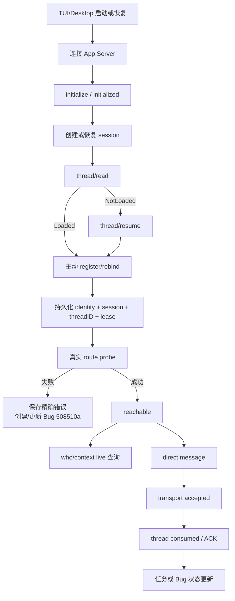
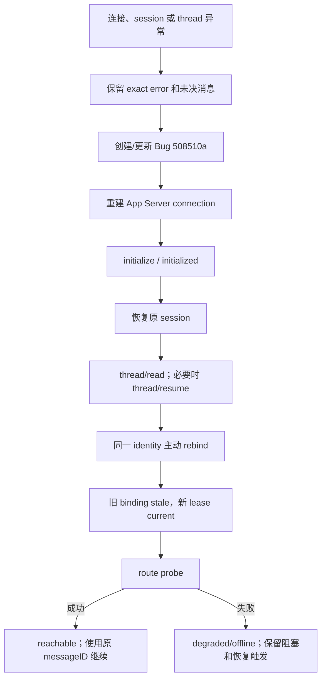

# AppSDK/Collab 主动注册与 live 通信闭环

状态：执行中
Feature：`bec3483`
Bug：`508510a`
基线：`origin/main`（文档候选 worktree）

## 目标

每个 Codex TUI 或 Desktop 在建立、恢复 App Server 连接以及恢复 session/thread 后，主动向 AppSDK/Collab 报告当前绑定。Collab 保存并验证绑定，提供当前 scope 的 live 查询和直接通信。

AppSDK 与 Collab 作为一个产品维护，但职责保持单一：

- `appsdk/collab/`：注册、绑定、路由、live 查询、恢复和 App Server transport；它是本仓库内的独立目录和独立 binary。
- AppSDK：Feature/Bug intake、角色约束、DAG、验证证据、main 集成和交付门禁。
- 不新增第二套身份库、任务库、daemon 或 mailbox。

### 仓库与发布边界

`appsdk` 是唯一源码、review、merge 和 push 真源。`collab/` 虽然单独编译为
`collab`/`collab-mcp` binary，但必须从 `appsdk/collab/` 构建和安装；独立
Collab checkout 不是本计划的源码、交付或发布输入，不建立第二条 merge/push 链。
所有 worker 都从 AppSDK main 建立 worktree，Collab 模块只修改该 worktree 下的
`collab/**`；最终以 AppSDK main SHA、Collab binary SHA、安装和 daemon 重启证据收口。

## 稳定绑定模型

```text
identity          稳定逻辑 Agent 身份；重启、重连、worktree 变化不改变
session           当前 App Server/Codex 运行绑定；恢复时可更新
threadID          当前 Codex thread；resume 默认保持，fork/new 才改变
connectionLeaseID 当前连接实例；每次连接重建都更新
cwd/worktree      当前执行位置；主动上报，不作为身份推断依据
```

最小注册记录：

```json
{
  "scope": "project-scope",
  "role": "master | peer | subagent",
  "identity": "stable-agent-id",
  "session": "current-session-id",
  "threadID": "codex-thread-id",
  "connectionLeaseID": "connection-lease",
  "cwd": "/project/path",
  "worktree": "worktree-id",
  "parent": "parent-identity-or-null",
  "status": "registered | reachable | degraded | offline | stale"
}
```

已有 `messageID`、`attemptID` 和历史 receipt 是事实身份，不能因 rebind 改写。

## 主 DAG



`registered` 不是 `reachable`；durable accepted 不是 consumed。只有 route probe 和实际消费证据都存在，才可宣称 live 通信闭环。

## 恢复 DAG



Collab 不扫描 socket、不猜目标 TUI、不根据 cwd 猜项目、不生成替代 identity、不重写原消息 ID。

## 角色与 live 查询

- master：项目结果最终负责人；可查询当前 scope 的 master、peer、subagent，负责调度、集成、验收和关闭问题。
- peer：独立贡献者；可查询和通信，忙碌时可拒绝新的 master 合作请求，但不能无声放弃已承诺任务。
- subagent：master/peer 直接派生的独立任务执行者；只服从 parent 对当前 assignment 的调度，不接管全局任务。

`who/context` 只读取 Collab 的注册投影，返回 identity、role、session、threadID、parent、cwd/worktree、lease 和 route status；不得从进程列表、socket 名称、历史 thread 或模型名推断。

## 独立模块和交付条件

| 模块 | 唯一 owner | 交付条件 | 依赖 |
|---|---|---|---|
| M0 文档/协议基线 | AppSDK | 本文和 Collab 协议文档落盘，绑定 `bec3483`/`508510a` | 无 |
| M1 主动 register/rebind | Collab | 客户端报告 identity/session/threadID，旧 binding 变 stale，事实可重放 | M0 |
| M2 live scope/query/route probe | Collab | who/context 能列出当前角色；probe 明确区分 registered/reachable/consumed | M1 |
| M3 restart/thread recovery | Collab | session/thread 恢复后同一 identity rebind，messageID 不变 | M1 |
| M4 角色和 intake 约束 | AppSDK | Bug/Feature ID 贯穿 worker、测试、review、merge 和 closure | M0 |
| M5 集成交付 | master | review PASS、merge main、重建/重启 daemon、live replay、关闭 issue | M1-M4 |

实现范围必须按模块 owner 隔离；不在 AppSDK 复制 Collab 的注册、路由或状态机。

## 完成标准

```text
Feature/Bug 有 authoritative issue_id
→ 候选来自最新 origin/main
→ 每个模块有独立测试和 evidence
→ 独立 review PASS
→ merge 到 main
→ 从 main 重建并安装 AppSDK/Collab
→ 受影响 daemon 重启并确认加载新 binary
→ master/peer/subagent live who/context
→ direct message 到达目标 thread 并被消费
→ restart + thread unload/resume replay 成功
→ 关闭 508510a 和 bec3483
```

缺少任一适用证据只能报告 `INCOMPLETE` 或 `UNVERIFIED`。
