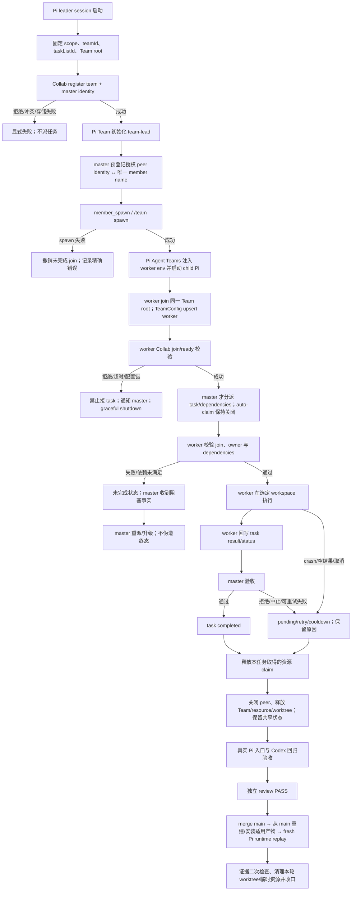

# AppSDK Collab Pi Agent Teams 适配规划

状态：实现 DAG 已补全；文档独立 review APPROVE；尚未实现或集成
基线：`main` / `origin/main` = `2792ff58c0f387727996b5ebbaabded83a231e1f`
范围：AppSDK 仓库内 Collab 的 Pi host 适配；Codex App Server 主链保持不变。

## 目标

在 Pi 中使用已安装的 Pi Agent Teams 能力执行 Collab master/peer 工作：master 负责任务调度、成员管理和资源决策；peers 接收任务、协作并回报结果。复用 Agent Teams 的团队消息、共享 task board、依赖、worker 生命周期和 workspace/worktree 能力，不在 AppSDK 另造同义的 Pi 消息系统或 task board。

Pi 适配是**Pi host 边界上的适配**，不是把 Collab 的 Rust App Server transport 换成 tmux，也不是让 Rust launcher 再启动一套 Pi worker。Codex 继续走当前 App Server 路径。Pi Agent Teams 自己负责 Pi leader/worker 子进程、团队消息与团队 task board。

### 当前收敛的 team lifecycle

```text
Pi leader session 获得/选择 teamId
→ Collab 按 scope 注册 teamId + master identity/role
→ leader 初始化 Pi Team（team-lead）并成为该 team 的 master
→ master 通过 Pi Agent Teams `member_spawn` / `/team spawn <name>` 启动 peer worker（不另开 leader 窗口冒充 join）
→ Pi Agent Teams 自动注入 `PI_TEAMS_WORKER=1`、`PI_TEAMS_TEAM_ID`、`PI_TEAMS_TASK_LIST_ID`、`PI_TEAMS_AGENT_NAME`、`PI_TEAMS_LEAD_NAME`
→ worker `session_start` 在同一 Team root 下 ensure config、upsert member 为 worker/online 并开始轮询
→ Collab Pi hook/adapter 校验该 member 对应的 peer identity；校验成功才将其视为有效 member，失败须显式阻止接任务
→ master 通过原生 task board/Teams 消息调度、协调
→ peer 回报结果，master 验收并完成或重派；资源释放后收口
```

因此，**teamId 可以作为通信/任务共享的 namespace**；新 peer 可加入同一 teamId，但不是只凭 teamId 就自动获得身份或权限。加入凭据至少需要唯一 member name 和已注册的 peer identity，并且要验证 `taskListId`、`PI_TEAMS_ROOT_DIR` 与 leader 一致。TeamConfig 的 `lead`/`worker` 是运行时成员信息；Collab 的 master/member register/join 是权限与身份依据，两者不可互相冒充。

进程角色在扩展加载时由 `PI_TEAMS_WORKER=1` 选定；普通 leader 窗口不能运行中切成 worker。Leader 可以 attach 到另一个 `teamId`，但 attach claim 用于限制同一时刻只有一个 leader session 控制该 Team；`--claim` 是接管，不是并行双 master。若要同时存在第二个协作者，应把它作为 worker/member 加入；它不能因此获得第二份 leader 调度权。若业务要求两个并行 master 同时操作同一 task board，当前 Pi Agent Teams 不满足该角色模型。

若目标只是同 host 同一共享 Team root 下，一个 master 与多个 peer 的任务和通信，这条主 DAG可以闭环；跨 host、durable message-consume receipt、终态 `failed/cancelled` 或双 master 并行控制不由该简单模型自动闭环。

## 设计决策与实施前置门禁

以下均为 P0；每项有证据并通过后才能进入实现。门禁未通过时，报告 `BLOCKED`，不以 prompt、名称约定或隐式 fallback 代替契约。

1. **参与者拓扑**：确认目标是同一用户、同一 host、共享同一 Pi Agent Teams 文件根目录的 Pi 子进程。源码默认写到用户 agent 目录下的 `teams`，也可由 `PI_TEAMS_ROOT_DIR` 改址；目前没有跨 host mailbox/task 分发能力的证据。若目标是跨主机 peer，Pi Agent Teams 当前本地文件存储不能单独承担共享 transport。
2. **Team 注册与自动 member 加入**：Collab 初始化/attach 时注册 `teamId`、project scope 和已授权 master identity；master 是该 Pi Team 的 `team-lead`。peer 由 master 经原生 `member_spawn` / `/team spawn <name>` 启动；Pi Agent Teams 自动设置 worker 环境、加入同一 Team 并登记 member。Collab Pi hook/adapter 再把 Pi member 绑定到已注册 peer identity，并在授权失败时显式阻止其接任务。teamId 只是 namespace，不是秘密或权限凭据；复用现有身份真源，不从名称、cwd、session 文件或 leader label 推导授权。实现不得要求用户手工维护第二套 peer 启动/通信机制。

3. **唯一 task owner**：Pi 侧 task board 是 Pi 团队任务分派、依赖及执行状态的唯一真源；不得同时镜像一份语义相同但可能分叉的 Collab task 状态。Collab 若仍有资源租约，只记录独立的共享资源占用，不复制 Pi task 状态。
4. **失败/取消语义**：当前 Teams task status 只有 `pending`、`in_progress`、`completed`。worker 可重试失败会回到 `pending`，并写 retry/failure metadata；没有独立 `failed` / `cancelled` task status。实现前必须确认业务接受以下映射：失败/中止不算完成，任务保持 pending/cooldown 或 retry-exhausted，由 master 显式重试、重派或升级处理；不能表示为 pending 时就不得声称已有终态支持。
5. **消息证据等级**：Team DM 用于协调/通知，不作为高完整性控制状态或 Collab durable-consumption receipt。写入成功、被标记 read 都不代表接收者已理解或完成处理。需要强 ACK 的操作必须由 task 状态/结果证据闭环；若某业务消息必须有 durable consume receipt，当前 Teams mailbox 能力不足，须在实现前补充协议能力或将该消息排除出适配范围，禁止伪造 receipt。
6. **扩展组合与实际加载**：确认 Pi 运行时有受支持的方式让 Collab role/resource guard 与既有 `teams` 工具协作，避免复制或覆盖 Teams 工具。不得仅因能 import 安装包内部文件就假定其为稳定 API。运行时必须证明 `teams` 工具只注册一次并且 leader/worker 都加载正确扩展。
7. **资源范围**：Agent Teams 的 worker 上限、`shared`/`worktree` workspace 只覆盖其支持的团队并发与 workspace 隔离；它不是通用跨 peer resource lock。master 负责选择和协调；已有 Collab resource claim 若承担跨团队互斥则继续由 Collab 单一 owner 管理，未获取 claim 不得开始受保护任务。

## 组件 owner 与边界

| 能力 | 唯一 owner | Pi 适配职责 | 禁止事项 |
|---|---|---|---|
| Codex 启动、App Server 注册/状态/archive | 现有 Collab App Server adapter / Codex 路径 | 无；保持行为不变 | 不把 Pi/Tmux 逻辑接入并替代此路径 |
| Pi worker 启动、Team 消息、成员 lifecycle、task board | 已安装 Pi Agent Teams 扩展 | 调用/协调现有 `teams` 能力；不重复实现 | 不另建 Pi mailbox、task DB 或第二个 worker lifecycle |
| master/peer 权限与稳定身份 | Collab 的权威 identity/registration owner（需确认 Pi binding 落点） | 验证已注册 identity 到 Team member 的绑定 | 不用显示名、cwd、session 文件或 leader 标签推导授权 |
| Pi task 调度与执行结果 | Pi Agent Teams task board；master 负责调度和验收 | 绑定任务 owner、依赖与结果 evidence | 不在 Collab task 状态中镜像同一 Pi 任务 |
| 跨任务/跨 peer 独占资源 | 现有 Collab resource owner（仅当该资源确由其管理） | master 在派发前取得/确认 claim，结束后释放 | 不把 worker 数或 worktree 当作通用资源锁 |
| Pi extension/host adapter | AppSDK Pi integration owner（实现阶段需明确单一 owner） | 负责身份 guard、Pi host 接线和适用 resource 协调 | 不在 Rust App Server adapter 中模拟 Pi 子进程 |

## 主 DAG



## 实现阶段、唯一 owner 与交付条件

| 阶段 | 唯一 owner | 交付条件（完成 iff） | 必需验证/证据 |
|---|---|---|---|
| P0 语义冻结 | 产品/任务 owner | 一个 Collab scope 对应一个 Pi Team；一个 Collab master/Team leader；所有 peer 必须加入该 Team；跨 Team leader-to-leader 通信不在本 feature scope。失败/取消只按 Teams 支持的状态表达 | 签定角色、同机/同 Team root、失败/取消、资源 owner 决定；不满足即 BLOCKED |
| P1 API/调用边核实 | Pi integration owner | 确认实际扩展加载入口、`teams` 工具/`member_spawn` 的受支持接线方式、Pi session identity 来源、build/install/reload 方式；定义 Collab team register、peer join/ready、leave/offline 的 typed contract | 文件/符号/调用入口证据；明确哪些为现有能力、哪些需新增；不得依赖未经支持的内部 import |
| P2 Team/master bootstrap | Collab identity owner + Pi integration owner（不同文件范围） | Pi leader 取得稳定 scope/team/task-list/root；Collab 只接受已授权 master 并登记 team；Pi Team config 的 `team-lead` 与 Collab master binding 一致；冲突/重复注册显式失败 | leader 首启、同 session restart/re-attach、重复 master、错误 scope 正反测；Team ID/config 与 Collab registration 对照证据 |
| P3 Peer auto-spawn/join gate | Pi integration owner | master 先把已注册 peer identity 绑定唯一 member name，再用 `member_spawn`/`/team spawn` 启动；worker 自动加入并回报 worker-side join-ready。授权 gate 必须在 worker `poll()` / `maybeStartNextWork()` 前；不能只看 TeamConfig online（leader spawn 本身会写 online）。Collab-managed workers 的 auto-claim 关闭，任务仅在 ready 后分派；不允许绕过 gate 的手工 worker | spawn env、worker TeamConfig、Collab join 记录和 worker-side ready 结果互相对应；未注册/重名/错 Team/ready 失败时无 task 执行且 worker 被停止/隔离。若已安装版本没有受支持的 pre-dispatch gate，P1 明确阻塞并先解决 API/扩展边界，不能用消息约定代替 |
| P4 Teams communication/task board | Pi Agent Teams owns task/mailbox；master 唯一调度 owner | 同一个 Team 内 master 与 workers 用原生 DM/broadcast/worker `team_message` 和 task board；不建第二份 task/message state；只在 peer join-ready 后派发 | master→peer、peer→master、peer↔peer 消息；task create/assign/dependency/complete/reassign；验证目标由同 Team member name 定位 |
| P5 资源与生命周期 | Collab resource owner 管共享 claim；master 管队内 worker/workspace | master 按 task 取得必要 claim，选择 shared/worktree 和 worker 上限；成功、失败、中止、shutdown 均释放本轮 claim；仅在 worker/task 安全终止后清理本轮 worktree | 同资源竞争、spawn 失败、busy shutdown rejection、idle shutdown、release/cleanup 失败注入；不删除既存/他人资源 |
| P6 失败、恢复、取消 | Pi integration owner | Team/task 文件错误、mailbox 读写失败、worker crash/restart、retry exhaustion、用户取消都进入显式未完成/阻塞路径；不能把 mailbox read 或 idle notification 当消费/成功证据；不支持的终态明示缺口 | 错误注入；task owner/status/metadata 与 worker 在线状态对照；不存在 silent success、伪造 receipt、孤儿 claim |
| P7 模块 gate | 各受影响模块 owner | 受影响 Pi extension/adapter build 和测试通过；若改 Rust 再跑受影响 Cargo gate；文档/map 与接线一致 | 先从对应 package manifest 查真实命令；Rust 变更适用 `cargo fmt --manifest-path collab/Cargo.toml -- --check`、`cargo check --manifest-path collab/Cargo.toml --bin collab`、受影响 tests；JS/TS 跑项目声明测试/build |
| P8 真实入口与兼容 | 独立 verifier | fresh Pi leader + 至少两个真实 worker 在共享 Team 上完成注册、互相通信、任务执行/失败/取消、资源释放；Codex App Server 路径不变 | 精确版本、Team/task IDs、Pi 实际 load/tool registration、成功与失败行为、App Server 定向回归 evidence；mock 不计 |
| P9 Review、集成和交付 | 独立 reviewer → master 集成 | 当前候选 review PASS 后才 merge；从 main 重建适用产物，安装/更新实际使用的 Pi extension/package，启动 fresh Pi process 验证加载；若不影响 daemon/emulator/设备，记录有依据的 N/A | review 绑定 candidate SHA；main merge SHA/clean；产物版本/hash；Pi runtime replay；适用安装/重启/OTA；资源/worktree 二次检查与清理回执 |

## 端到端状态与失败闭环

| 节点 | 成功条件 | 失败/取消路径 | 验收证据 |
|---|---|---|---|
| Runtime/扩展加载 | leader 和 worker 各有唯一 Teams tool 注册；team/task-list 可读 | 缺扩展、重复注册、配置/读取错误：停止，明确失败；不创建影子 transport | Pi 实际 runtime 工具清单、启动日志/返回码、team/task-list 标识 |
| 身份和角色 guard | 当前 master 与每个 worker 均绑定 Collab 稳定 identity 和正确 scope | 缺失、冲突、越权：拒绝分派/处理；不根据 member name 补猜 | 正反角色测试、绑定记录、拒绝结果 |
| 分派和依赖 | master 创建 task、明确 owner/dependencies；阻塞任务不能执行 | worker 不在线或依赖未完成：task 留在适用的未完成状态，由 master 决定；不可谎报启动 | task board 状态、owner、依赖、Pi worker 实际活动 |
| 执行和结果 | owner worker 执行并写入结果；master 读结果并验收后才 completed | 空结果、abort、crash、失败：保持未完成并记录可用 failure metadata；依策略重试或人工处置 | 任务结果、失败原因、重试/恢复记录、master 验收状态 |
| 通信 | Teams DM/broadcast 仅用于协调和唤醒；必要控制状态由 task board表达 | mailbox read 不作为业务 ACK；消息不可用时由 task/status 证据识别阻塞并显式暴露 | 发送方、目标 member、task 状态及实际 worker 结果；不伪造消费回执 |
| Shutdown/cancel | 空闲 worker graceful shutdown；任务完成/取消决定已明确 | 忙碌 worker 收到 shutdown rejection 时保留任务；中止不映射为 completed；强制清理不属于正常路径 | shutdown request/rejection/approval、task 状态和资源状态 |
| 资源释放与清理 | 释放本轮获取的 claim；只清理本轮创建且已确认不再需要的资源 | 释放失败、worker 仍运行、task 仍 in-progress：显式阻塞收口，不删除共享目录 | claim acquire/release 证据、worktree/worker 清理清单 |
| Codex 不回归 | Codex 原 App Server 注册、route、status/archive 仍通过现有入口 | 回归失败即阻止集成 | 原有 App Server 定向测试及实际入口验证 |

## 测试矩阵

1. **角色与身份**：授权 master 可调度；普通 peer 不能分派/改资源；未知 member、重名、错误 team/scope、旧 session/name 重用不继承他人权限。
2. **task board**：create/assign、dependencies、blocked worker、owner 校验、完成验收、重派；状态只用包支持的 enum，不写入虚构 `failed`/`cancelled`。
3. **消息**：DM/broadcast 到正确 team/member；同时证明消息 read 不是消费 ACK；消息写入/读取失败不能造成 task 完成或静默成功。
4. **失败/恢复**：worker spawn/load 失败、worker crash、空结果、abort、retry cooldown/exhaustion、stale lease recovery；每条路径保留 task 未完成并让 master 看见事实。
5. **资源/workspace**：最大并发和 workspace mode 符合 master 决策；争抢 Collab 管理资源时 claim 唯一；失败、取消和完成均验证释放；清理不得删除既存目录/他人资源。
6. **生命周期**：忙碌 worker 优雅关闭被拒时 task 保留；空闲关闭更新状态；不通过 force cleanup 隐藏未完成 task；重启后 board 状态能被 master 查询。
7. **兼容**：Codex App Server 的注册、route、status、archive/subagent 行为不变；Pi 流程不依赖 tmux，不触碰 Codex transport。
8. **运行时**：检查实际 Pi/child Pi 加载顺序、扩展路径和工具注册次数；验证未完成 Collab join 的 worker 无法领取已有或新 task；版本、配置、测试命令及结果入证据。

## Worktree 与交付边界

- 本文只规划，不授权本轮实现、merge、push、安装或重启。
- `main` 当前已有未提交改动：`.gitignore`、`scripts/install-global-appsdk.sh`、`bench/`、两份性能报告。本计划保留这些状态，不覆盖、不清理。
- 两个 Codex 候选 `playground/collab-tmux-rewrite-20260923` 与 `playground/collab-tmux-transport-20260923` 在五个 Rust 文件上有重叠，且尚未证明编辑 owner。本轮不修改、不合并它们；先由各自 owner 明确交接/处置。
- 代码实施开始后，按项目强制流程从最新 `origin/main` 建立新的独立 worktree；不在 dirty `main` 或 tmux 候选上继续开发。可复用其调用链调查和测试证据，但不能把未完成 tmux diff 当作 Pi 实现。
- 适用 gate 通过、候选 review PASS 后才进入授权的 main 集成流程；任何未闭合的终点报告 `INCOMPLETE` 或 `UNVERIFIED`。

## 现有证据与限制

### 仓库及候选调查

- Baseline SHA：`2792ff58c0f387727996b5ebbaabded83a231e1f`。
- Rewrite 候选计划：`playground/collab-tmux-rewrite-20260923/docs/goals/appsdk-collab-tmux-rewrite-20260923-plan.md`；记录 tmux P0 因 main 既存 dirty 被阻塞、部分 Cargo/identity/route 检查通过、双 peer 实际消费与完整 App Server 消融尚未闭环。此处引用为候选计划所记录证据，不等同本轮独立重跑。
- Call map：`playground/collab-tmux-rewrite-20260923/collab/docs/mainline-call-map.json`。
- Worktree 审计 run：`team_20260923132725_fd96d910635d9f89`；结论是 rewrite 和 transport 候选在 `adapters/codex_app_server.rs`、`adapters/mod.rs`、`main.rs`、`proto.rs`、`subagent.rs` 重叠；没有证据证明 owner。

### Pi Agent Teams 源码核实

已直接读取当前可见的安装源码（版本记录为 0.4.1；实际部署版本仍须在实现/验收时重核）：

- `~/.pi/agent/npm/node_modules/@codexstar/pi-agent-teams/extensions/teams/leader-teams-tool.ts`：现有 Teams 工具包含 task assignment/status/dependencies、DM/broadcast/steer、member lifecycle 和 workspace mode；task status schema 为 `pending | in_progress | completed`。
- `.../extensions/teams/task-store.ts`：任务 owner 使用 member 名称，支持 dependencies、lease/heartbeat/stale recovery 和 retryable failure；失败重试回到 pending；event log 写入是 best-effort。
- `.../extensions/teams/mailbox.ts`：message 字段为 `from/text/timestamp/read`；`popUnreadMessages` 在读取时标记 read；读坏 JSON 返回空集合、lock timeout 返回空集合；因此不能作为 Collab durable consume proof。
- `.../extensions/teams/team-config.ts`：teamId/taskListId/leadName/member name 与 lead/worker role 存在本地 config；名称不是稳定授权 identity。
- `.../extensions/teams/worker.ts`：`session_start` 中的 TeamConfig 写入错误会被 catch 后忽略，随后仍启动 `poll()` 与 `maybeStartNextWork()`；leader `spawnTeammate` 也会在 child start 后自行 upsert member online。因此 TeamConfig online 不是 worker ready/authorized 的证明；Collab gate 必须在实际领取任务前得到 worker-side join-ready，且失败不能继续处理任务。
- `.../extensions/teams/paths.ts`：team 产物位于本地 Agent dir 下，可由 `PI_TEAMS_ROOT_DIR` 改址；不据此推断远端共享。
- 一次 follow-up agent 报告无法解析安装目录；本计划以上能力事实以直接读取的源码为依据。路径可见不代表当前 Pi child runtime 加载成功。

Pi Crew 子进程此前出现过 `teams` 工具重复注册；本机 `pi-crew` 安装目录有仅本地 hotfix，smoke test 曾通过，但持久性和完整回归未验证。这是 P1/P7 的运行时门禁，不属于本计划允许修改的 AppSDK 源码范围。

## 完成定义

```text
P0 单 Team/单 master/peer worker scope 冻结
→ 从最新 origin/main 创建 clean worktree 并绑定唯一 owner
→ Pi leader/teamId + Collab master registration
→ peer identity 预授权 → native member_spawn → 自动 worker join/ready
→ ready 后才允许 task assignment（auto-claim disabled）
→ 原生 Team messages + task board → master 验收/重派
→ 错误/取消/恢复/claim release/worker & worktree cleanup 全有可测终点
→ 模块 build/tests + Codex App Server 回归 + fresh Pi runtime replay
→ 候选 review PASS → merge main → 从 main 重建/安装适用产物
→ 真实 runtime 二次 replay → 证据收口与清理本轮资源/worktree
```

若身份绑定、跨主机范围、失败/取消语义或受支持的扩展组合任一仍未确定，计划视为有条件完成，实施状态保持 `BLOCKED`；不通过 tmux、不并行双 transport、不将源码/单测代替真实 Pi 入口验收。
